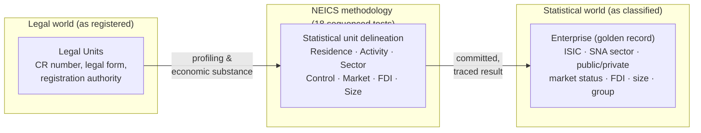
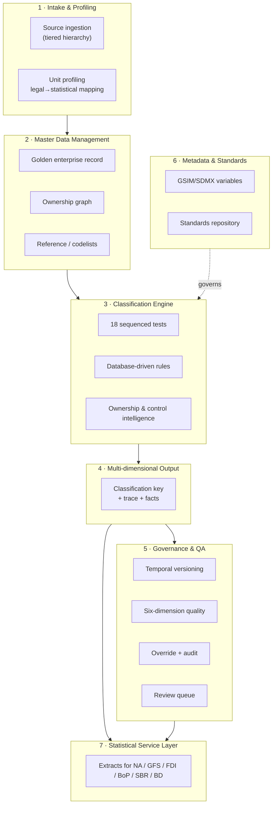
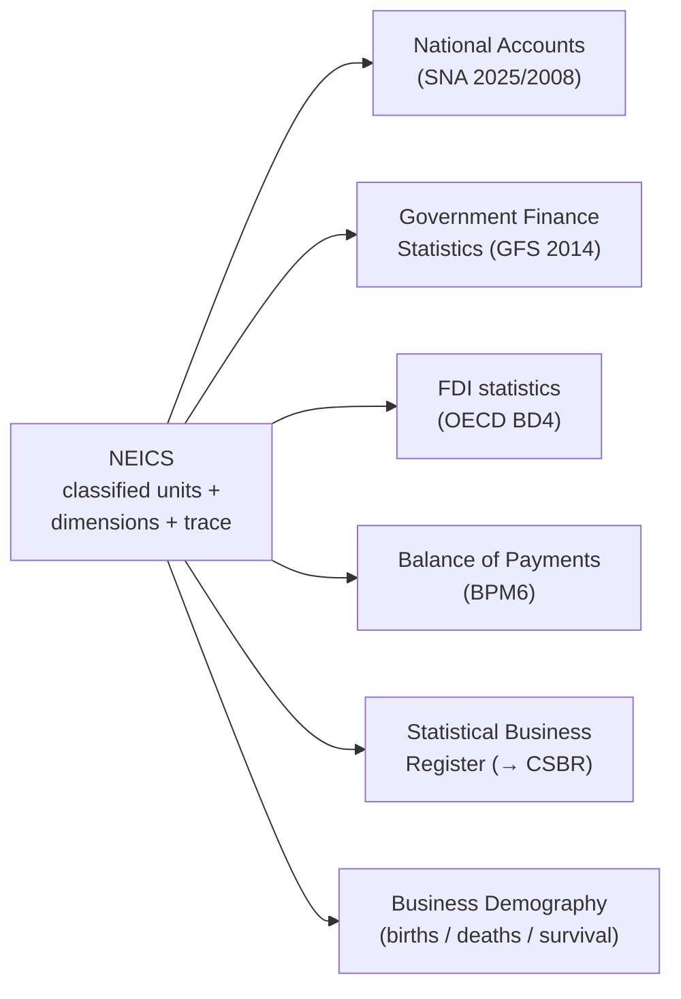

# NEICS — Executive Architecture

**National Enterprise Intelligence and Classification System**
State of Qatar · National Statistics Office (NSO)

| | |
|---|---|
| **Document** | 00 — Executive Architecture |
| **Status** | STAGING / UAT — pre-pilot review draft |
| **Audience** | Senior statisticians, enterprise architects, data-governance specialists |
| **Classification** | Official — Internal (subject to Qatar Statistics Law) |
| **Owner** | National Statistics Office (NSO), Statistical Methodology & Business Register Programme |
| **Date** | 2026-06-18 |
| **Related** | [`./01_business_architecture.md`](./01_business_architecture.md) · [`./02_information_architecture.md`](./02_information_architecture.md) · [`./05_enterprise_data_model.md`](./05_enterprise_data_model.md) · [`./10_rules_repository_design.md`](./10_rules_repository_design.md) · [`./INDEX.md`](./INDEX.md) |

---

## 1. Purpose of this document

This document is the apex of the NEICS architecture set. It states the system's vision, its
core proposition, the scope under review, and the capability set that the platform delivers.
It maps those capabilities to the National Framework deck (nine parts) and to the downstream
official statistics programmes that NEICS is designed to serve. It is deliberately concise on
implementation detail; the business, information, data, rules and operational specifics are
elaborated in the sibling documents listed above.

This is a **STAGING / UAT** description. Nothing in this document should be read as a statement
that the platform has entered pilot or production. The architecture is presented so that
reviewers can assess fitness-for-purpose *before* any pilot is authorised.

---

## 2. Vision

NEICS is the **single national source of truth for the classification, profiling, ownership
analysis and statistical sectorisation of enterprises operating in the State of Qatar.** It is
owned and operated by the National Statistics Office (NSO) and is designed to evolve into
Qatar's **Central Statistical Business Register (CSBR)** — the authoritative, continuously
maintained register of statistical units that underpins the national statistical system.

The vision rests on a single methodological conviction:

> **Statistical classification must reflect economic reality, not merely legal form.**

A legal entity registered as a limited liability company may, on the economic substance of its
ownership, control, financing and market behaviour, be a public non-financial corporation, a
unit of general government, a captive financial institution, or an empty-shell special purpose
vehicle. The legal register cannot tell the difference. NEICS exists precisely to make that
determination — transparently, reproducibly, and with every decision traced to an international
or national statistical standard.

---

## 3. The core proposition — economic reality over legal form

The defining design choice of NEICS is that it separates the **legal world** from the
**statistical world** and resolves one into the other through an explicit, auditable
methodology.

Three consequences follow from this proposition, and they shape the entire architecture:

1. **The statistical unit is not the legal unit.** NEICS implements the international statistical
   unit model — Enterprise Group, Enterprise, Kind-of-Activity Unit (KAU), and
   Establishment / Local Unit — and maps one or more **Legal Units** onto each **Enterprise**.
   The Enterprise is the *golden record*. (See [`./02_information_architecture.md`](./02_information_architecture.md).)

2. **Ownership and control are evaluated on substance.** A directed, share-by-share ownership
   graph is traversed to find ultimate control, beneficial-ownership chains, government
   participation and foreign participation. Nine distinct control indicators are evaluated —
   majority voting is only the first of them.

3. **Every classification is explainable and standard-anchored.** The result of classifying an
   enterprise is not a single label; it is a multi-dimensional key plus an ordered **trace** of
   which test and which rule produced each dimension, and the **fact set** those rules consumed.
   No classification can exist without its evidence.

---

## 4. Standards foundation

NEICS does not invent methodology. It operationalises the international and national statistical
standards canon. Every classification rule traces to one or more of the following.

| Standard | Issuer | Role in NEICS |
|---|---|---|
| **SNA 2025** (with **SNA 2008** transition) | UN/IMF/OECD/EC/World Bank | Institutional units, sectors, market/non-market, consolidation |
| **IMF GFS 2014** | IMF | Public sector boundary, general government delineation |
| **IMF BPM6** | IMF | Residence, balance of payments unit treatment |
| **OECD BD4** (Benchmark Definition of FDI, 4th ed.) | OECD | FDI 10% threshold, inward/outward/round-trip/fellow |
| **ISIC Rev.4** | UNSD | Economic activity coding (4-digit class) |
| **CPC, COFOG, ICSE, SEEA** | UNSD | Products, government function, employment status, environment |
| **ISO 17442 (LEI)** | ISO/GLEIF | Legal entity identification |
| **SDMX · GSIM · GSBPM** | SDMX/UNECE | Metadata, statistical information model, process model |
| **DAMA DMBOK** | DAMA International | Data management and six data-quality dimensions |
| **UNSD / Eurostat Business Register recommendations** | UNSD / Eurostat | Statistical unit model, register design |
| **Qatar National Classification Standards** | NSO / State of Qatar | National sizing thresholds, legal forms, jurisdictions |

The standards themselves are first-class data in the platform: the **Standards Repository**
(`std_standard`, `std_concept`) records each standard, its issuer, edition, and the concepts it
defines, so that a rule's `standard_ref` resolves to an authoritative concept definition.

---

## 5. Scope

### 5.1 In scope (STAGING / UAT build)

- The **statistical unit model** and master data management for Enterprise Groups, Enterprises,
  Legal Units, Establishments / Local Units, and the ownership graph.
- The **18-test classification methodology** (Framework Part III) executed by a
  **database-driven rules engine** (~40 seeded rules at this build).
- The **classification output dimensions**: residence, ISIC class, SNA institutional sector,
  public/private boundary, control flag, market status, size class, FDI flag, special-entity
  flag.
- **Reference and master data** (codelists, ISIC hierarchy, institutional sectors, legal forms,
  size thresholds) as controlled vocabularies.
- **Statistical metadata** (GSIM/SDMX-aligned variable catalogue) and the **Standards
  Repository**.
- **Governance artefacts**: temporal-versioned classification records, full audit trail,
  six-dimension data-quality results, the review/exception queue, and statistical override with
  logged rationale.
- **Backend services** (FastAPI), **persistent identifiers** (QA-ENT/LU/EST/GRP-…), **RBAC**,
  and a **React (Vite)** analyst front end.

### 5.2 Out of scope (this build)

- Live production integrations with source authorities (data is ingested via controlled
  staging loads and seed/profiling inputs at UAT).
- Statistical output dissemination products (National Accounts compilation tables, GFS
  presentations, FDI/BoP outputs) — NEICS *feeds* these programmes; it does not compile them.
- Migration to the full CSBR operating footprint and the production identity/access estate.

### 5.3 Coverage population

The intended statistical population is **all resident institutional units** of the Qatari
economy and the relevant non-resident counterparts implicated by ownership and FDI analysis,
across all jurisdictions — Mainland (MoCI), **QFC**, **QFZA**, and **QSTP** — and across all
institutional sectors (S.11 through S.15 and the rest of the world, S.2).

---

## 6. Capability overview

NEICS is organised into seven capability areas. Each is summarised here and detailed in the
business and information architecture documents.

| # | Capability | What it does |
|---|---|---|
| 1 | **Intake & Profiling** | Ingests records from the tiered data-source hierarchy and profiles legal units into statistical units. |
| 2 | **Master Data Management** | Maintains the golden enterprise record, the ownership graph, and all reference/master data. |
| 3 | **Classification Engine** | Executes the 18 sequenced tests via the database-driven rules engine and the ownership & control intelligence engine. |
| 4 | **Multi-dimensional Output** | Produces the classification key, the explainability trace, and the fact provenance. |
| 5 | **Governance & QA** | Temporal versioning, six DAMA quality dimensions, statistical override with rationale, full audit, and the review queue. |
| 6 | **Metadata & Standards** | Holds the GSIM/SDMX variable catalogue and the Standards Repository that every rule references. |
| 7 | **Statistical Service Layer** | Supplies classified, quality-assured units and dimensions to the downstream official statistics programmes. |

---

## 7. The 18-test methodology at a glance

The classification methodology (Framework Part III) is a sequence of **18 tests**, each owning
one or more output dimensions, and each executed in a strict order so that dependencies resolve.
The execution order is encoded in a `seq` field on the `classification_test` catalogue, **not**
in code, so methodology evolution does not require redeployment.

| Test | Name | Output dimension |
|---|---|---|
| T1 | Statistical Unit | unit delineation |
| T2 | Institutional Unit | institutional-unit flag |
| T3 | Residence | `residence` (RES / NRES / MULTI) |
| T4 | Economic Activity (ISIC) | `isic_class` (ISIC Rev.4 4-digit) |
| T5 | Institutional Sector | `sector_code` (S.11…S.2) |
| T6 | Public Sector Boundary | `public_private` |
| T7 | Market vs Non-Market (50% rule) | `market_status` |
| T8 | Ownership & Effective Control (9 indicators) | `control_flag` |
| T9 | Listed Company | listing flag |
| T10 | Enterprise Size | `size_class` |
| T11 | Enterprise Group & Consolidation | `group_id`, consolidation |
| T12 | Foreign Ownership & FDI (10% threshold) | `fdi_flag` |
| T13 | Special Entity (SPV / holding / empty-shell) | `special_entity_flag` |
| T14 | Data Source Hierarchy | provenance precedence |
| T15 | Conflict Resolution | first-match-by-priority |
| T16 | Governance | committee / override controls |
| T17 | Quality Assurance | six DAMA dimensions |
| T18 | Final Classification Record | committed multi-dimensional key |

**Dependency note (critical for reviewers).** The market test (T7) and the ownership/control
test (T8) are sequenced *before* the institutional-sector test (T5) and the public-sector
boundary test (T6) in execution order, because sectorisation depends on market behaviour and
public-private classification depends on effective control. The `seq` field guarantees this
ordering irrespective of test numbering. Within any single test, conflicts are resolved by
**first-match-by-priority** (lower `priority` value evaluated first).

The nine control indicators evaluated by T8 are: majority voting, board appointment rights,
golden share / veto, contractual control, financing dependency, dominant customer / supplier,
regulatory control, beneficial-ownership chain, and key-personnel appointment. The full rule
catalogue and condition-tree semantics are documented in
[`./10_rules_repository_design.md`](./10_rules_repository_design.md).

---

## 8. Classification output dimensions

A committed classification (`classification` table, framework Test 18) carries the following
multi-dimensional key. These are the controlled outputs the statistical service layer exposes.

| Dimension | Field | Domain |
|---|---|---|
| Residence | `residence` | RES, NRES, MULTI |
| Economic activity | `isic_class` | ISIC Rev.4 4-digit class |
| Institutional sector | `sector_code` | S.11; S.12 + S.121–S.129; S.13 + S.1311–S.1314; S.14; S.15; S.2 |
| Public / private | `public_private` | PUB-NFC, PUB-FC, GG, PRV-NFC, PRV-FC, FCC, NPISH |
| Control | `control_flag` | MAJ-VOTE, BOARD, GOLDEN, CONTRACT, FINANCING, DOMINANT, REGULATORY, BO-CHAIN, KEY-PERS, NONE |
| Market status | `market_status` | MARKET, NON-MARKET |
| Size | `size_class` | MICRO, SMALL, MEDIUM, LARGE |
| FDI | `fdi_flag` | INWARD-FULL, INWARD-ASSOC, OUTWARD, ROUND-TRIP, FELLOW, NONE |
| Special entity | `special_entity_flag` | HOLDING, SPV, CONSOLIDATE-PARENT, NONE |

**Qatar size thresholds** (T10; higher criterion governs): MICRO 1–9 FTE / ≤ QAR 3m;
SMALL 10–49 / 3–30m; MEDIUM 50–249 / 30–200m; LARGE 250+ / > QAR 200m. **FDI threshold** (T12):
the OECD BD4 10% voting-power rule distinguishes direct investment (associate / subsidiary) from
portfolio.

---

## 9. Mapping to the National Framework deck (nine parts)

NEICS implements the National Framework for Enterprise Classification, presented in nine parts.
The table below maps each part to the platform components that realise it.

| Part | National Framework subject | NEICS realisation |
|---|---|---|
| **I** | Vision, mandate & guiding principle (economic reality over legal form) | This document; the legal→statistical separation across the whole platform |
| **II** | Statistical standards & the statistical unit model | Standards Repository; statistical unit model (Group / Enterprise / KAU / Establishment); [`./02_information_architecture.md`](./02_information_architecture.md) |
| **III** | The 18-test classification methodology | `classification_test` catalogue + database-driven `rule` rows; classification engine |
| **IV** | Classification dimensions & codelists | Output dimensions (§8); reference/master data (`ref_*`); [`./05_enterprise_data_model.md`](./05_enterprise_data_model.md) |
| **V** | Ownership, control & enterprise groups | `ownership_edge` graph; ownership & control intelligence engine; T8 / T11 |
| **VI** | Foreign ownership & FDI | T12; BD4 10% rule; FDI flags |
| **VII** | Data sources, lineage & integration | Tiered data-source hierarchy (Tier 1–4); facts provenance; T14 |
| **VIII** | Governance, quality & audit | Technical Classification Committee; three-layer QA; temporal versioning; audit trail; T15–T17 |
| **IX** | Outputs, the CSBR vision & service to official statistics | Statistical service layer (§10); CSBR evolution path |

A complete cross-reference of Framework paragraphs to rules and concepts is maintained in the
Standards Repository and surfaced in [`./10_rules_repository_design.md`](./10_rules_repository_design.md).

---

## 10. How NEICS serves the official statistics programmes

NEICS is an upstream infrastructure asset. It does not compile macroeconomic aggregates; it
supplies the classified, sectorised, quality-assured statistical units and dimensions that the
compilation programmes consume. The dependency is one-directional and explicit.

| Programme | Standard | What NEICS supplies |
|---|---|---|
| **National Accounts** | SNA 2025 / 2008 | Institutional sector (S.11–S.2), market/non-market status, consolidation and enterprise-group structure for production and income accounts |
| **Government Finance Statistics** | IMF GFS 2014 | The public sector boundary (T6) — general government (GG) vs public corporations (PUB-NFC / PUB-FC) — and the controlling-sector attribution |
| **FDI statistics** | OECD BD4 | FDI flags (inward full / associate, outward, round-trip, fellow), 10%-threshold determinations, and the ownership chain |
| **Balance of Payments** | IMF BPM6 | Residence determinations (RES / NRES / MULTI) and resident/non-resident counterpart identification from the ownership graph |
| **Statistical Business Register** | UNSD / Eurostat | The golden enterprise register, persistent identifiers, and the statistical unit hierarchy — the seed of the CSBR |
| **Business Demography** | UNSD / Eurostat | Birth/death dates, demographic events, and survival/continuity over the temporal-versioned record |

Because every supplied dimension carries its standard reference and its decision trace, the
downstream programmes can attribute their inputs to an auditable methodological basis — a
prerequisite for credible official statistics.

---

## 11. Technology architecture (summary)

The platform is a conventional, well-understood stack chosen for transparency and
maintainability rather than novelty. Full detail is in the technical architecture documents; the
essentials follow.

| Layer | Choice |
|---|---|
| Backend | **Python 3.11**, **FastAPI**, **SQLAlchemy 2.0**, **Pydantic v2** |
| Auth | **JWT** (python-jose) with passlib/bcrypt password hashing; role-based access (`app_user.role`) |
| API docs | **OpenAPI** auto-generated at `/docs` |
| Database | **PostgreSQL** in staging/production; **SQLite** for local development |
| Rules engine | **Database-driven** — rules are rows in the `rule` table with a JSON condition tree; ~40 seeded rules |
| Frontend | **React (Vite)** analyst console |
| Deployment | **Docker Compose** (staging); **Kubernetes-ready** |

The single most important architectural property for this audience is that **the methodology is
data, not code.** The 18 tests live in `classification_test`; the rules live in `rule` (JSON
condition tree, output, priority, confidence, `standard_ref`, effective/expiry dates, approval
status, version). The Technical Classification Committee can evolve methodology through governed
data changes without code deployment — and every change is versioned and auditable.

---

## 12. Architectural principles

1. **Economic substance over legal form** — the founding principle, realised structurally.
2. **Standard-anchored** — no rule without a `standard_ref`; no dimension without a standard.
3. **Explainable by construction** — every result carries an ordered trace and its fact set.
4. **Methodology as governed data** — tests and rules are versioned data, not hard-coded logic.
5. **Single source of truth** — one golden enterprise record; designed to become the CSBR.
6. **Temporal integrity** — classifications are versioned and never overwritten.
7. **Quality is measured, not assumed** — six DAMA dimensions on every record.
8. **Confidentiality by law** — all microdata handled under Qatar Statistics Law.
9. **Separation of source authority and statistical authority** — providers provide; NSO decides.

---

## 13. Confidentiality and legal basis

All enterprise microdata held in NEICS is statistical data processed under **Qatar Statistics
Law**. Identifiable unit-level data is confidential; access is role-restricted (RBAC) and
audited (`audit_entry`); and outputs to downstream programmes are governed by the confidentiality
model described in [`./02_information_architecture.md`](./02_information_architecture.md §9).
Source-authority data is used strictly for statistical purposes and is not redisclosed for
administrative or enforcement use.

---

## 14. Readiness posture (STAGING / UAT)

| Aspect | Posture at this build |
|---|---|
| Methodology | 18 tests catalogued; ~40 rules seeded; sequencing and conflict resolution implemented |
| Data model | Full statistical unit model, ownership graph, governance and metadata tables present |
| Engine | Database-driven rules engine operational with trace + facts capture |
| Governance | Temporal versioning, audit, quality, override, review queue present |
| Integrations | Controlled staging/seed loads; live source-authority feeds **not** in scope this build |
| Identity | RBAC in place; production IAM estate out of scope this build |
| Verdict | **Suitable for UAT review prior to a pilot decision** |

---

## 15. Document set and next reading

| Doc | Title |
|---|---|
| [`./00_executive_architecture.md`](./00_executive_architecture.md) | Executive Architecture *(this document)* |
| [`./01_business_architecture.md`](./01_business_architecture.md) | Business Architecture — stakeholders, roles, value streams, governance |
| [`./02_information_architecture.md`](./02_information_architecture.md) | Information Architecture — conceptual/logical models, metadata, lineage, confidentiality |
| [`./05_enterprise_data_model.md`](./05_enterprise_data_model.md) | Enterprise Data Model — physical schema |
| [`./10_rules_repository_design.md`](./10_rules_repository_design.md) | Rules Repository Design — condition trees, seeding, evolution |
| [`./INDEX.md`](./INDEX.md) | Documentation index |

*End of document 00.*
