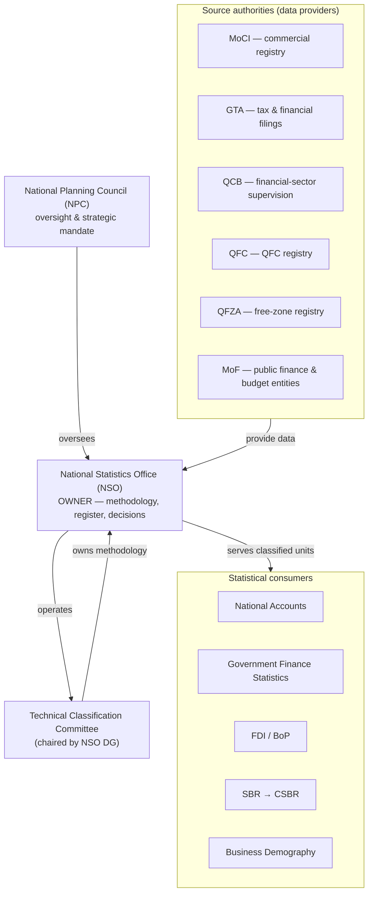
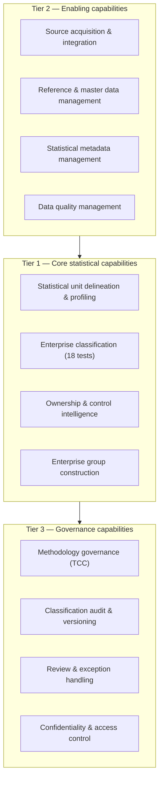
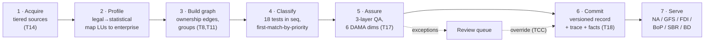
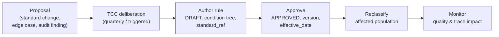
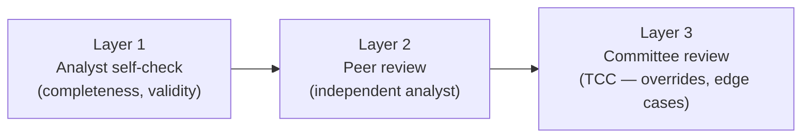

# NEICS — Business Architecture

**National Enterprise Intelligence and Classification System**
State of Qatar · National Statistics Office (NSO)

| | |
|---|---|
| **Document** | 01 — Business Architecture |
| **Status** | STAGING / UAT — pre-pilot review draft |
| **Audience** | Senior statisticians, enterprise architects, data-governance specialists |
| **Classification** | Official — Internal (subject to Qatar Statistics Law) |
| **Owner** | National Statistics Office (NSO), Statistical Methodology & Business Register Programme |
| **Date** | 2026-06-18 |
| **Related** | [`./00_executive_architecture.md`](./00_executive_architecture.md) · [`./02_information_architecture.md`](./02_information_architecture.md) · [`./10_rules_repository_design.md`](./10_rules_repository_design.md) · [`./INDEX.md`](./INDEX.md) |

---

## 1. Purpose

This document describes the **business architecture** of NEICS: who the stakeholders are, what
each institution is accountable for, the business capabilities the platform delivers, the value
streams through which classified statistical intelligence is produced, and the governance and
operating model that holds it all together. It is the bridge between the executive vision
([`./00_executive_architecture.md`](./00_executive_architecture.md)) and the information,
data, and rules architectures.

The central organising idea of the business architecture mirrors the platform's founding
principle. Just as classification rests on economic reality rather than legal form, **authority
rests with the statistical owner (NSO) rather than with the source authorities.** Many
institutions *provide* data; only the NSO *decides* classification. This separation is the
backbone of the institutional model.

---

## 2. Stakeholders

### 2.1 Stakeholder landscape

### 2.2 Stakeholder roles

| Stakeholder | Type | Primary interest in NEICS |
|---|---|---|
| **National Planning Council (NPC)** | Oversight | Strategic mandate, assurance that the national statistical system has an authoritative enterprise register |
| **National Statistics Office (NSO)** | Owner / Operator | Owns the methodology, the golden register, and every classification decision; operates the platform and the Committee |
| **Ministry of Commerce and Industry (MoCI)** | Provider | Primary commercial registry (mainland legal units, CR numbers, legal forms) |
| **General Tax Authority (GTA)** | Provider | Tax and financial filings — turnover, financial statements, activity evidence |
| **Qatar Central Bank (QCB)** | Provider | Financial-sector supervision data; identification of financial corporations and sub-sectors |
| **Qatar Financial Centre (QFC)** | Provider | QFC-jurisdiction registry |
| **Qatar Free Zones Authority (QFZA)** | Provider | Free-zone registry |
| **Ministry of Finance (MoF)** | Provider | Public-finance and budget-entity information for the public sector boundary |
| **Statistical consumers** | Consumer | National Accounts, GFS, FDI, BoP, SBR/CSBR, Business Demography programmes |

---

## 3. Institutional roles and the responsibility map

The single most important governance statement in NEICS is the allocation of **decision rights**.
The principle is unambiguous:

> **NSO owns and decides. Source authorities provide. NPC oversees.**

Source authorities contribute the administrative and supervisory data that feeds profiling and
classification, but **they do not own the statistical classification of any enterprise.** A unit
that MoCI registers as a particular legal form, or that QCB licenses as a particular kind of
financial institution, may be classified differently by NEICS on the economic substance — and
that determination is the NSO's alone, exercised through the methodology and the Technical
Classification Committee.

### 3.1 RACI — institutional responsibility map

**Legend:** R = Responsible (does the work) · A = Accountable (owns the outcome, one per row) ·
C = Consulted · I = Informed.

| Activity | NSO | TCC | MoCI | GTA | QCB | QFC | QFZA | MoF | NPC |
|---|---|---|---|---|---|---|---|---|---|
| Define classification methodology (18 tests) | R | A | C | C | C | C | C | C | I |
| Author / approve classification rules | R | A | C | C | C | I | I | C | I |
| Maintain reference data & codelists | A/R | C | C | I | C | I | I | C | I |
| Provide primary registry data (Tier 1) | A | I | R | I | I | R | R | I | I |
| Provide tax & financial data (Tier 2) | A | I | I | R | R | I | I | C | I |
| Conduct profiling & beneficial-ownership analysis (Tier 3) | A/R | C | C | C | C | C | C | C | I |
| Resolve source conflicts (T15) | A/R | C | C | C | C | I | I | C | I |
| Determine institutional sector & public-sector boundary | A/R | C | I | I | C | I | I | C | I |
| Determine ownership / control & FDI | A/R | C | C | I | C | I | I | I | I |
| Commit a classification record (T18) | A/R | C | I | I | I | I | I | I | I |
| Approve a statistical override | R | A | I | I | C | I | I | C | I |
| Quality assurance (three layers) | A/R | C | I | I | I | I | I | I | I |
| Reclassification (quarterly / trigger-based) | A/R | C | C | C | C | C | C | C | I |
| Strategic oversight & mandate | C | C | I | I | I | I | I | I | A/R |
| Confidentiality & lawful use (Qatar Statistics Law) | A/R | C | I | I | I | I | I | I | I |

Two structural observations for reviewers:

- **The "A" column is dominated by NSO / TCC.** No source authority is ever *Accountable* for a
  classification decision. This is intentional and load-bearing.
- **NPC is Accountable only for oversight and mandate** — it does not enter the operational
  classification path.

---

## 4. Business capabilities

The business capabilities are the stable "what the organisation does", independent of how the
platform implements them. They decompose into three tiers.

| Capability | Description | Realising components |
|---|---|---|
| Statistical unit delineation & profiling | Map legal units to enterprises; delineate KAUs and establishments | `enterprise`, `legal_unit`, `establishment`; profiling workflow |
| Enterprise classification | Execute the 18 sequenced tests to produce the multi-dimensional key | classification engine; `classification_test`; `rule` |
| Ownership & control intelligence | Traverse the share-by-share graph for ultimate control, BO chains, government & foreign participation | `ownership_edge`; ownership engine |
| Enterprise group construction | Build groups, identify global ultimate parent and domestic head; consolidation | `enterprise_group`; T11 |
| Source acquisition & integration | Ingest from the tiered data-source hierarchy and reconcile | ingest services; T14 |
| Reference & master data management | Maintain controlled vocabularies and the golden record | `ref_*` tables; MDM core |
| Statistical metadata management | GSIM/SDMX variable catalogue; Standards Repository | `meta_variable`; `std_standard`; `std_concept` |
| Data quality management | Measure six DAMA dimensions; raise exceptions | `quality_result`; `review_item` |
| Methodology governance | TCC owns and evolves tests and rules | governance process; rule versioning |
| Classification audit & versioning | Temporal versioning; full change log | `classification`; `audit_entry` |
| Review & exception handling | Queue and resolve anomalies, validation failures, triggers, overrides | `review_item` |
| Confidentiality & access control | RBAC; lawful statistical use | `app_user`; audit |

---

## 5. Value streams

A **value stream** is the end-to-end sequence through which a stakeholder need is satisfied with
value — here, a fully classified, quality-assured, standard-anchored statistical unit available
to the official statistics programmes.

### 5.1 Primary value stream — *from legal record to classified statistical unit*

| Stage | Trigger | Key activity | Output | Standard / test |
|---|---|---|---|---|
| 1 Acquire | New or updated source record | Ingest per source-hierarchy precedence | Candidate facts | T14 |
| 2 Profile | Candidate facts available | Delineate statistical units; map legal units to one enterprise | Golden record skeleton | UNSD/Eurostat SBR |
| 3 Build graph | Profiled enterprise | Construct ownership edges; identify ultimate control & group | Ownership graph, group | T8, T11 |
| 4 Classify | Facts + graph ready | Run 18 tests in `seq`; resolve conflicts first-match-by-priority | Multi-dimensional key + trace | T1–T13, T15 |
| 5 Assure | Draft classification | Three-layer QA; six DAMA dimensions; raise exceptions | Quality result; review items | T17 |
| 6 Commit | QA passed (or override approved) | Write temporal-versioned record with trace + facts | Committed classification | T18, T16 |
| 7 Serve | Committed record | Expose classified units & dimensions | Extracts for NA/GFS/FDI/BoP/SBR/BD | Framework Part IX |

### 5.2 Secondary value stream — *methodology evolution*

Because rules are governed data (see [`./10_rules_repository_design.md`](./10_rules_repository_design.md)),
methodology evolution flows through the same governance the platform applies to classifications:
draft → approve → version → reclassify → monitor, with full audit at every step and no code
deployment required.

### 5.3 Supporting value stream — *reclassification (quarterly and trigger-based)*

Reclassification runs on a **quarterly cadence** and is additionally **trigger-based**: a change
in ownership, a demographic event, a source-data update, a methodology change, or a quality
exception can each trigger re-evaluation of an enterprise. Each reclassification writes a new
temporal version; prior versions are never overwritten (see
[`./02_information_architecture.md`](./02_information_architecture.md §7).

---

## 6. Governance — the Technical Classification Committee

### 6.1 Composition and authority

The **Technical Classification Committee (TCC)** is the methodological authority of NEICS. It is
**chaired by the NSO Director-General** and its members are drawn from the source authorities:
**MoCI, GTA, QCB, QFC, QFZA, and MoF.** This composition is deliberate: it gives the providers a
consultative voice in methodology while preserving the NSO's ownership of decisions — the chair,
and therefore the deciding authority, sits with the NSO.

| Attribute | Value |
|---|---|
| Chair | NSO Director-General |
| Members | MoCI, GTA, QCB, QFC, QFZA, MoF |
| Owns | The 18-test methodology and the rule catalogue |
| Cadence | Quarterly, plus trigger-based reclassification sessions |
| Decisions | Rule approval/retirement, methodology change, statistical override approval, conflict-resolution precedence |
| Records | Every decision logged; overrides recorded with explicit rationale |

### 6.2 Statistical override

When the methodology produces a result that the NSO, through the TCC, determines does not reflect
economic reality, a **statistical override** may be applied. An override:

- is recorded on the classification record (`is_override = true`, `override_reason`, `reviewer`);
- carries an explicit, human-readable rationale;
- is logged in the audit trail (`audit_entry`, action `OVERRIDE`); and
- does not delete or rewrite the rule-derived result — it supersedes it as a new version.

Overrides are exceptional and visible. They are the controlled escape hatch that keeps the
methodology honest without hiding deviations from it.

### 6.3 Three-layer quality assurance

Quality assurance is a layered human-plus-system control:

| Layer | Performed by | Focus |
|---|---|---|
| 1 — Analyst self-check | The classifying analyst | Six DAMA dimensions, fact completeness, trace coherence |
| 2 — Peer review | An independent analyst | Reproducibility, source precedence, conflict resolution |
| 3 — Committee review | The TCC | Overrides, novel cases, methodology gaps, precedent-setting decisions |

The six DAMA dimensions measured at Layer 1 and recorded in `quality_result` are
**completeness, validity, consistency, uniqueness, accuracy, and timeliness**, with an aggregate
`overall_score` and an `exceptions` list that feeds the review queue.

---

## 7. Operating model

### 7.1 Roles (RBAC)

The platform's human roles map to the access model (`app_user.role`).

| Role | Responsibilities | Typical actions |
|---|---|---|
| **Analyst** | Profile units, run classification, self-check (Layer 1) | Ingest, profile, classify, raise review items |
| **Senior Analyst / Peer Reviewer** | Independent peer review (Layer 2) | Review, approve, return for rework |
| **Committee Member (TCC)** | Methodology governance, override approval (Layer 3) | Approve rules, approve overrides, set precedence |
| **Methodology Author** | Author and version rules under TCC authority | Draft rules, set `standard_ref`, manage versions |
| **Administrator** | Platform and user administration | Manage users, reference data, configuration |
| **Read-only / Consumer** | Consume classified outputs | Query committed records and extracts |

### 7.2 Operating cadence

| Activity | Cadence |
|---|---|
| Source ingestion & profiling | Continuous (controlled staging loads at UAT) |
| Classification of new/changed units | On demand, as units enter or change |
| Reclassification sweep | Quarterly |
| Trigger-based reclassification | Event-driven (ownership change, demographic event, source update, methodology change) |
| TCC sessions | Quarterly + ad hoc for triggers and overrides |
| Quality reporting | Per classification + periodic aggregate review |

### 7.3 Separation of duties

The operating model enforces separation of duties consistent with the RACI:

- The analyst who classifies (Layer 1) is **not** the peer reviewer (Layer 2).
- Overrides require Layer 3 (TCC) authority — an analyst cannot self-approve a deviation.
- Methodology authoring (rule changes) is segregated from operational classification and is
  subject to TCC approval before rules become `APPROVED` and `effective`.

---

## 8. Business policies and principles

1. **Decision rights are non-negotiable** — NSO/TCC are Accountable for every classification;
   providers are never Accountable.
2. **Economic reality governs** — where legal form and economic substance conflict, substance
   wins, by methodology and, exceptionally, by logged override.
3. **Source precedence is explicit** — conflicts resolve by the tiered data-source hierarchy
   (T14) and first-match-by-priority (T15).
4. **No silent deviation** — overrides are visible, rationalised, versioned and audited.
5. **Quality is a gate, not a report** — Layer 1–3 QA precedes commit.
6. **Confidentiality is a duty** — all microdata is handled under Qatar Statistics Law and used
   only for statistical purposes.
7. **Methodology is governed data** — changes flow through the TCC and the versioned rule
   catalogue, not through code.

---

## 9. Confidentiality and lawful use

NEICS holds identifiable enterprise microdata under **Qatar Statistics Law**. The business
architecture imposes three controls: (a) **purpose limitation** — provider data is used for
statistical classification only and is not redisclosed for administrative or enforcement use;
(b) **access control** — RBAC restricts unit-level access by role, and every access and change
is audited (`audit_entry`); and (c) **output protection** — extracts to downstream programmes
follow the confidentiality model in
[`./02_information_architecture.md`](./02_information_architecture.md §9). The legal and
information-architecture details are elaborated in that document.

---

## 10. Cross-references

| Doc | Relevance |
|---|---|
| [`./00_executive_architecture.md`](./00_executive_architecture.md) | Vision, scope, capability overview, programme mapping |
| [`./02_information_architecture.md`](./02_information_architecture.md) | Information model, statistical unit model, lineage, confidentiality |
| [`./05_enterprise_data_model.md`](./05_enterprise_data_model.md) | Physical schema realising the capabilities |
| [`./10_rules_repository_design.md`](./10_rules_repository_design.md) | Rule authoring, condition trees, methodology evolution |
| [`./INDEX.md`](./INDEX.md) | Documentation index |

*End of document 01.*
