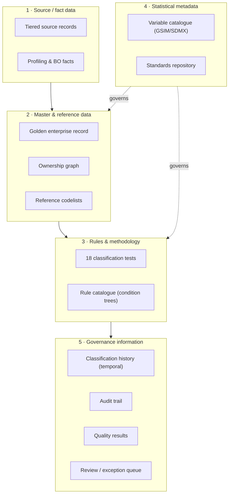
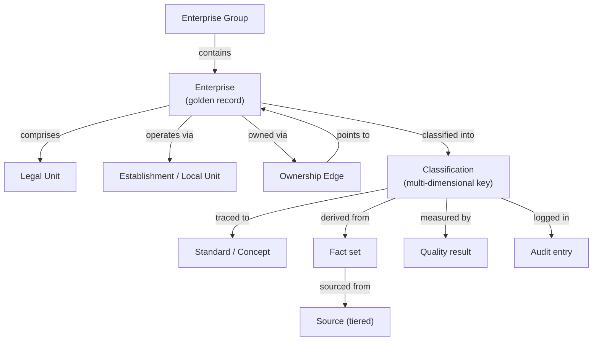
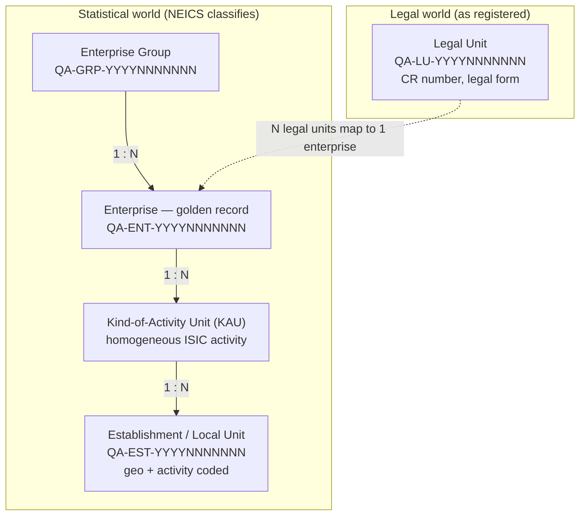
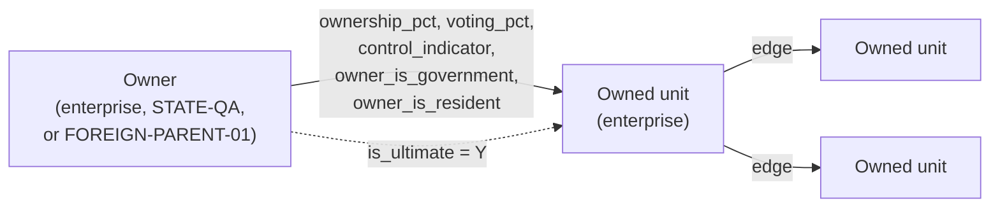
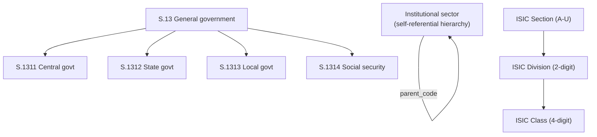
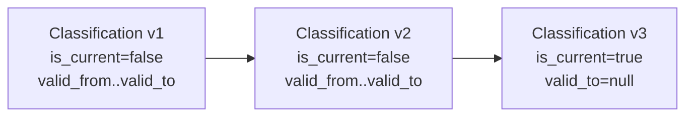
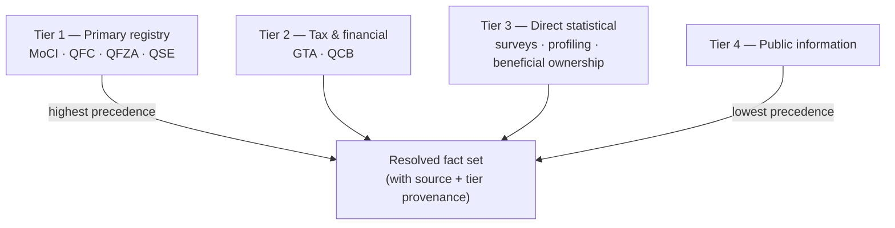
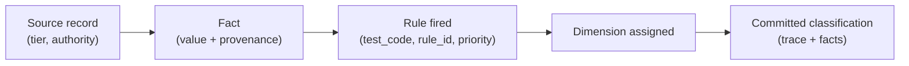
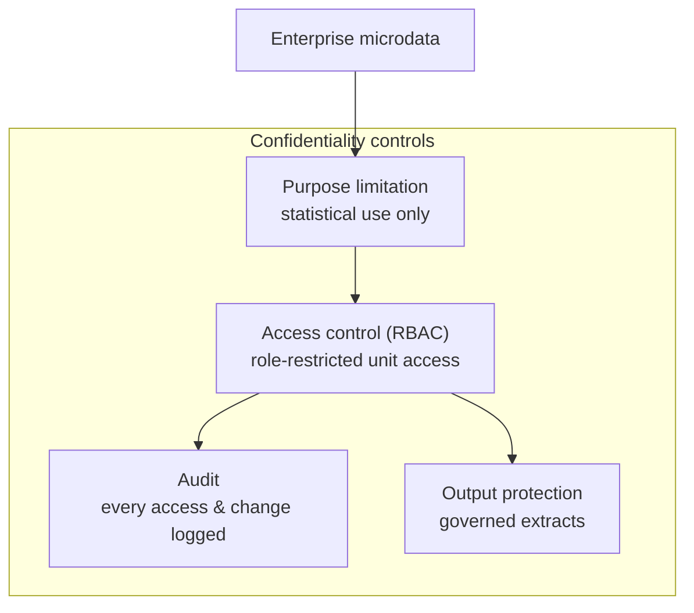
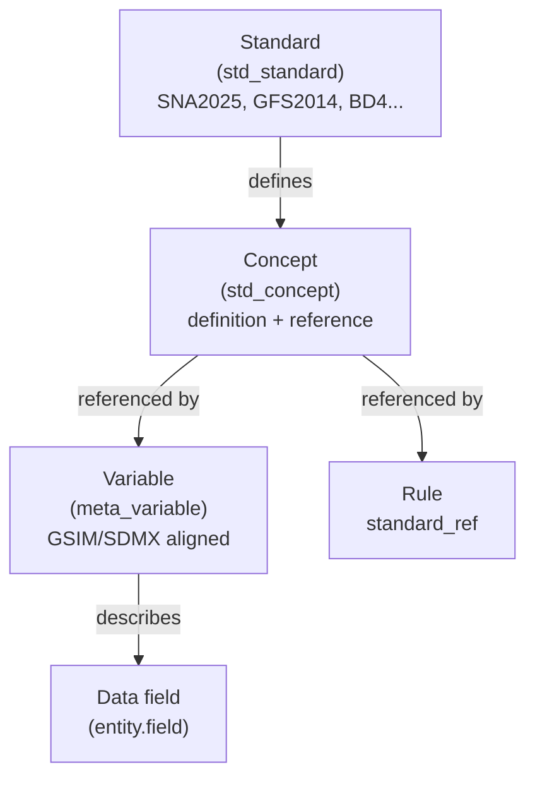

# NEICS — Information Architecture

**National Enterprise Intelligence and Classification System**
State of Qatar · National Statistics Office (NSO)

| | |
|---|---|
| **Document** | 02 — Information Architecture |
| **Status** | STAGING / UAT — pre-pilot review draft |
| **Audience** | Senior statisticians, enterprise architects, data-governance specialists |
| **Classification** | Official — Internal (subject to Qatar Statistics Law) |
| **Owner** | National Statistics Office (NSO), Statistical Methodology & Business Register Programme |
| **Date** | 2026-06-18 |
| **Related** | [`./00_executive_architecture.md`](./00_executive_architecture.md) · [`./01_business_architecture.md`](./01_business_architecture.md) · [`./05_enterprise_data_model.md`](./05_enterprise_data_model.md) · [`./10_rules_repository_design.md`](./10_rules_repository_design.md) · [`./INDEX.md`](./INDEX.md) |

---

## 1. Purpose and scope

This document defines the **information architecture** of NEICS: the conceptual and logical
information models, the statistical unit model, the master and reference data, the statistical
metadata (GSIM/SDMX), the data-source hierarchy and lineage, and the confidentiality model. It
describes *what information NEICS holds, how it is structured, where it comes from, and how it is
protected* — independent of the physical schema, which is detailed in
[`./05_enterprise_data_model.md`](./05_enterprise_data_model.md).

The information architecture is the most direct expression of the platform's founding principle
(economic reality over legal form), because it is here that the **legal world** (legal units, as
registered) is structurally distinguished from the **statistical world** (enterprises, as
classified), and the bridge between them is made explicit.

---

## 2. Information architecture layers

NEICS information divides into five layers, each with a distinct governance and lifecycle.

| Layer | Content | Volatility | Authority |
|---|---|---|---|
| 1 Source / fact | Incoming records, facts used in classification | High | Source authorities (provided), NSO (profiling) |
| 2 Master & reference | Golden records, ownership graph, codelists | Medium | NSO (decides) |
| 3 Rules & methodology | Tests and rules | Low (governed) | TCC |
| 4 Metadata & standards | Variable catalogue, standards | Low | NSO methodology |
| 5 Governance | Classifications, audit, quality, review | Append-only | NSO |

---

## 3. Conceptual information model

At the conceptual level, NEICS holds information about **enterprises** and the **economic
relationships** among them, classified along **statistical dimensions**, derived from **sources**
under a **methodology**, and protected by **governance**.

The conceptual model expresses six core information concepts:

1. **Statistical units** — the things being classified (groups, enterprises, KAUs,
   establishments).
2. **Legal units** — the registered entities mapped onto enterprises.
3. **Economic relationships** — ownership edges forming the control graph.
4. **Classifications** — the multi-dimensional statistical keys, with trace and facts.
5. **Methodology & standards** — the tests, rules, and standards that govern classification.
6. **Governance information** — audit, quality, and review.

---

## 4. The statistical unit model

The statistical unit model is the heart of the information architecture. It implements the
international (UNSD / Eurostat) hierarchy and resolves the legal world into the statistical
world.

### 4.1 The four statistical units

| Unit | Definition | Identifier | Notes |
|---|---|---|---|
| **Enterprise Group** | The set of enterprises under common control; records global ultimate parent, domestic head, truncated group | `QA-GRP-…` | Holds controlling sector and member count |
| **Enterprise** | The smallest combination of legal units that is an organisational unit producing goods/services and enjoying autonomy in decision-making — the **golden record** | `QA-ENT-…` | Carries the latest committed classification dimensions |
| **Kind-of-Activity Unit (KAU)** | The part of an enterprise engaged in a single (homogeneous) ISIC activity | (KAU reference on establishment) | Used for activity homogeneity |
| **Establishment / Local Unit** | A unit at a single physical location performing one or mainly one activity | `QA-EST-…` | Geo-coded (municipality, zone, lat/long) and ISIC-coded |

### 4.2 Legal-to-statistical mapping — the bridge

The mapping rule is foundational and is the structural realisation of "economic reality over
legal form":

> **One or more Legal Units map to exactly one Enterprise.**

A legal unit is *as registered* (CR number, legal form, registration authority, registration
date). An enterprise is *as profiled and classified*. Several legal units — for example, an
operating company and its dormant holding shell registered separately — may resolve to a single
enterprise where economic substance dictates. The enterprise, not the legal unit, is what
National Accounts and the other programmes consume.

### 4.3 Persistent identifiers

NEICS issues stable national statistical identifiers, independent of any source-authority
identifier (such as a CR number or an LEI):

| Unit | Identifier pattern |
|---|---|
| Enterprise | `QA-ENT-YYYYNNNNNNN` |
| Legal Unit | `QA-LU-YYYYNNNNNNN` |
| Establishment | `QA-EST-YYYYNNNNNNN` |
| Enterprise Group | `QA-GRP-YYYYNNNNNNN` |

The LEI (ISO 17442) is retained as a cross-reference on enterprises and legal units, but it is
not the primary key — the persistent national identifier is.

---

## 5. The ownership graph

Economic control is held as a **directed, share-by-share ownership graph**. Each edge records an
owner, an owned unit, the ownership and voting percentages, the control indicator, and flags for
whether the owner is government and whether the owner is resident — the inputs that the ownership
& control intelligence engine (T8, T11, T12) traverses.

| Edge attribute | Meaning | Feeds |
|---|---|---|
| `owner_id` / `owned_id` | Directed relationship endpoints (may be registered enterprises or external parties) | Graph traversal |
| `ownership_pct` | Equity share | Size of stake, FDI |
| `voting_pct` | Voting power | Majority-voting control, BD4 10% rule |
| `control_indicator` | One of the nine control indicators (or NONE) | Control flag (T8) |
| `owner_is_government` | Government participation | Public-sector boundary (T6), sector (T5) |
| `owner_is_resident` | Residence of owner | FDI (T12), residence (T3) |
| `is_ultimate` | Marks the ultimate controlling edge | Group head, controlling sector (T11) |

The graph supports the nine control indicators evaluated by T8 — majority voting, board
appointment rights, golden share / veto, contractual control, financing dependency, dominant
customer / supplier, regulatory control, beneficial-ownership chain, and key-personnel
appointment — and the FDI determinations of T12 (inward full / associate, outward, round-trip,
fellow), using the resident/non-resident and government flags. Full traversal semantics are in
[`./05_enterprise_data_model.md`](./05_enterprise_data_model.md).

---

## 6. Master and reference data

Reference data are the **controlled vocabularies** every classification is traced to. They are
versionable and standard-referenced, and they are governed by the NSO (with TCC consultation).

| Reference set | Holds | Standard |
|---|---|---|
| Institutional sectors | S.11; S.12 + S.121–S.129; S.13 + S.1311–S.1314; S.14; S.15; S.2 (hierarchical via parent code) | SNA 2025/2008 |
| Legal forms | Qatar legal forms | Qatar National Classification Standards |
| ISIC hierarchy | Sections (A–U), divisions, classes (4-digit), with NACE / GCC-SIC cross-walks | ISIC Rev.4 |
| Generic codelists | residence, public_private, control_indicator, demographic_event, fdi_flag, size_class, quality_flag | Framework Part IV |
| Size thresholds | MICRO/SMALL/MEDIUM/LARGE FTE and turnover bands | Qatar thresholds |

**Master data** (the golden enterprise record and its constituent units) and **reference data**
(the codelists above) are deliberately separated: master data is the population of classified
units; reference data is the vocabulary in which they are classified. Both are owned by the NSO.

---

## 7. Classification information and temporal versioning

A committed classification is the multi-dimensional statistical key (Test 18) plus its
**explainability trace** and its **fact provenance**. Classifications are **temporally
versioned** — never overwritten.

| Information element | Role |
|---|---|
| Multi-dimensional key | residence, isic_class, sector_code, public_private, control_flag, market_status, size_class, fdi_flag, special_entity_flag, group_id |
| `version` / `methodology_version` | Per-enterprise increment; methodology baseline |
| `trace` (JSON) | Ordered list of which test/rule produced each dimension |
| `facts` (JSON) | The exact fact set consumed, with provenance |
| `confidence` | Aggregate confidence from contributing rules |
| `is_current` | Marks the single active version |
| `is_override` / `override_reason` / `reviewer` | Statistical override metadata |
| `valid_from` / `valid_to` | Temporal validity bounds |

Two information guarantees follow: **(a) reproducibility** — given the `facts` and the
`methodology_version`, the rule engine reproduces the result; and **(b) auditability** — the
`trace` shows the decision path, and `audit_entry` records every change with old/new values and
the actor.

---

## 8. Data source hierarchy and lineage

Classification facts are acquired from sources ranked by a **four-tier precedence** (Test 14).
When two sources disagree, the higher tier prevails (Test 15, conflict resolution by
first-match-by-priority), and the precedence is recorded in the fact provenance.

| Tier | Source class | Examples | Typical facts |
|---|---|---|---|
| **Tier 1** | Primary registry | MoCI, QFC, QFZA, QSE | Legal unit, CR number, legal form, listing |
| **Tier 2** | Tax & financial | GTA, QCB | Turnover, financial statements, financial-sector status |
| **Tier 3** | Direct statistical | Surveys, profiling, beneficial-ownership analysis | Statistical-unit delineation, control, employment |
| **Tier 4** | Public information | Public domain | Corroborating evidence of last resort |

### 8.1 Lineage

Lineage in NEICS is end-to-end and explicit:

Every committed dimension can be traced backward: dimension → rule → fact → source tier and
authority. This satisfies the GSBPM expectation of transparent provenance and underpins the
quality and audit layers.

---

## 9. Confidentiality model

All unit-level information in NEICS is statistical microdata processed under **Qatar Statistics
Law**. The confidentiality model is layered over the information architecture.

| Control | Mechanism | Information element |
|---|---|---|
| Purpose limitation | Provider data used only for statistical classification; no administrative/enforcement redisclosure | All source facts |
| Access control | RBAC by role (`app_user.role`); least privilege | All microdata |
| Auditability | Append-only change log with actor, action, old/new values, evidence reference | `audit_entry` |
| Temporal integrity | Versioned, non-overwriting classification history | `classification` |
| Output protection | Extracts to downstream programmes follow disclosure-control rules; identifiable microdata is not released | Service-layer extracts |

The information sensitivity tiers are: **identifiable microdata** (highest protection, RBAC +
audit), **methodology & reference data** (internal, governed), and **aggregate/derived outputs**
(disclosure-controlled before release to programmes). No identifiable unit-level data crosses
the service layer to a consumer without an authorised, lawful basis.

---

## 10. Metadata architecture (GSIM / SDMX)

NEICS treats metadata as first-class information, aligned to **GSIM** (Generic Statistical
Information Model) and **SDMX**, and anchored to the **Standards Repository**.

| Metadata element | Content | Alignment |
|---|---|---|
| **Standards** (`std_standard`) | Each standard, issuer, edition, domains, URL | The canon (SNA, GFS, BPM6, BD4, ISIC, …) |
| **Concepts** (`std_concept`) | Definitions and paragraph/chapter references within a standard | Standards Repository |
| **Variables** (`meta_variable`) | Variable catalogue: definition, methodology, data type, allowed values, mandatory flag, source, `standard_ref`, related domains, effective date, version, example | GSIM / SDMX |

Two alignments matter for reviewers: **(a)** every classification **rule** carries a
`standard_ref` resolving into `std_concept`, so a rule's authority is always discoverable; and
**(b)** the **variable catalogue** documents every field of the data model with its methodology
and allowed values, providing the GSIM/SDMX-aligned descriptive metadata that downstream SDMX
exchange requires.

---

## 11. Information governance summary

| Information class | Owner | Lifecycle | Protection |
|---|---|---|---|
| Source facts | NSO (provided by authorities) | Acquired, superseded | Confidential; purpose-limited |
| Master data (golden records, graph) | NSO | Profiled, maintained, reclassified | Confidential; RBAC; audited |
| Reference data / codelists | NSO (TCC consulted) | Versioned vocabularies | Internal |
| Rules & tests | TCC | Drafted → approved → versioned → retired | Internal; audited |
| Metadata & standards | NSO methodology | Versioned | Internal |
| Classifications | NSO | Temporally versioned; never overwritten | Confidential; audited |
| Audit / quality / review | NSO | Append-only | Internal; audited |

---

## 12. Cross-references

| Doc | Relevance |
|---|---|
| [`./00_executive_architecture.md`](./00_executive_architecture.md) | Vision, dimensions, programme mapping |
| [`./01_business_architecture.md`](./01_business_architecture.md) | Stakeholders, decision rights, governance, confidentiality duty |
| [`./05_enterprise_data_model.md`](./05_enterprise_data_model.md) | Physical schema, ownership-graph traversal, identifiers |
| [`./10_rules_repository_design.md`](./10_rules_repository_design.md) | Rule condition trees, `standard_ref`, evolution |
| [`./INDEX.md`](./INDEX.md) | Documentation index |

*End of document 02.*
