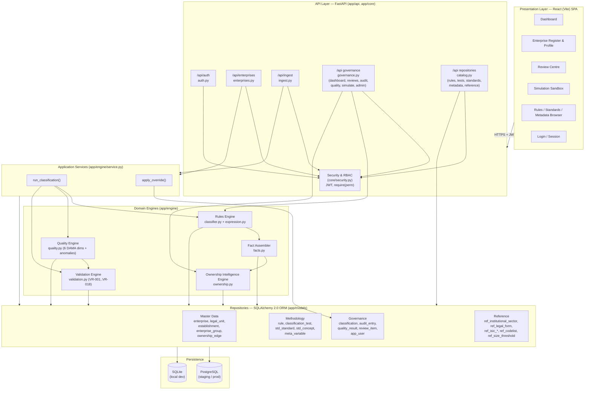
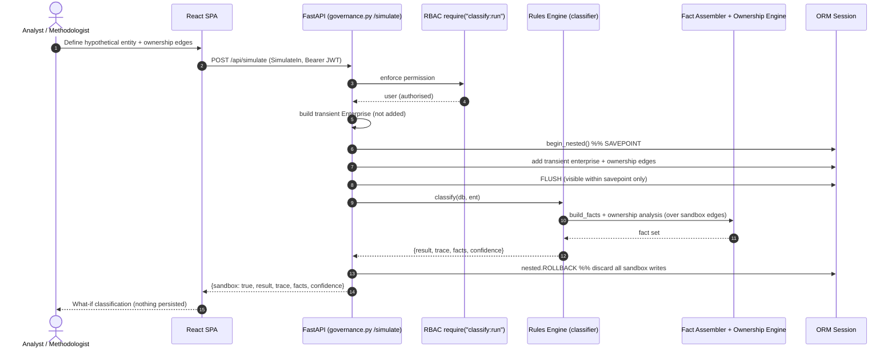

# 03 — Application Architecture

> **National Enterprise Intelligence and Classification System (NEICS)**
> National Statistics Office (NSO) — State of Qatar
> **Environment: STAGING / UAT.** Isolated from production and from live data providers.
> Document status: For review by senior statisticians, enterprise architects and data-governance specialists.

---

## 1. Purpose and Scope

This document describes the **application architecture** of NEICS: the logical components that
implement the national enterprise-classification capability, their responsibilities, the
contracts between them, and the principal runtime behaviours expressed as sequence diagrams.

NEICS implements the **18-test classification methodology** (T1–T18) against a single golden
enterprise register, using a **database-driven Rules Engine**, an **Ownership Intelligence
Engine**, a **Validation Engine** and a **Quality Engine**, with full explainability,
temporal versioning and complete auditability.

The application architecture deliberately separates four concerns:

1. **Presentation** — a React (Vite) single-page application for stewards, classifiers,
   reviewers, methodologists, auditors and analysts.
2. **API / orchestration** — a FastAPI application exposing a versioned REST surface,
   enforcing authentication and RBAC, and orchestrating the engines.
3. **Domain engines** — pure, side-effect-light computation: rules evaluation, ownership
   graph analysis, validation and quality scoring.
4. **Persistence** — SQLAlchemy 2.0 ORM models over a relational store (PostgreSQL in
   staging/production; SQLite for zero-infra local development).

Related documents:

- [`./05_enterprise_data_model.md`](./05_enterprise_data_model.md) — the master-data and
  classification data model (tables, keys, relationships).
- [`./10_rules_repository_design.md`](./10_rules_repository_design.md) — the rule schema,
  the JSON condition DSL, seeding and governance of rules.
- [`./04_technical_architecture.md`](./04_technical_architecture.md) — runtime stack,
  deployment topology and operational concerns.
- [`./12_security_architecture.md`](./12_security_architecture.md) — RBAC, authentication,
  confidentiality and audit.
- [`./INDEX.md`](./INDEX.md) — documentation index.

---

## 2. Architectural Principles

| # | Principle | Manifestation in NEICS |
|---|-----------|------------------------|
| P1 | **Rules are data, never code.** | Every classification rule is a row in the `rule` table with a JSON `logic` condition tree and a JSON `output`. There are no hard-coded classification rules in the engine. |
| P2 | **Methodology is explicit and sequenced.** | The 18 tests are rows in `classification_test`, ordered by a `seq` field; the orchestrator runs them strictly in sequence. |
| P3 | **Every decision is explainable.** | Each classification stores an ordered `trace` and the full `facts` set used. The `/explain` endpoint reconstructs applied rules, fields used, sources, confidence and reviewer/override information. |
| P4 | **History is immutable.** | Classifications are temporally versioned; a new row is written on every (re)classification and the prior `is_current` row is closed, never overwritten. |
| P5 | **Substance over form.** | The Ownership Intelligence Engine derives *effective* control (e.g. minority equity + golden share ⇒ public corporation) rather than relying on nominal equity alone. |
| P6 | **Same model, two stores.** | Identical ORM models run on SQLite (dev) and PostgreSQL (staging/prod); only the DSN changes. |
| P7 | **Least privilege.** | A permission-verb RBAC model gates every write and most reads; staging is isolated from production data. |

---

## 3. Component Overview

The system decomposes into the layers and components shown below. Solid arrows denote
synchronous calls; the engines depend on the repositories (ORM) but not on the API layer.



---

## 4. Module Responsibilities

### 4.1 Presentation Layer — React (Vite) SPA

- Stack: React 18 + React Router 6, built and served by Vite. In development the Vite dev
  server proxies `/api` and `/health` to the backend (`VITE_API_BASE`, default
  `http://localhost:8000`).
- Authenticates against `POST /api/auth/login`, stores the JWT, and attaches it as a
  `Bearer` token on subsequent calls. The UI adapts visible actions to the role returned by
  `/api/auth/me`, but **authorisation is always enforced server-side** (the SPA is untrusted).
- Principal screens: Dashboard (aggregate counts and quality), Enterprise Register and
  Profile (master data, ownership chain, classification, explainability, audit), Review
  Centre, Simulation Sandbox, and the Rules / Standards / Metadata browsers.

### 4.2 API Layer — FastAPI

The API layer is a thin orchestration boundary. It owns request validation (Pydantic v2),
authentication, RBAC enforcement, and the wiring of services and engines to the ORM session.
OpenAPI documentation is auto-generated at `/docs`.

| Router (module) | Prefix | Selected endpoints | Permission(s) enforced |
|-----------------|--------|--------------------|------------------------|
| `auth.py` | `/api/auth` | `POST /login`, `GET /me` | public / authenticated |
| `enterprises.py` | `/api/enterprises` | `GET`/`POST`/`PUT`, `GET /{id}/profile`, `POST /{id}/ownership`, `POST /{id}/classify`, `GET /{id}/classification`, `GET /{id}/history`, `GET /{id}/explain`, `POST /{id}/override` | `enterprise:read/write`, `ownership:write`, `classify:run/read`, `override:write` |
| `ingest.py` | `/api/ingest` | `POST /enterprises` (JSON array), `POST /upload` (JSON/CSV file) | `enterprise:write` |
| `governance.py` | `/api` | `GET /dashboard`, `GET /reviews`, `POST /reviews/{id}/resolve`, `GET /audit`, `GET /quality`, `POST /simulate`, `GET /admin/users`, `GET /admin/roles` | `enterprise:read`, `review:read/write`, `audit:read`, `quality:read`, `classify:run`, `*` |
| `catalog.py` | `/api` | `GET /rules`, `GET /rules/{id}`, `POST /rules/{id}/test`, `GET /tests`, `GET /standards`, `GET /metadata`, `GET /reference/*` | `rule:read`, `metadata:read` |

The `core/security.py` module supplies the `require(perm)` dependency factory used as a
FastAPI dependency on every protected route, plus JWT issuance/validation and the role →
permission matrix. See [`./12_security_architecture.md`](./12_security_architecture.md).

### 4.3 Application Services — `app/engine/service.py`

Services tie the stateless engines to persistence and own the **transactional** writes that
the engines themselves avoid:

- **`run_classification(db, ent, user)`** — executes the 18-test pipeline, computes the next
  version, closes the prior `is_current` classification (temporal versioning), writes the new
  `classification` row (with `trace` and `facts`), updates the enterprise golden record,
  emits an `audit_entry` (`action=CLASSIFY`), scores quality into `quality_result`, and pushes
  detected anomalies into the `review_item` queue.
- **`apply_override(db, ent, field, value, reason, reviewer)`** — records a Technical
  Classification Committee / reviewer decision as a **new classification version** with
  `is_override=True`, an `OVERRIDE` trace entry, `quality_flag=COMMITTEE-RULED`, and an
  `audit_entry` (`action=OVERRIDE`). Confidence and facts are carried from the prior record.

### 4.4 Domain Engines — `app/engine/`

#### Fact Assembler (`facts.py`)
Produces the single **flat fact dictionary** that is the input contract for the Rules Engine.
It folds enterprise master-data fields together with derived metrics (e.g.
`sales_to_cost_ratio`, `sales_cover_pct`, `has_substance`) and the entire ownership-derived
fact set from the Ownership Intelligence Engine. The assembled facts are recorded verbatim on
every classification for provenance.

#### Rules Engine (`classifier.py` + `expression.py`) — DATABASE-DRIVEN
- Loads the 18 `classification_test` rows ordered by `seq`.
- For each test, loads the active, **approved**, in-effect (`effective_date`/`expiry_date`)
  rules for that `test_code`, ordered by `priority` (lower first).
- Evaluates each rule's JSON `logic` against the fact set using the **safe interpreter** in
  `expression.py`. The DSL supports the logical operators `all` / `any` / `not` and the leaf
  operators `eq`, `ne`, `gt`, `gte`, `lt`, `lte`, `in`, `between`, `exists`, `truthy`. No
  `eval` is used — the interpreter walks the condition tree explicitly.
- **Conflict resolution (framework Test 15)** is implemented as *first-match-by-priority
  within each test*: the first rule whose logic is satisfied fires and the loop breaks.
- Rule outputs are folded back into the fact set so later tests can chain on earlier results.
  Result fields are projected into the classification key.
- Approximately **40 rules are seeded**; the engine never embeds rule logic itself.

> Detailed rule schema, the DSL grammar and seeding are documented in
> [`./10_rules_repository_design.md`](./10_rules_repository_design.md).

#### Ownership Intelligence Engine (`ownership.py`)
Walks the directed ownership graph (`ownership_edge`) with cycle guards to compute:
- **Effective government ownership / voting %** and **effective foreign ownership %** (direct
  plus indirect, recursively aggregated across intermediate vehicles).
- **Present control indicators** and a **representative control flag** by strength priority
  (`MAJ-VOTE > GOLDEN > BOARD > KEY-PERS > CONTRACT > REGULATORY > FINANCING > DOMINANT >
  BO-CHAIN`).
- The **Ultimate Controlling Institutional Unit (UCI)** — the top-of-chain controller.
- The full **ownership chain** for explainability and visualisation.

It encodes the *substance-over-form* logic of Test 8: aggregation of state holdings across
multiple sovereign vehicles, and the multi-level Sovereign Wealth Fund cascade through a
non-resident vehicle that nonetheless yields a **resident public corporation** flagged
**ROUND-TRIP**.

#### Validation Engine (`validation.py`)
Implements the workbook business-rule library **VR-001 … VR-018**: codelist membership
(sector/ISIC/legal form), LEI format, ownership-sum ≤ 100%, public-sector control-flag
presence, financial-sector ISIC section-K alignment, residence enumeration, demographic-date
ordering, group reference integrity, dormant/empty-shell detection, size-consistency and
duplicate detection. Each finding carries `rule_id`, `severity` (`ERROR`/`WARN`/`INFO`),
`message` and `action`.

#### Quality Engine (`quality.py`)
Scores each enterprise across the **six DAMA DMBOK dimensions** — completeness, validity,
consistency, uniqueness, accuracy, timeliness — and reduces them to an `overall_score`, with
the validation findings surfaced as `exceptions`. It also performs **rule-based anomaly
detection** (e.g. hidden government ownership, empty-shell producers, ISIC/sector mismatch,
missing FDI flag) which feeds the **review queue**. Anomaly detection is advisory and never
overrides official classification rules.

#### Explainability
Every classification persists an ordered `trace` (one entry per test: matched/not, rule id,
output, confidence, standard reference, rationale) plus the full `facts` set. The
`GET /api/enterprises/{id}/explain` endpoint returns applied rules, data fields used, data
sources, confidence, reviewer/override information and the methodology version.

### 4.5 Repositories — SQLAlchemy 2.0 ORM (`app/models/`)

The ORM is grouped into four model modules mapping to the tables below. See
[`./05_enterprise_data_model.md`](./05_enterprise_data_model.md) for full column detail.

| Group | Tables |
|-------|--------|
| Reference (`reference.py`) | `ref_institutional_sector`, `ref_legal_form`, `ref_isic_section`, `ref_isic_division`, `ref_isic_class`, `ref_codelist`, `ref_size_threshold` |
| Master data (`enterprise.py`) | `enterprise_group`, `enterprise`, `legal_unit`, `establishment`, `ownership_edge` |
| Methodology (`rules.py`) | `std_standard`, `std_concept`, `meta_variable`, `rule`, `classification_test` |
| Governance (`governance.py`) | `classification`, `audit_entry`, `quality_result`, `review_item`, `app_user` |

Identifiers follow the national convention `QA-ENT-YYYYNNNNNNN` (enterprises),
`QA-GRP-YYYYNNNNNNN` (groups), `QA-LU-YYYYNNNNNNN` (legal units),
`QA-EST-YYYYNNNNNNN` (establishments).

---

## 5. Key Sequence Diagrams

### 5.1 Classify an Enterprise

The classification flow is the central use case. It assembles facts (including the full
ownership analysis), runs the 18 sequenced tests against database-driven rules, persists a new
versioned classification with trace and facts, updates the golden record, scores quality and
queues any anomalies.

```mermaid
sequenceDiagram
    autonumber
    actor U as Classifier / Data Steward
    participant SPA as React SPA
    participant API as FastAPI (enterprises.py)
    participant SEC as RBAC require("classify:run")
    participant SVC as run_classification()
    participant CLS as Rules Engine (classifier)
    participant FX as Fact Assembler (facts)
    participant OWN as Ownership Engine
    participant EXP as Safe Interpreter (expression)
    participant Q as Quality Engine
    participant DB as Repositories (ORM)

    U->>SPA: Trigger "Classify"
    SPA->>API: POST /api/enterprises/{id}/classify (Bearer JWT)
    API->>SEC: enforce permission
    SEC-->>API: user (authorised)
    API->>SVC: run_classification(db, ent, user)

    SVC->>CLS: classify(db, ent)
    CLS->>FX: build_facts(db, ent)
    FX->>OWN: facts(enterprise_id)
    OWN->>DB: load ownership_edge graph
    OWN-->>FX: gov/foreign %, control flags, UCI, chain
    FX-->>CLS: flat fact set

    CLS->>DB: load classification_test ordered by seq
    loop For each test T1..T18 (in sequence)
        CLS->>DB: load active+approved+in-effect rules (order by priority)
        loop Rules by ascending priority
            CLS->>EXP: evaluate(rule.logic, facts)
            EXP-->>CLS: match? (true/false)
            alt First match
                CLS->>CLS: apply output to facts + result; append trace; break
            end
        end
    end
    CLS-->>SVC: {result, trace, facts, confidence}

    SVC->>DB: SELECT max(version) for enterprise
    SVC->>DB: UPDATE prior is_current -> false, set valid_to
    SVC->>DB: INSERT classification (version+1, trace, facts, confidence)
    SVC->>DB: UPDATE enterprise golden record (result fields)
    SVC->>DB: INSERT audit_entry (action=CLASSIFY)
    SVC->>Q: score_enterprise(db, ent)
    Q-->>SVC: 6 DAMA dimensions + overall_score + exceptions
    SVC->>DB: INSERT quality_result
    SVC->>Q: detect_anomalies(db, ent, facts)
    Q-->>SVC: anomalies
    SVC->>DB: INSERT review_item (dedup on open title)
    SVC->>DB: COMMIT
    SVC-->>API: Classification (current version)
    API-->>SPA: 200 ClassificationOut
    SPA-->>U: Result + confidence; link to /explain
```

#### Test sequence note

The 18 tests run in the order defined by the `seq` column. Critically, **T7
(Market vs Non-Market, 50% rule) and T8 (Ownership & Effective Control) run before T5
(Institutional Sector) and T6 (Public Sector Boundary)** — sector and public/private
boundary determinations depend on prior market and control determinations. Output fields from
earlier tests are folded back into the fact set, so a later test (e.g. T5) can reference the
result of T7/T8.

| Test | Name | Output dimension (illustrative) |
|------|------|--------------------------------|
| T1 | Statistical Unit | unit delineation |
| T2 | Institutional Unit | institutional-unit status |
| T3 | Residence | `residence` |
| T4 | Economic Activity (ISIC) | `isic_class` |
| T7 | Market vs Non-Market (50% rule) | `market_status` |
| T8 | Ownership & Effective Control | `control_flag` |
| T5 | Institutional Sector | `sector_code` |
| T6 | Public Sector Boundary | `public_private` |
| T9 | Listed Company | listing flag |
| T10 | Enterprise Size | `size_class` |
| T11 | Enterprise Group & Consolidation | `group_id` |
| T12 | Foreign Ownership & FDI (10% threshold) | `fdi_flag` |
| T13 | Special Entity | `special_entity_flag` |
| T14 | Data Source Hierarchy | provenance resolution |
| T15 | Conflict Resolution | first-match-by-priority |
| T16 | Governance | governance checks |
| T17 | Quality Assurance | quality gating |
| T18 | Final Classification Record | committed key |

### 5.2 Ingest a File

Bulk ingestion validates each record, rejects records missing required fields, creates DRAFT
enterprises, runs validation, and optionally classifies immediately within the same
transaction. CSV and JSON are both accepted; CSV is coerced to typed fields before mapping to
the Pydantic `EnterpriseIn` model.

```mermaid
sequenceDiagram
    autonumber
    actor U as Data Steward
    participant SPA as React SPA
    participant API as FastAPI (ingest.py)
    participant SEC as RBAC require("enterprise:write")
    participant ING as _ingest_records()
    participant VAL as Validation Engine
    participant SVC as run_classification()
    participant DB as Repositories (ORM)

    U->>SPA: Upload JSON/CSV file
    SPA->>API: POST /api/ingest/upload (multipart, Bearer JWT)
    API->>SEC: enforce permission
    SEC-->>API: user (authorised)
    API->>API: decode utf-8-sig; detect JSON vs CSV; coerce types
    API->>ING: records[], classify_now

    loop For each record
        ING->>ING: check REQUIRED (legal_name_en) + RECOMMENDED
        alt Missing required field
            ING->>ING: mark REJECTED; continue
        else Valid shape
            ING->>API: EnterpriseIn(**fields)  %% Pydantic v2 validation
            alt Pydantic error
                ING->>ING: mark REJECTED with error
            else OK
                ING->>DB: INSERT enterprise (quality_flag=DRAFT, event=BIRTH)
                ING->>DB: INSERT audit_entry (CREATE, evidence=bulk-ingest)
                ING->>DB: FLUSH (assign id)
                ING->>VAL: validate_enterprise(db, ent)
                VAL-->>ING: findings[]
                opt classify_now == true
                    ING->>SVC: run_classification(db, ent, commit=false)
                    SVC-->>ING: classification (dimensions + confidence)
                end
                ING->>ING: mark CREATED
            end
        end
    end
    ING->>DB: COMMIT
    ING-->>API: report {received, created, rejected, results[]}
    API-->>SPA: 200 ingestion report
    SPA-->>U: Per-record status, missing fields, validation, draft classification
```

### 5.3 Run a Simulation (What-If)

The Simulation Sandbox classifies a hypothetical enterprise and ownership structure
**in-memory only**. Edges are inserted in a nested transaction, the pipeline runs, and the
nested transaction is **rolled back** so the register is never mutated. This supports
restructuring, ownership-change and legal-status what-if analysis.



### 5.4 Apply an Override

A reviewer or the Technical Classification Committee can override a single classification
dimension. The override is recorded as a **new classification version** carrying the prior
key, with the overridden field replaced, `is_override=True`, an `OVERRIDE` trace entry, and a
full audit record. The golden record and `quality_flag` are updated to `COMMITTEE-RULED`.

```mermaid
sequenceDiagram
    autonumber
    actor R as Reviewer / Committee
    participant SPA as React SPA
    participant API as FastAPI (enterprises.py /override)
    participant SEC as RBAC require("override:write")
    participant OVR as apply_override()
    participant DB as Repositories (ORM)

    R->>SPA: Select field, new value, justification
    SPA->>API: POST /api/enterprises/{id}/override (OverrideIn, Bearer JWT)
    API->>SEC: enforce permission
    SEC-->>API: user (authorised)
    API->>OVR: apply_override(db, ent, field, value, reason, reviewer)

    OVR->>DB: SELECT current classification (is_current)
    OVR->>OVR: capture old_value (provenance)
    OVR->>DB: UPDATE current -> is_current=false, set valid_to
    OVR->>OVR: copy prior key fields; set field=value
    OVR->>DB: INSERT classification (version+1, is_override=true,\noverride_reason, reviewer, quality_flag=COMMITTEE-RULED,\nappended OVERRIDE trace)
    OVR->>DB: UPDATE enterprise golden record (field, quality_flag)
    OVR->>DB: INSERT audit_entry (action=OVERRIDE, old, new, reason)
    OVR->>DB: COMMIT
    OVR-->>API: Classification (override version)
    API-->>SPA: 200 ClassificationOut
    SPA-->>R: Override recorded; history shows committee decision
```

---

## 6. Cross-Cutting Concerns

### 6.1 Explainability and Provenance
Every committed classification is self-describing: it stores the ordered decision `trace`,
the full `facts` set, confidence (mean of fired-rule confidences), methodology version, and —
where applicable — reviewer and override metadata. The `/explain` endpoint composes these
into a reviewer-facing payload that names applied rules, the data fields used, and the data
sources consulted.

### 6.2 Temporal Versioning
Classifications are append-only. `run_classification` and `apply_override` both close the
prior `is_current` row (setting `valid_to`) and insert a new versioned row. History is
retrievable via `GET /api/enterprises/{id}/history`.

### 6.3 Data Source Hierarchy (Test 14)
When inputs conflict, the methodology resolves provenance by tier:
**Tier 1** primary registries (MoCI / QFC / QFZA / QSE) →
**Tier 2** tax & financial (GTA / QCB) →
**Tier 3** direct statistical (surveys / profiling / beneficial-ownership) →
**Tier 4** public information. This precedence is expressed through T14 rules in the Rules
Repository rather than hard-coded in the engine.

### 6.4 Stateless Engines, Transactional Services
The engines (`classifier`, `ownership`, `validation`, `quality`, `expression`, `facts`) are
read-mostly and free of commit logic; all transactional writes are concentrated in
`service.py` and the routers. This keeps the engines unit-testable and reusable by both the
live classification path and the in-memory simulation path.

---

## 7. Component-to-Source Map

| Logical component | Source module(s) |
|-------------------|------------------|
| API entrypoint & CORS | `app/main.py` |
| Configuration | `app/config.py` |
| Auth, JWT, RBAC | `app/core/security.py` |
| Database engine/session | `app/database.py` |
| Auth router | `app/api/auth.py` |
| Enterprise / classification router | `app/api/enterprises.py` |
| Ingestion router | `app/api/ingest.py` |
| Governance router (dashboard/reviews/audit/quality/simulate/admin) | `app/api/governance.py` |
| Repositories router (rules/tests/standards/metadata/reference) | `app/api/catalog.py` |
| Classification orchestrator | `app/engine/classifier.py` |
| Safe condition interpreter | `app/engine/expression.py` |
| Fact assembler | `app/engine/facts.py` |
| Ownership Intelligence Engine | `app/engine/ownership.py` |
| Validation Engine | `app/engine/validation.py` |
| Quality Engine | `app/engine/quality.py` |
| Application services | `app/engine/service.py` |
| ORM models | `app/models/{reference,enterprise,rules,governance}.py` |
| Pydantic schemas | `app/schemas.py` |
| Seed loader | `app/seed/loader.py`, `app/seed/definitions.py` |

---

*End of document — `03_application_architecture.md`. See also
[`04_technical_architecture.md`](./04_technical_architecture.md) and
[`12_security_architecture.md`](./12_security_architecture.md).*
