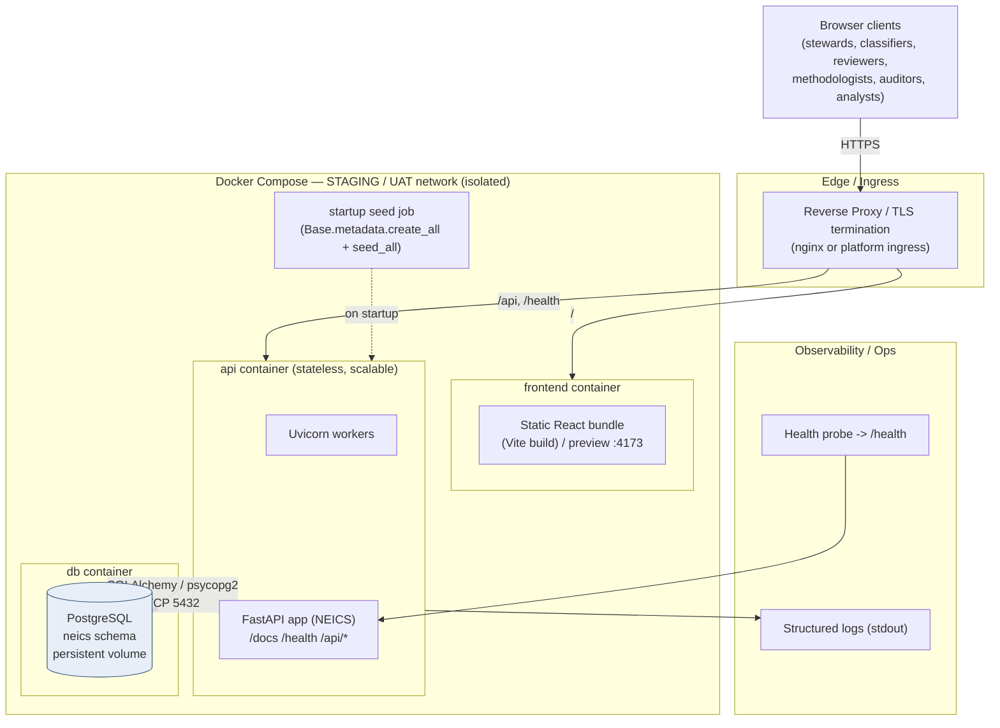
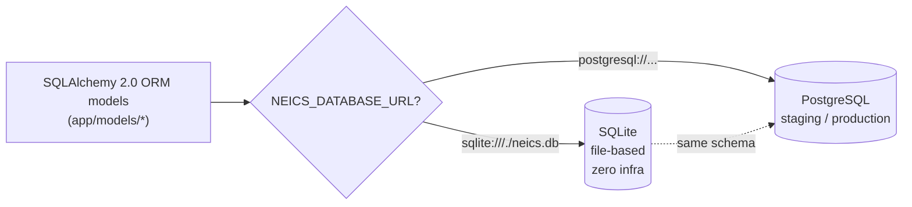
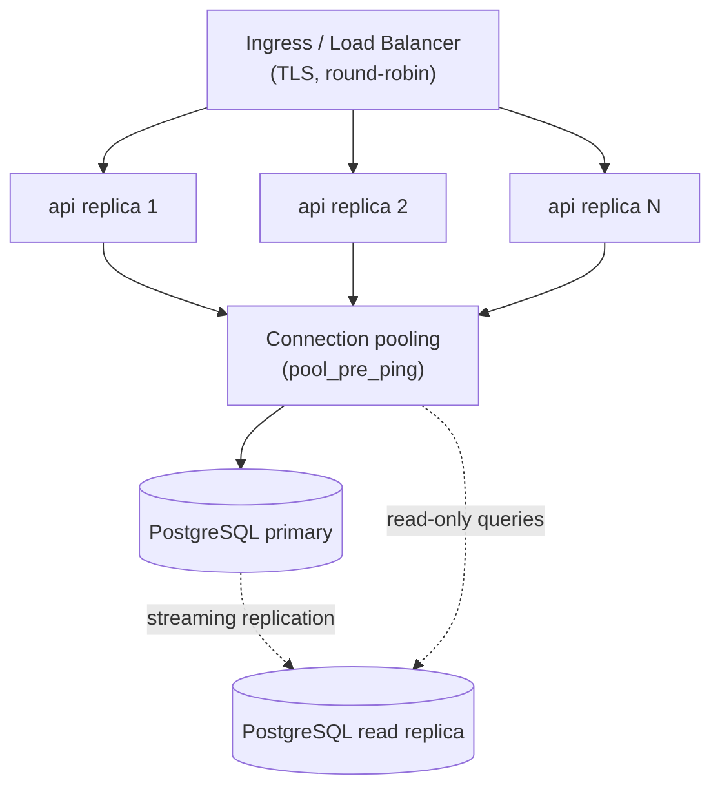

# 04 — Technical Architecture

> **National Enterprise Intelligence and Classification System (NEICS)**
> National Statistics Office (NSO) — State of Qatar
> **Environment: STAGING / UAT.** Isolated from production and from live data providers.
> Document status: For review by enterprise architects, platform engineers and data-governance specialists.

---

## 1. Purpose and Scope

This document describes the **technical architecture** of NEICS: the technology stack, the
deployment topology of the STAGING/UAT build, configuration and environment management,
scalability and high-availability considerations, the persistence strategy (PostgreSQL vs
SQLite), the security stack and the observability approach.

It complements:

- [`./03_application_architecture.md`](./03_application_architecture.md) — components, module
  responsibilities and runtime sequences.
- [`./05_enterprise_data_model.md`](./05_enterprise_data_model.md) — the relational data model.
- [`./10_rules_repository_design.md`](./10_rules_repository_design.md) — the rule schema and DSL.
- [`./12_security_architecture.md`](./12_security_architecture.md) — RBAC, authentication,
  confidentiality and audit.
- [`./INDEX.md`](./INDEX.md) — documentation index.

---

## 2. Technology Stack

### 2.1 Backend

| Concern | Technology | Version (pinned) | Notes |
|---------|------------|------------------|-------|
| Language / runtime | Python | 3.11 | Modern typing (`X | None`, `Mapped[...]`). |
| Web framework | FastAPI | 0.111.0 | ASGI, dependency injection, auto OpenAPI. |
| ASGI server | Uvicorn (`[standard]`) | 0.30.1 | `uvloop` + `httptools` in production profile. |
| ORM | SQLAlchemy | 2.0.30 | 2.0 declarative `Mapped[...]` models. |
| Validation / settings | Pydantic v2 + pydantic-settings | 2.7.1 / 2.3.0 | Request schemas and env-driven config. |
| PostgreSQL driver | psycopg2-binary | 2.9.9 | Used when DSN is `postgresql://`. |
| Auth — JWT | python-jose `[cryptography]` | 3.3.0 | HS256 signing/verification. |
| Auth — password hashing | passlib + bcrypt | 1.7.4 / 4.0.1 | `bcrypt` scheme via `CryptContext`. |
| File handling | python-multipart, openpyxl | 0.0.9 / 3.1.5 | Multipart upload; spreadsheet support. |
| Config / data | PyYAML | 6.0.1 | Seed and configuration assets. |
| API documentation | OpenAPI (FastAPI built-in) | — | Interactive docs at `/docs`; schema at `/openapi.json`. |

### 2.2 Frontend

| Concern | Technology | Version | Notes |
|---------|------------|---------|-------|
| UI library | React | 18.3.1 | SPA. |
| Routing | react-router-dom | 6.26.2 | Client-side routing. |
| Build tool / dev server | Vite | 5.4.8 | `dev`, `build`, `preview` scripts. |
| React plugin | @vitejs/plugin-react | 4.3.1 | JSX/Fast Refresh. |

The Vite dev server (`port 5173`) proxies `/api` and `/health` to the backend, with the
target taken from `VITE_API_BASE` (default `http://localhost:8000`). The production build is
a static bundle served by a reverse proxy or static host.

### 2.3 Standards alignment

NEICS is anchored in **SNA 2025, IMF GFS 2014, IMF BPM6, OECD BD4 and ISIC Rev.4**, plus the
modern statistical-standards stack (**LEI, SDMX, GSIM, GSBPM**). These are catalogued in the
Standards Repository (`std_standard`, `std_concept`) and referenced from rules via
`standard_ref`.

---

## 3. Deployment Topology (STAGING / UAT)

The staging build runs as a small set of containers orchestrated by **Docker Compose**. The
architecture is **Kubernetes-ready** (stateless API, externalised configuration, externalised
state), so the same images can be promoted to a managed cluster with no application changes.



### 3.1 Containers

| Service | Image basis | Responsibility | State |
|---------|-------------|----------------|-------|
| `api` | `python:3.11-slim` + `requirements.txt` | FastAPI/Uvicorn application; serves `/api/*`, `/health`, `/docs`. | Stateless |
| `db` | `postgres:16` | Primary relational store for staging. | Stateful (named volume) |
| `frontend` | `node:20` build → static host / `vite preview` | Serves the React bundle. | Stateless |
| (ingress) | `nginx` or platform ingress | TLS termination and path routing. | Stateless |

### 3.2 Startup behaviour

On application startup (`app/main.py`):

1. `Base.metadata.create_all(bind=engine)` ensures all ORM tables exist (idempotent).
2. If `NEICS_AUTO_SEED` is true (default), `seed_all(db)` loads reference codelists, the ~40
   classification rules, the 18 tests, standards/metadata, and sample/UAT enterprises when the
   store is empty.

> In a strict production posture, schema management would be migration-driven (e.g. Alembic)
> and auto-seed disabled. For the STAGING/UAT build, `create_all` + idempotent seed is
> intentional to make the environment reproducible and self-bootstrapping.

### 3.3 Kubernetes-ready notes

The application is designed so it can be lifted into Kubernetes without code change:

- **Stateless API** → `Deployment` with `replicas: N` behind a `Service` and `Ingress`.
- **Externalised configuration** → all settings are environment variables (`NEICS_` prefix),
  mappable to a `ConfigMap`; secrets (`NEICS_JWT_SECRET`, DB credentials) to a `Secret`.
- **Externalised state** → PostgreSQL runs as a managed service or `StatefulSet`; the API
  holds no local state.
- **Health probes** → `GET /health` serves as both `livenessProbe` and `readinessProbe`.
- **Horizontal scaling** → a `HorizontalPodAutoscaler` can scale the API on CPU/RPS because
  requests are independent and DB-backed.

---

## 4. Configuration and Environment

All configuration is environment-driven via `pydantic-settings` with the `NEICS_` prefix
(`app/config.py`). An optional `.env` file is read; unknown keys are ignored.

| Setting | Env var | Default | Purpose |
|---------|---------|---------|---------|
| `app_name` | `NEICS_APP_NAME` | "National Enterprise Intelligence and Classification System (NEICS)" | Display name / OpenAPI title. |
| `app_version` | `NEICS_APP_VERSION` | `1.0.0` | Application version. |
| `methodology_version` | `NEICS_METHODOLOGY_VERSION` | `1.0.0` | Version of the 18-test framework in force; stamped on every classification. |
| `database_url` | `NEICS_DATABASE_URL` | `sqlite:///./neics.db` | SQLAlchemy DSN. **Compose overrides with a PostgreSQL DSN.** |
| `jwt_secret` | `NEICS_JWT_SECRET` | `change-me-in-production` | HMAC signing key. **Must be overridden in every non-local environment.** |
| `jwt_algorithm` | `NEICS_JWT_ALGORITHM` | `HS256` | JWT signing algorithm. |
| `jwt_expire_minutes` | `NEICS_JWT_EXPIRE_MINUTES` | `480` | Access-token lifetime (8 hours). |
| `auto_seed` | `NEICS_AUTO_SEED` | `true` | Seed reference data and samples on startup if empty. |
| `cors_origins` | `NEICS_CORS_ORIGINS` | `*` | Allowed CORS origin(s); set to the SPA origin in staging. |

### 4.1 Illustrative `docker-compose.yml` (staging)

```yaml
services:
  db:
    image: postgres:16
    environment:
      POSTGRES_DB: neics
      POSTGRES_USER: neics
      POSTGRES_PASSWORD: ${DB_PASSWORD}
    volumes:
      - neics-pgdata:/var/lib/postgresql/data
    healthcheck:
      test: ["CMD-SHELL", "pg_isready -U neics"]
      interval: 10s
      timeout: 5s
      retries: 5

  api:
    build: ./backend
    environment:
      NEICS_DATABASE_URL: postgresql://neics:${DB_PASSWORD}@db:5432/neics
      NEICS_JWT_SECRET: ${JWT_SECRET}        # never the default
      NEICS_CORS_ORIGINS: https://uat.neics.local
      NEICS_AUTO_SEED: "true"                # reproducible UAT data
    depends_on:
      db:
        condition: service_healthy
    command: uvicorn app.main:app --host 0.0.0.0 --port 8000

  frontend:
    build: ./frontend
    environment:
      VITE_API_BASE: https://uat.neics.local

volumes:
  neics-pgdata:
```

> Secrets (`DB_PASSWORD`, `JWT_SECRET`) are supplied from the deployment platform's secret
> store, not committed. In Kubernetes they become a `Secret`; the non-secret values become a
> `ConfigMap`.

---

## 5. Persistence Strategy — PostgreSQL vs SQLite

NEICS runs the **same SQLAlchemy 2.0 ORM models** against two engines, selected purely by the
`NEICS_DATABASE_URL` DSN (`app/database.py`). SQLite-specific connection arguments
(`check_same_thread=False`) are applied automatically only when the DSN begins with `sqlite`;
`pool_pre_ping=True` is always set.



| Aspect | SQLite (local dev) | PostgreSQL (staging / production) |
|--------|--------------------|-----------------------------------|
| Intended use | Zero-infra local development, unit tests, demos | UAT, integration, production |
| Setup | None — single file (`neics.db` / `neics_api.db`) | Managed instance or container with persistent volume |
| Concurrency | Single-writer; adequate for one developer | MVCC; many concurrent readers/writers |
| Types | JSON stored as text; loose typing | Native `JSONB`, strict types, constraints |
| Integrity | Foreign keys (where enabled) | Full FK/unique/check constraint enforcement |
| Scaling / HA | Not applicable | Read replicas, connection pooling, failover |
| Backups | File copy | PITR / WAL archiving / managed snapshots |
| ORM code | **Identical** | **Identical** |

**Design intent.** The JSON columns used for `rule.logic`, `rule.output`,
`classification.trace`, `classification.facts` and `quality_result.exceptions` map to
PostgreSQL `JSONB` (indexable, queryable) and degrade gracefully to text-encoded JSON under
SQLite. This is what lets the rules engine remain fully data-driven across both engines
without a schema fork.

---

## 6. Scalability and High Availability



### 6.1 Statelessness and horizontal scale
The API holds no session state — authentication is a stateless JWT verified on each request —
so the `api` service scales horizontally simply by adding replicas behind the load balancer.
Classification, ingestion and simulation are all request-scoped and operate within a single
DB transaction.

### 6.2 Workload characteristics
- **Read-heavy** browsing of the register, dashboards, profiles and explainability.
- **Bursty writes** during bulk ingestion and batch (re)classification.
- The Ownership Intelligence Engine loads the relevant ownership-edge graph per request and
  walks it in-process with cycle guards; for very large groups this is the principal CPU cost
  and the natural target for caching/materialisation in future iterations.

### 6.3 High availability (production posture)
- **Database**: managed PostgreSQL with synchronous/asynchronous replicas, automated failover
  and point-in-time recovery; read replicas can absorb analytics/dashboard reads.
- **API**: ≥ 2 replicas across availability zones; rolling deployments; `/health` gating
  readiness.
- **Frontend**: static assets behind a CDN/edge cache.

### 6.4 Concurrency and consistency
Temporal versioning of classifications (close-then-insert under one transaction) preserves a
single `is_current` record per enterprise. The simulation path uses a **nested transaction
(savepoint)** that is rolled back, guaranteeing the register is never mutated by what-if runs.

---

## 7. Security Stack (Technical Summary)

A full treatment is in [`./12_security_architecture.md`](./12_security_architecture.md). The
technical building blocks are:

| Layer | Mechanism | Implementation |
|-------|-----------|----------------|
| Transport | TLS termination at ingress | reverse proxy / platform ingress |
| Authentication | OAuth2 password flow → JWT (HS256) | `python-jose`; `POST /api/auth/login` issues a Bearer token (8 h). |
| Credential storage | bcrypt password hashing | `passlib` `CryptContext(schemes=["bcrypt"])`. |
| Authorization | Permission-verb RBAC | `require(perm)` dependency; role → permission matrix in `core/security.py`. |
| Input validation | Pydantic v2 schemas | `app/schemas.py`; ingestion coercion in `ingest.py`. |
| Safe rule evaluation | No `eval`; explicit tree interpreter | `app/engine/expression.py`. |
| CORS | Configurable allow-origins | `CORSMiddleware`; restrict in staging via `NEICS_CORS_ORIGINS`. |
| Auditability | Append-only change log | `audit_entry` table for CREATE/UPDATE/CLASSIFY/OVERRIDE. |
| Environment isolation | Separate staging network, DB and secrets | Compose-isolated network; distinct `JWT_SECRET` and DB. |

> **Hardening notes for promotion beyond UAT:** override `NEICS_JWT_SECRET` (never the
> shipped default), set `NEICS_CORS_ORIGINS` to the exact SPA origin, disable
> `NEICS_AUTO_SEED`, and front the API with the ingress' rate-limiting and WAF features.

---

## 8. Observability

| Capability | STAGING/UAT approach | Production extension |
|------------|----------------------|----------------------|
| Logging | Structured stdout via Python `logging` (`neics` logger, INFO) captured by the container runtime. | Ship to a central log store (e.g. ELK/Loki); correlation IDs per request. |
| Health | `GET /health` returns status, environment (`staging-uat`), `app_version` and `methodology_version`. | Wire to liveness/readiness probes and uptime monitoring. |
| API discoverability | OpenAPI at `/docs` and `/openapi.json`. | Same; optionally gated behind auth in production. |
| Audit trail | `audit_entry` queryable via `GET /api/audit` (permission `audit:read`). | Immutable export / SIEM integration. |
| Data quality telemetry | `quality_result` per enterprise; aggregate via `GET /api/quality`. | Trend dashboards; threshold alerting. |
| Application metrics | Derived counts via `GET /api/dashboard`. | Prometheus exporters; RED/USE dashboards. |

The `/health` response is intentionally explicit about the environment so that monitors and
operators can never mistake a staging instance for production:

```json
{ "status": "ok", "environment": "staging-uat", "version": "1.0.0", "methodology_version": "1.0.0" }
```

---

## 9. Request Lifecycle (End-to-End)

```mermaid
sequenceDiagram
    autonumber
    participant B as Browser (React SPA)
    participant I as Ingress / TLS
    participant U as Uvicorn / FastAPI
    participant M as CORS + Auth + RBAC
    participant H as Route handler / engines
    participant D as PostgreSQL (ORM session)

    B->>I: HTTPS request (Bearer JWT)
    I->>U: forward (TLS terminated)
    U->>M: CORS check; decode + verify JWT; load user; require(perm)
    alt Unauthenticated / unauthorized
        M-->>B: 401 / 403
    else Authorized
        M->>H: invoke handler
        H->>D: query / mutate within request transaction
        D-->>H: rows
        H-->>U: Pydantic-serialised response
        U-->>B: 200 / 201 JSON
    end
```

---

## 10. Environments Matrix

| Environment | Store | Seed | JWT secret | CORS | Purpose |
|-------------|-------|------|-----------|------|---------|
| Local dev | SQLite (`neics.db`) | On | Default (dev only) | `*` | Zero-infra development and tests. |
| **STAGING / UAT** | **PostgreSQL** | On (reproducible UAT data) | Environment-supplied | SPA origin | **This build** — acceptance testing, isolated from production and live providers. |
| Production (target) | Managed PostgreSQL (HA) | Off | Secret store | SPA origin | Operational classification on live data. |

---

## 11. Build and Run (Reference)

| Step | Backend | Frontend |
|------|---------|----------|
| Install | `pip install -r backend/requirements.txt` | `npm install` (in `frontend/`) |
| Run (dev) | `uvicorn app.main:app --reload` | `npm run dev` (Vite, port 5173) |
| Build | container image (`python:3.11-slim`) | `npm run build` (static bundle) |
| Serve (staging) | Uvicorn in `api` container | static host / `npm run preview` (port 4173) |
| Verify | `GET /health`, `GET /docs` | SPA login → dashboard |

---

*End of document — `04_technical_architecture.md`. See also
[`03_application_architecture.md`](./03_application_architecture.md) and
[`12_security_architecture.md`](./12_security_architecture.md).*
