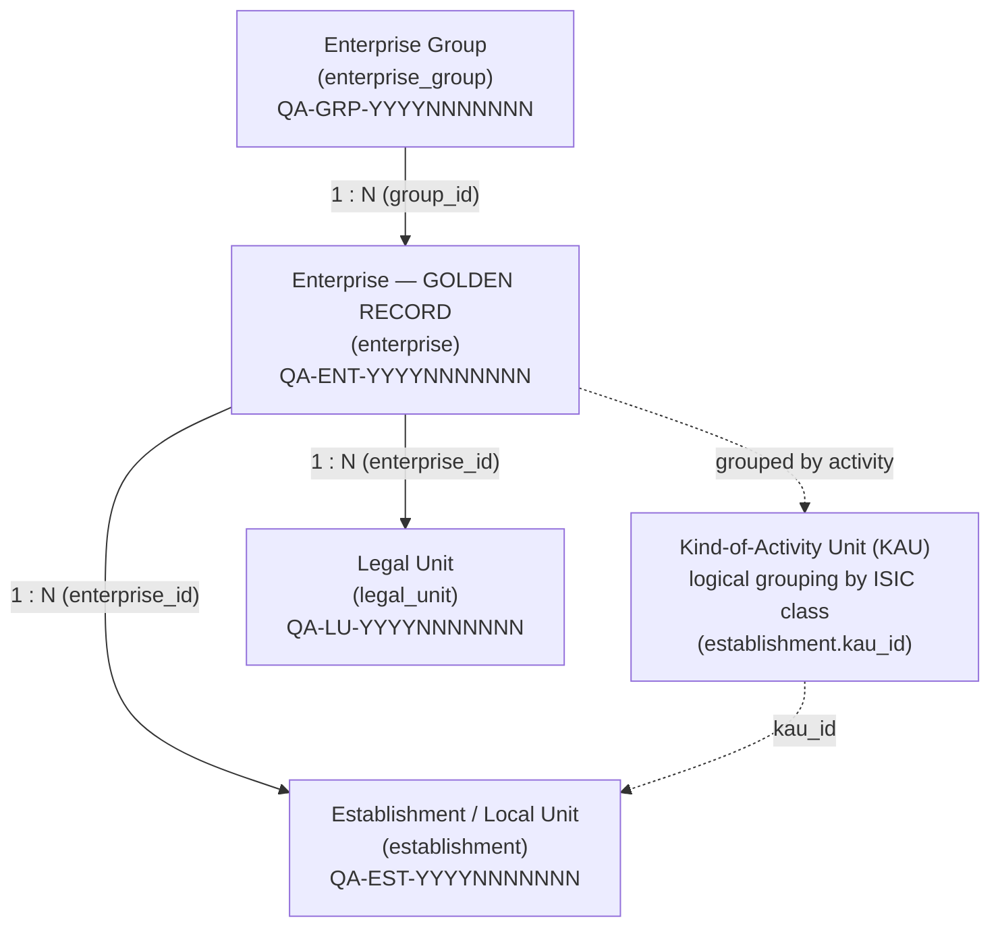
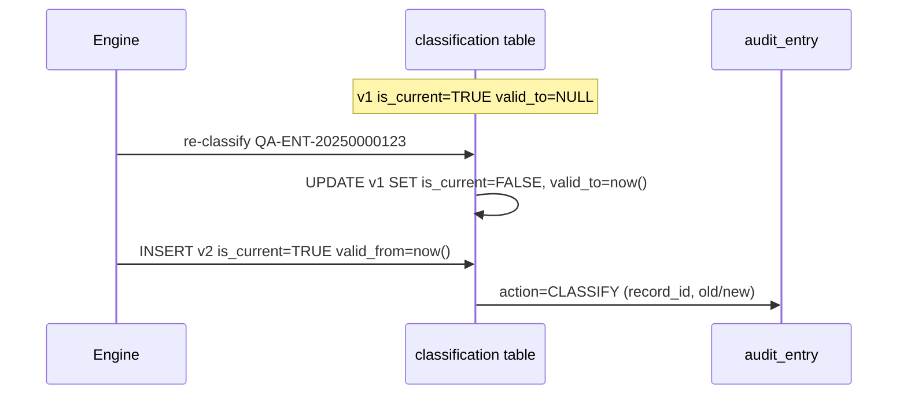

# NEICS — Enterprise Data Model

**National Enterprise Intelligence and Classification System**
State of Qatar · National Statistics Office (NSO)

| | |
|---|---|
| **Document** | 05 — Enterprise Data Model (Logical & Physical) |
| **Status** | STAGING / UAT — pre-pilot review draft |
| **Audience** | Senior statisticians, enterprise architects, data-governance specialists |
| **Classification** | Official — Internal (subject to Qatar Statistics Law) |
| **Owner** | National Statistics Office (NSO), Statistical Methodology & Business Register Programme |
| **Date** | 2026-06-18 |
| **Related** | [`./06_erd.md`](./06_erd.md) · [`./07_data_dictionary.md`](./07_data_dictionary.md) · [`./08_metadata_model.md`](./08_metadata_model.md) · [`./10_rules_repository_design.md`](./10_rules_repository_design.md) · [`./INDEX.md`](./INDEX.md) |

---

## 1. Purpose and scope

This document is the authoritative specification of the **NEICS persistence layer** — the
logical and physical data model that underpins the National Enterprise Intelligence and
Classification System. It describes, table by table and column by column, every persistent
structure in the STAGING / UAT build, together with the identifier schemes, the temporal
versioning strategy, the relationships between structures, and the international standards each
structure is anchored to.

The model is implemented in **SQLAlchemy 2.0** (declarative `Mapped[...]` typing) over
**PostgreSQL**. JSON-bearing columns are realised as PostgreSQL `JSONB`. The model is grouped
into five cohesive subject areas, each owned by a distinct module of the application layer:

| # | Subject area | Module | Tables |
|---|---|---|---|
| 1 | **Reference / codelists** | `app.models.reference` | `ref_institutional_sector`, `ref_legal_form`, `ref_isic_section`, `ref_isic_division`, `ref_isic_class`, `ref_codelist`, `ref_size_threshold` |
| 2 | **MDM core (golden record)** | `app.models.enterprise` | `enterprise_group`, `enterprise`, `legal_unit`, `establishment`, `ownership_edge` |
| 3 | **Standards & metadata repositories** | `app.models.rules` | `std_standard`, `std_concept`, `meta_variable` |
| 4 | **Rules repository** | `app.models.rules` | `rule`, `classification_test` |
| 5 | **Governance** | `app.models.governance` | `classification`, `audit_entry`, `quality_result`, `review_item`, `app_user` |

The companion entity-relationship diagrams are maintained in
[`./06_erd.md`](./06_erd.md); the field-level data dictionary with allowed values and standard
provenance is in [`./07_data_dictionary.md`](./07_data_dictionary.md).

---

## 2. Design principles

The data model expresses a small number of non-negotiable principles drawn from the National
Framework and from the UNSD / Eurostat Business Register recommendations:

1. **Separation of the statistical unit from the legal unit.** The register is built around
   *statistical* units (enterprise group, enterprise, KAU, establishment) that are derived from,
   but distinct from, the *legal* units recorded by administrative registers. Legal units are
   mapped onto enterprises rather than equated with them.

2. **The enterprise is the golden record.** The `enterprise` table is the single,
   reconciled, deduplicated master record for each statistical enterprise. All classification
   outputs are surfaced on it for query convenience, but their authoritative, fully-traced
   history lives in the temporal `classification` table.

3. **Rules are data, never code.** Every classification decision is taken by a rule stored in
   the `rule` table and sequenced by a test in `classification_test`. No classification logic is
   hard-coded. This is what allows the methodology to be versioned, audited, and re-run against
   historical fact sets.

4. **Everything is traceable to a standard.** Reference tables, metadata variables, rules and
   standard concepts all carry a `standard_ref`. The `std_standard` / `std_concept` repository
   is the controlled register of those standards (SNA 2025, GFS 2014, BPM6, OECD BD4, ISIC
   Rev.4, ISO 17442, SDMX, GSIM, etc.).

5. **Full temporal reproducibility.** Classification results are versioned and never
   overwritten. The fact set used for each decision is captured alongside the decision trace, so
   any historical classification can be reproduced exactly. Demographic events (births, deaths)
   are dated on the units themselves.

6. **Bilingual by construction.** Names and titles carry both English (`*_en`) and Arabic
   (`*_ar`) variants throughout, consistent with Qatar's bilingual official-statistics
   obligations.

---

## 3. The statistical unit hierarchy

NEICS implements the standard four-level statistical unit hierarchy, with legal units bound to
the enterprise level:

- An **enterprise group** is the widest delineation: the set of enterprises under common
  control. NEICS records the global ultimate parent (GUP), the domestic group head, and whether
  the group is *truncated* at the national border.
- An **enterprise** is the smallest combination of legal units that constitutes an organisational
  unit producing goods or services and benefitting from a degree of autonomy in decision-making.
  It is the golden record.
- A **KAU** (kind-of-activity unit) is an enterprise (or part of one) that engages in a single
  productive activity. In this build a KAU is represented logically via the `kau_id` attribute
  on `establishment`, not as a separate table.
- An **establishment / local unit** is an enterprise, or part of an enterprise, situated in a
  single geographical location and carrying out a single activity. It is geo-coded and
  activity-coded.
- A **legal unit** is the administrative / legal entity (a registered company, a sole
  proprietorship, a government body). Legal units are *mapped to* enterprises (N:1) but are not
  themselves statistical units.

Ownership relationships that cut across the hierarchy — for example, foreign or state ownership
of an enterprise — are captured separately in the directed `ownership_edge` graph (§7).

---

## 4. Identifier schemes

All four statistical-unit tables and the group table use **persistent, human-readable national
identifiers** as primary keys. The scheme is `QA-<UNIT>-YYYYNNNNNNN`:

| Unit | PK column | Prefix | Pattern | Physical type |
|---|---|---|---|---|
| Enterprise group | `group_id` | `QA-GRP-` | `QA-GRP-` + 4-digit cohort year + 7-digit serial | `VARCHAR(24)` |
| Enterprise (golden) | `enterprise_id` | `QA-ENT-` | `QA-ENT-` + year + 7-digit serial | `VARCHAR(24)` |
| Legal unit | `legal_unit_id` | `QA-LU-` | `QA-LU-` + year + 7-digit serial | `VARCHAR(24)` |
| Establishment | `establishment_id` | `QA-EST-` | `QA-EST-` + year + 7-digit serial | `VARCHAR(24)` |

Identifier properties:

- **Persistent.** An identifier is never re-used; once allocated it stays bound to that unit for
  the unit's lifetime, including after death.
- **Opaque to classification.** The identifier carries a cohort year and serial only; no
  classification meaning is encoded into it. Classification is held in dedicated columns.
- **National scope.** The `QA-` prefix scopes the identifier to the State of Qatar.

The **Legal Entity Identifier (LEI)**, where one exists, is recorded on `enterprise.lei` and
`legal_unit.lei` as a 20-character code conforming to **ISO 17442**. The LEI is a secondary,
internationally-interoperable identifier; it is nullable because not every Qatari unit holds one.

Ownership-edge endpoints (`ownership_edge.owner_id` / `owned_id`) use a wider `VARCHAR(40)`
domain because an endpoint may be a registered NEICS unit (`QA-ENT-...`) **or** an external
party that is not itself in the register — for example `STATE-QA` for the sovereign owner, or
`FOREIGN-PARENT-01` for an unregistered foreign parent.

---

## 5. Temporal versioning strategy

NEICS distinguishes three categories of time-handling, applied selectively:

### 5.1 Demographic dating (units)

The lifecycle of a statistical unit is recorded with explicit birth/death dates rather than
versioned rows:

- `enterprise.birth_date` / `enterprise.death_date` and `enterprise.last_demographic_event`.
- `legal_unit.registration_date` / `legal_unit.ceased_date` plus `legal_unit.is_active`.
- `establishment.is_active`.

**Integrity rule:** a death/cease date must be greater than or equal to the corresponding
birth/registration date (`death_date >= birth_date`; `ceased_date >= registration_date`). This
is enforced as a `CHECK`-style validation in the application layer and recommended as a database
`CHECK` constraint in the physical deployment.

### 5.2 Result versioning (classification)

Classification is **fully temporally versioned** using a current-flag + version-number + valid
period pattern on the `classification` table:

- Each (re)classification of an enterprise inserts a **new row**; existing rows are never
  overwritten.
- `version` is an integer that increments per enterprise (1, 2, 3, …).
- `is_current = TRUE` marks exactly one active row per enterprise; superseded rows are set
  `is_current = FALSE`.
- `valid_from` / `valid_to` bound the period during which a row was the current result;
  `valid_to` is set on the prior row when a new row supersedes it.
- The full decision `trace` and the input `facts` are stored on every row, so a superseded
  classification can be reproduced exactly — including against the methodology version
  (`methodology_version`) that produced it.

The latest committed values are *also* denormalised onto the `enterprise` golden record
(`sector_code`, `public_private`, `control_flag`, `market_status`, `size_class`, `fdi_flag`,
`special_entity_flag`, `classification_version`, `classification_date`) so that the most common
queries do not need to join the history table. The `classification` table remains the system of
record for the full multi-dimensional key and its lineage.

### 5.3 Methodology / vocabulary versioning (rules & reference)

- `rule` rows carry `version`, `effective_date`, `expiry_date`, `approval_status` and
  `is_active`, so the rule base is itself a versioned, dated artefact (see
  [`./10_rules_repository_design.md`](./10_rules_repository_design.md)).
- `meta_variable` rows carry `version` and `effective_date`.
- Reference codelists carry a `standard_ref` and are revised by controlled release rather than
  per-row versioning.

### 5.4 Audit

Every create/update/classify/override/delete on any record is written to `audit_entry`,
recording the record type, record id, field changed, old/new value, action, actor and evidence
reference. The audit trail is append-only and is the immutable backbone of reproducibility and
of compliance with Qatar Statistics Law.

---

## 6. Subject area 1 — Reference / codelists

These tables are the controlled vocabularies to which every classification, fact and metadata
variable is anchored. They are versionable and standard-referenced and are seeded from the
implementation workbook codelist sheets.

### 6.1 `ref_institutional_sector`

SNA 2008 / 2025 institutional sectors and sub-sectors. Self-referencing hierarchy via
`parent_code`.

| Column | Type | Null | Key | Description |
|---|---|---|---|---|
| `code` | `VARCHAR(10)` | no | **PK** | SNA sector code, e.g. `S.11`, `S.122`, `S.1311`. |
| `name_en` | `VARCHAR(200)` | no | | English sector name. |
| `name_ar` | `VARCHAR(200)` | yes | | Arabic sector name. |
| `parent_code` | `VARCHAR(10)` | yes | self-FK | Parent sector code (e.g. `S.12` for `S.122`); NULL for top-level. |
| `definition` | `TEXT` | yes | | SNA definition of the sector. |
| `standard_ref` | `VARCHAR(100)` | no | | Anchoring standard; default `SNA 2008/2025`. |

The seeded hierarchy covers `S.11` (non-financial corporations), `S.12` and sub-sectors
`S.121`–`S.129` (financial corporations), `S.13` and sub-sectors `S.1311`–`S.1314` (general
government), `S.14` (households), `S.15` (NPISH) and `S.2` (rest of the world). The
`sector_code` columns on `enterprise` and `classification` are logical foreign keys onto this
table.

### 6.2 `ref_legal_form`

Qatar legal forms.

| Column | Type | Null | Key | Description |
|---|---|---|---|---|
| `code` | `VARCHAR(10)` | no | **PK** | Legal-form code (e.g. `WLL`, `QPSC`, `SP`, `GOV`). |
| `name_en` | `VARCHAR(200)` | no | | English name of the legal form. |
| `name_ar` | `VARCHAR(200)` | yes | | Arabic name. |
| `notes` | `TEXT` | yes | | Usage notes / scope. |

`enterprise.legal_form_code` and `legal_unit.legal_form_code` are logical foreign keys onto this
table.

### 6.3 `ref_isic_section`

ISIC Rev.4 sections (A–U). Top of the activity-classification hierarchy.

| Column | Type | Null | Key | Description |
|---|---|---|---|---|
| `code` | `VARCHAR(1)` | no | **PK** | Section letter, `A`–`U`. |
| `title_en` | `VARCHAR(300)` | no | | English section title. |
| `title_ar` | `VARCHAR(300)` | yes | | Arabic section title. |

### 6.4 `ref_isic_division`

ISIC Rev.4 divisions (2-digit). Child of section.

| Column | Type | Null | Key | Description |
|---|---|---|---|---|
| `code` | `VARCHAR(2)` | no | **PK** | 2-digit division code, e.g. `64`. |
| `section_code` | `VARCHAR(1)` | no | **FK → `ref_isic_section.code`** | Parent section letter. |
| `title_en` | `VARCHAR(400)` | no | | English division title. |
| `title_ar` | `VARCHAR(400)` | yes | | Arabic division title. |

### 6.5 `ref_isic_class`

ISIC Rev.4 classes (4-digit), with cross-walks to NACE and GCC-SIC. This is the activity
classification used throughout NEICS.

| Column | Type | Null | Key | Description |
|---|---|---|---|---|
| `code` | `VARCHAR(4)` | no | **PK** | 4-digit ISIC Rev.4 class, e.g. `6419`. |
| `section_code` | `VARCHAR(1)` | no | | Owning section letter (denormalised for fast roll-up). |
| `activity_en` | `VARCHAR(400)` | no | | English activity description. |
| `activity_ar` | `VARCHAR(400)` | yes | | Arabic activity description. |
| `nace` | `VARCHAR(20)` | yes | | NACE cross-walk code. |
| `gcc_sic` | `VARCHAR(20)` | yes | | GCC Standard Industrial Classification cross-walk. |

`enterprise.isic_class`, `establishment.isic_class` and `classification.isic_class` are logical
foreign keys onto this table. The `section_code` is held both here and (transitively) via
`ref_isic_division` to allow roll-up either way.

### 6.6 `ref_codelist`

Generic auxiliary codelist table for the smaller controlled vocabularies that do not warrant a
dedicated table. Keyed by surrogate `id`; identified logically by `(domain, code)`.

| Column | Type | Null | Key | Description |
|---|---|---|---|---|
| `id` | `INTEGER` | no | **PK** (autoincrement) | Surrogate key. |
| `domain` | `VARCHAR(60)` | no | indexed | Codelist domain, e.g. `residence`, `public_private`, `control_indicator`, `demographic_event`, `fdi_flag`, `size_class`, `quality_flag`. |
| `code` | `VARCHAR(40)` | no | indexed | Code value within the domain. |
| `meaning` | `TEXT` | no | | Human-readable meaning. |
| `sort_order` | `INTEGER` | no | | Display ordering within domain; default 0. |

This table backs the dropdown vocabularies for residence, public/private status, control
indicator, demographic event, FDI flag, size class and quality flag.

### 6.7 `ref_size_threshold`

Enterprise size-class thresholds. Keyed by the size class itself.

| Column | Type | Null | Key | Description |
|---|---|---|---|---|
| `size_class` | `VARCHAR(20)` | no | **PK** | `MICRO` / `SMALL` / `MEDIUM` / `LARGE`. |
| `turnover_min` | `FLOAT` | yes | | Lower turnover bound (QAR). |
| `turnover_max` | `FLOAT` | yes | | Upper turnover bound (QAR); NULL = unbounded. |
| `fte_min` | `INTEGER` | yes | | Lower full-time-equivalent headcount bound. |
| `fte_max` | `INTEGER` | yes | | Upper FTE bound; NULL = unbounded. |

Seeded thresholds (the **higher criterion governs** — an entity meeting the headcount band for
one class but the turnover band for a larger class is assigned the larger class):

| Size class | FTE band | Turnover band (QAR) |
|---|---|---|
| `MICRO` | 1–9 | ≤ 3,000,000 |
| `SMALL` | 10–49 | 3,000,000 – 30,000,000 |
| `MEDIUM` | 50–249 | 30,000,000 – 200,000,000 |
| `LARGE` | 250+ | > 200,000,000 |

---

## 7. Subject area 2 — MDM core (golden record)

### 7.1 `enterprise_group`

The widest delineation of control. Records the global ultimate parent, the domestic head and
truncation status.

| Column | Type | Null | Key | Description |
|---|---|---|---|---|
| `group_id` | `VARCHAR(24)` | no | **PK** | `QA-GRP-YYYYNNNNNNN`. |
| `group_name` | `VARCHAR(300)` | no | | English group name. |
| `group_name_ar` | `VARCHAR(300)` | yes | | Arabic group name. |
| `global_ultimate_parent` | `VARCHAR(300)` | yes | | Name of the global ultimate parent (GUP). |
| `gup_country` | `VARCHAR(2)` | yes | | ISO 3166-1 alpha-2 country of the GUP. |
| `domestic_group_head` | `VARCHAR(24)` | yes | | Identifier of the domestic group head enterprise. |
| `truncated_group_flag` | `VARCHAR(1)` | no | | `Y`/`N` — whether the group is truncated at the national border; default `N`. |
| `member_count` | `INTEGER` | no | | Count of member enterprises; default 0. |
| `controlling_sector` | `VARCHAR(10)` | yes | | SNA sector of the controlling unit (logical FK → `ref_institutional_sector`). |
| `notes` | `TEXT` | yes | | Free-text notes. |
| `created_at` | `TIMESTAMP` | no | | Row creation timestamp (server default). |

**Relationships:** one group has many enterprises (`enterprise.group_id` → `enterprise_group.group_id`).

### 7.2 `enterprise` — the golden record

The reconciled master record for a statistical enterprise. Holds (a) declared/sourced facts that
feed classification, (b) the latest committed classification outputs, and (c) demography and
governance metadata.

**Primary key & identifiers**

| Column | Type | Null | Key | Description |
|---|---|---|---|---|
| `enterprise_id` | `VARCHAR(24)` | no | **PK** | `QA-ENT-YYYYNNNNNNN`. |
| `lei` | `VARCHAR(20)` | yes | | ISO 17442 Legal Entity Identifier, where held. |
| `legal_name_en` | `VARCHAR(300)` | no | | English legal name. |
| `legal_name_ar` | `VARCHAR(300)` | yes | | Arabic legal name. |
| `legal_form_code` | `VARCHAR(10)` | yes | logical FK → `ref_legal_form` | Legal form. |

**Classification input facts**

| Column | Type | Null | Description |
|---|---|---|---|
| `residence` | `VARCHAR(10)` | yes | Declared residence: `RES` / `NRES` / `MULTI`. |
| `isic_class` | `VARCHAR(4)` | yes | Declared principal activity (logical FK → `ref_isic_class`). |
| `employment` | `INTEGER` | yes | Total employment (persons / FTE) feeding the size test. |
| `turnover_qar` | `FLOAT` | yes | Annual turnover in QAR. |
| `total_assets_qar` | `FLOAT` | yes | Total assets in QAR. |
| `sales` | `FLOAT` | yes | Sales — numerator of the market/non-market test. |
| `production_costs` | `FLOAT` | yes | Production costs — denominator of the market test. |
| `is_nonprofit` | `BOOLEAN` | no | NPI flag; default `FALSE`. |
| `has_premises` | `BOOLEAN` | no | Establishment-criteria fact; default `TRUE`. |
| `has_employees` | `BOOLEAN` | no | Establishment-criteria fact; default `TRUE`. |
| `has_autonomy` | `BOOLEAN` | no | Decision-making autonomy fact; default `TRUE`. |
| `is_financial` | `BOOLEAN` | no | Financial-corporation fact; default `FALSE`. |
| `jurisdiction` | `VARCHAR(20)` | yes | Registration regime: `MAINLAND` / `QFC` / `QFZA` / `QSTP`. |

**Classification outputs (latest committed result; full history in `classification`)**

| Column | Type | Null | Description |
|---|---|---|---|
| `sector_code` | `VARCHAR(10)` | yes | SNA institutional sector (logical FK → `ref_institutional_sector`). |
| `public_private` | `VARCHAR(15)` | yes | Public/private status: `PUB-NFC` / `PUB-FC` / `GG` / `PRV-NFC` / `PRV-FC` / `FCC` / `NPISH`. |
| `control_flag` | `VARCHAR(15)` | yes | Control determinant: `MAJ-VOTE` / `BOARD` / `GOLDEN` / `CONTRACT` / `FINANCING` / `DOMINANT` / `REGULATORY` / `BO-CHAIN` / `KEY-PERS` / `NONE`. |
| `market_status` | `VARCHAR(15)` | yes | `MARKET` / `NON-MARKET`. |
| `size_class` | `VARCHAR(15)` | yes | `MICRO` / `SMALL` / `MEDIUM` / `LARGE` (logical FK → `ref_size_threshold`). |
| `fdi_flag` | `VARCHAR(15)` | yes | FDI status: `INWARD-FULL` / `INWARD-ASSOC` / `OUTWARD` / `ROUND-TRIP` / `FELLOW` / `NONE`. |
| `special_entity_flag` | `VARCHAR(30)` | yes | `HOLDING` / `SPV` / `CONSOLIDATE-PARENT` / `NONE`. |

**Group, demography & governance**

| Column | Type | Null | Key | Description |
|---|---|---|---|---|
| `group_id` | `VARCHAR(24)` | yes | **FK → `enterprise_group.group_id`** | Owning enterprise group. |
| `birth_date` | `DATE` | yes | | Demographic birth date. |
| `death_date` | `DATE` | yes | | Demographic death date (`>= birth_date`). |
| `last_demographic_event` | `VARCHAR(30)` | yes | | Last demographic event (logical FK → `ref_codelist` domain `demographic_event`). |
| `classification_version` | `VARCHAR(10)` | yes | | Methodology version of the latest committed result. |
| `classification_date` | `TIMESTAMP` | yes | | Timestamp of the latest committed result. |
| `quality_flag` | `VARCHAR(20)` | no | | Lifecycle quality flag; default `DRAFT`. |
| `quality_score` | `FLOAT` | yes | | Latest overall DAMA quality score. |
| `created_at` | `TIMESTAMP` | no | | Row creation timestamp. |
| `updated_at` | `TIMESTAMP` | no | | Last update timestamp (`onupdate`). |

**Relationships:** belongs to one `enterprise_group`; has many `legal_unit` (cascade
delete-orphan); has many `establishment` (cascade delete-orphan); referenced by many
`classification` and `quality_result` rows.

### 7.3 `legal_unit`

Legal / administrative units mapped to enterprises (N:1).

| Column | Type | Null | Key | Description |
|---|---|---|---|---|
| `legal_unit_id` | `VARCHAR(24)` | no | **PK** | `QA-LU-YYYYNNNNNNN`. |
| `enterprise_id` | `VARCHAR(24)` | no | **FK → `enterprise.enterprise_id`** | Owning enterprise. |
| `lei` | `VARCHAR(20)` | yes | | ISO 17442 LEI where held. |
| `legal_name_en` | `VARCHAR(300)` | no | | English legal name. |
| `legal_name_ar` | `VARCHAR(300)` | yes | | Arabic legal name. |
| `legal_form_code` | `VARCHAR(10)` | yes | logical FK → `ref_legal_form` | Legal form. |
| `cr_number` | `VARCHAR(40)` | yes | | Commercial Registration number. |
| `registration_authority` | `VARCHAR(60)` | yes | | Registering authority (e.g. MOCI, QFC, QFZA, QSTP). |
| `registration_date` | `DATE` | yes | | Date of registration (birth). |
| `ceased_date` | `DATE` | yes | | Date ceased (`>= registration_date`). |
| `is_active` | `BOOLEAN` | no | | Active flag; default `TRUE`. |
| `notes` | `TEXT` | yes | | Free-text notes. |

**Relationships:** belongs to one `enterprise` (`back_populates="legal_units"`).

### 7.4 `establishment`

Establishments / local units — geo-coded and activity-coded.

| Column | Type | Null | Key | Description |
|---|---|---|---|---|
| `establishment_id` | `VARCHAR(24)` | no | **PK** | `QA-EST-YYYYNNNNNNN`. |
| `enterprise_id` | `VARCHAR(24)` | no | **FK → `enterprise.enterprise_id`** | Owning enterprise. |
| `kau_id` | `VARCHAR(24)` | yes | | Logical kind-of-activity-unit grouping key. |
| `name` | `VARCHAR(300)` | no | | English establishment name. |
| `name_ar` | `VARCHAR(300)` | yes | | Arabic name. |
| `isic_class` | `VARCHAR(4)` | yes | logical FK → `ref_isic_class` | Activity of the establishment. |
| `municipality` | `VARCHAR(100)` | yes | | Municipality. |
| `zone` | `VARCHAR(100)` | yes | | Zone. |
| `latitude` | `FLOAT` | yes | | WGS84 latitude. |
| `longitude` | `FLOAT` | yes | | WGS84 longitude. |
| `employment` | `INTEGER` | yes | | Establishment headcount. |
| `is_active` | `BOOLEAN` | no | | Active flag; default `TRUE`. |

**Relationships:** belongs to one `enterprise` (`back_populates="establishments"`). The KAU
level is represented logically by `kau_id` rather than a physical table.

### 7.5 `ownership_edge`

The directed, share-by-share ownership graph. Each row is a single edge: *owner → owned*. This
is the substrate for the Enterprise Group & Ownership Intelligence Engine, which derives control,
ultimate ownership chains, FDI status and government control.

| Column | Type | Null | Key | Description |
|---|---|---|---|---|
| `edge_id` | `VARCHAR(24)` | no | **PK** | Edge identifier. |
| `owner_id` | `VARCHAR(40)` | no | indexed | Owner endpoint — a `QA-ENT-…` id or an external party token (`STATE-QA`, `FOREIGN-PARENT-01`, …). |
| `owner_name` | `VARCHAR(300)` | yes | | Owner display name. |
| `owner_is_government` | `BOOLEAN` | no | | Whether the owner is a government unit; default `FALSE`. Drives public/government control tests. |
| `owner_is_resident` | `BOOLEAN` | no | | Whether the owner is resident in Qatar; default `TRUE`. Drives FDI/residence tests. |
| `owner_country` | `VARCHAR(2)` | yes | | ISO 3166-1 alpha-2 country of the owner. |
| `owned_id` | `VARCHAR(40)` | no | indexed | Owned endpoint — typically a `QA-ENT-…` id. |
| `owned_name` | `VARCHAR(300)` | yes | | Owned display name. |
| `ownership_pct` | `FLOAT` | no | | Equity / ownership percentage; default 0.0. |
| `voting_pct` | `FLOAT` | no | | Voting-rights percentage; default 0.0. |
| `control_indicator` | `VARCHAR(15)` | yes | | Control basis on this edge: `MAJ-VOTE`, `BOARD`, `GOLDEN`, … (logical FK → `ref_codelist` domain `control_indicator`). |
| `is_ultimate` | `VARCHAR(1)` | no | | `Y`/`N` — whether this edge represents an ultimate-controlling relationship; default `N`. |
| `created_at` | `TIMESTAMP` | no | | Row creation timestamp. |

**Graph semantics:** edges are directed (`owner_id` → `owned_id`). Multiple edges may target the
same owned unit (multiple shareholders). Endpoints need not be registered enterprises, which is
why `owner_id` / `owned_id` use the wider 40-character domain rather than being declared as
formal foreign keys. The `owner_is_government` and `owner_is_resident` flags allow the engine to
compute government control and inward/outward/round-trip FDI without resolving every endpoint to
a register row.

---

## 8. Subject area 3 — Standards & metadata repositories

### 8.1 `std_standard`

The controlled register of international and national standards the framework is anchored to.

| Column | Type | Null | Key | Description |
|---|---|---|---|---|
| `code` | `VARCHAR(40)` | no | **PK** | Standard code, e.g. `SNA2025`, `GFS2014`, `BPM6`, `BD4`, `ISIC4`, `ISO17442`. |
| `name` | `VARCHAR(300)` | no | | Full title. |
| `issuer` | `VARCHAR(200)` | yes | | Issuing body (UNSD, IMF, OECD, ISO, …). |
| `edition` | `VARCHAR(40)` | yes | | Edition / year. |
| `description` | `TEXT` | yes | | Scope and relevance. |
| `url` | `VARCHAR(400)` | yes | | Canonical reference URL. |
| `domains` | `VARCHAR(300)` | yes | | Comma-separated statistical domains served. |

Seeded standards include SNA 2025 (with the SNA 2008 transition), IMF GFS 2014, IMF BPM6, OECD
BD4, ISIC Rev.4, CPC, COFOG, ICSE, SEEA, ISO 17442 (LEI), SDMX, GSIM, GSBPM, DAMA DMBOK, the
UNSD / Eurostat Business Register recommendations, and the Qatar National Classification
Standards.

### 8.2 `std_concept`

Concepts / definitions belonging to a standard (the Standards Repository).

| Column | Type | Null | Key | Description |
|---|---|---|---|---|
| `id` | `INTEGER` | no | **PK** (autoincrement) | Surrogate key. |
| `standard_code` | `VARCHAR(40)` | no | **FK → `std_standard.code`** | Owning standard. |
| `concept` | `VARCHAR(200)` | no | | Concept name (e.g. "institutional unit", "control"). |
| `definition` | `TEXT` | no | | Authoritative definition. |
| `reference` | `VARCHAR(200)` | yes | | Paragraph / chapter reference within the standard. |

### 8.3 `meta_variable`

The Statistical Metadata Repository — a GSIM / SDMX-aligned variable catalogue. Documented in
full in [`./08_metadata_model.md`](./08_metadata_model.md).

| Column | Type | Null | Key | Description |
|---|---|---|---|---|
| `id` | `INTEGER` | no | **PK** (autoincrement) | Surrogate key. |
| `entity` | `VARCHAR(60)` | no | | Owning table / dataset. |
| `field` | `VARCHAR(60)` | no | | Field name. |
| `definition` | `TEXT` | no | | Conceptual definition. |
| `description` | `TEXT` | yes | | Extended description. |
| `methodology` | `TEXT` | yes | | Derivation / measurement methodology. |
| `data_type` | `VARCHAR(40)` | yes | | Logical data type. |
| `allowed_values` | `VARCHAR(200)` | yes | | Allowed-values expression or codelist reference. |
| `mandatory` | `BOOLEAN` | no | | Whether the variable is mandatory; default `FALSE`. |
| `source` | `VARCHAR(120)` | yes | | Authoritative source. |
| `standard_ref` | `VARCHAR(120)` | yes | | Anchoring standard. |
| `related_domains` | `VARCHAR(300)` | yes | | Comma-separated related statistical domains. |
| `effective_date` | `DATE` | yes | | Effective date of this variable definition. |
| `version` | `VARCHAR(10)` | no | | Semantic version; default `1.0.0`. |
| `example` | `VARCHAR(200)` | yes | | Example value. |

---

## 9. Subject area 4 — Rules repository

The database-driven rules engine. Full design rationale is in
[`./10_rules_repository_design.md`](./10_rules_repository_design.md); the persistence is below.

### 9.1 `rule`

A single configurable classification rule.

| Column | Type | Null | Key | Description |
|---|---|---|---|---|
| `rule_id` | `VARCHAR(40)` | no | **PK** | Rule identifier, e.g. `R-T07-001`. |
| `name` | `VARCHAR(300)` | no | | Rule name. |
| `description` | `TEXT` | yes | | Rule description. |
| `test_code` | `VARCHAR(10)` | no | indexed; logical FK → `classification_test.test_code` | Owning test (`T1`–`T18`). |
| `domain` | `VARCHAR(40)` | no | indexed | Output dimension the rule contributes to. |
| `inputs_required` | `JSONB` | yes | | List of fact keys the rule consumes. |
| `logic` | `JSONB` | yes | | Condition tree evaluated against the enterprise fact set. |
| `output` | `JSONB` | yes | | `{field: value}` assignment when the rule fires. |
| `priority` | `INTEGER` | no | | Evaluation order within a test (lower = first); default 100. |
| `confidence` | `FLOAT` | no | | Confidence weight contributed; default 1.0. |
| `standard_ref` | `VARCHAR(200)` | yes | | Anchoring standard reference. |
| `rationale` | `TEXT` | yes | | Human-readable "why". |
| `effective_date` | `DATE` | yes | | Date from which the rule is in force. |
| `expiry_date` | `DATE` | yes | | Date the rule expires; NULL = open-ended. |
| `version` | `VARCHAR(10)` | no | | Semantic version; default `1.0.0`. |
| `author` | `VARCHAR(120)` | yes | | Author. |
| `approval_status` | `VARCHAR(20)` | no | | `DRAFT` / `APPROVED` / `RETIRED`; default `APPROVED`. |
| `is_active` | `BOOLEAN` | no | | Active flag; default `TRUE`. |
| `created_at` | `TIMESTAMP` | no | | Row creation timestamp. |

> **Note on naming.** The framework specification refers to a `test_code`, `logic`, `output`,
> `priority`, `confidence`, `standard_ref`, `rationale`, `effective_date`, `expiry_date`,
> `version` and `approval_status` for each rule. In this build the primary key is named
> `rule_id` (string, pattern `R-Txx-nnn`) rather than a numeric `id`, and two additional
> operational columns — `inputs_required`, `author` and `is_active` — are present. The
> condition tree (`logic`) and the assignment (`output`) are stored as `JSONB`.

### 9.2 `classification_test`

The catalogue of the 18 sequenced classification tests (framework Part III).

| Column | Type | Null | Key | Description |
|---|---|---|---|---|
| `test_code` | `VARCHAR(10)` | no | **PK** | `T1`–`T18`. |
| `seq` | `INTEGER` | no | | Execution order. |
| `name` | `VARCHAR(200)` | no | | Test name. |
| `phase` | `VARCHAR(60)` | yes | | Phase grouping, e.g. `A.UNIT&RESIDENCE`. |
| `output_dimension` | `VARCHAR(60)` | yes | | Classification dimension the test sets. |
| `description` | `TEXT` | yes | | Test description. |
| `standard_ref` | `VARCHAR(200)` | yes | | Anchoring standard reference. |

**Sequencing note.** Execution order is governed by `seq`, not by the numeric label. In
particular **T7 and T8 run before T5 and T6** — control and public/private determination precede
the sector finalisation that depends on them. The engine sorts tests by `seq` and, within a test,
rules by `priority`.

---

## 10. Subject area 5 — Governance

### 10.1 `classification`

The temporally-versioned committed classification result (see §5.2 for the versioning
mechanics). Holds the full multi-dimensional classification key plus its trace and fact
provenance.

| Column | Type | Null | Key | Description |
|---|---|---|---|---|
| `id` | `INTEGER` | no | **PK** (autoincrement) | Surrogate key. |
| `enterprise_id` | `VARCHAR(24)` | no | **FK → `enterprise.enterprise_id`**, indexed | Subject enterprise. |
| `version` | `INTEGER` | no | | Per-enterprise incrementing version; default 1. |
| `methodology_version` | `VARCHAR(10)` | no | | Methodology / rule-base version that produced the result. |
| `residence` | `VARCHAR(10)` | yes | | `RES` / `NRES` / `MULTI`. |
| `isic_class` | `VARCHAR(4)` | yes | | ISIC Rev.4 4-digit class. |
| `sector_code` | `VARCHAR(10)` | yes | | SNA institutional sector. |
| `public_private` | `VARCHAR(15)` | yes | | Public/private status. |
| `control_flag` | `VARCHAR(15)` | yes | | Control determinant. |
| `market_status` | `VARCHAR(15)` | yes | | `MARKET` / `NON-MARKET`. |
| `size_class` | `VARCHAR(15)` | yes | | Size class. |
| `fdi_flag` | `VARCHAR(15)` | yes | | FDI status. |
| `special_entity_flag` | `VARCHAR(30)` | yes | | Special-entity flag. |
| `group_id` | `VARCHAR(24)` | yes | | Enterprise group at time of classification. |
| `confidence` | `FLOAT` | yes | | Overall confidence of the result. |
| `trace` | `JSONB` | yes | | Ordered list of test/rule decisions (explainability). |
| `facts` | `JSONB` | yes | | Fact set used (data provenance for reproducibility). |
| `is_current` | `BOOLEAN` | no | indexed | Marks the active row; default `TRUE`. |
| `is_override` | `BOOLEAN` | no | | Whether the result is a manual override; default `FALSE`. |
| `override_reason` | `TEXT` | yes | | Justification when overridden. |
| `reviewer` | `VARCHAR(120)` | yes | | Reviewing officer. |
| `quality_flag` | `VARCHAR(20)` | no | | Quality flag; default `DRAFT`. |
| `created_by` | `VARCHAR(120)` | yes | | Creating actor. |
| `created_at` | `TIMESTAMP` | no | | Creation timestamp. |
| `valid_from` | `TIMESTAMP` | no | | Start of validity period (server default now). |
| `valid_to` | `TIMESTAMP` | yes | | End of validity period; NULL while current. |

### 10.2 `audit_entry`

Append-only per-record change log.

| Column | Type | Null | Key | Description |
|---|---|---|---|---|
| `audit_id` | `INTEGER` | no | **PK** (autoincrement) | Surrogate key. |
| `timestamp` | `TIMESTAMP` | no | | When the change occurred (server default). |
| `record_type` | `VARCHAR(40)` | no | | Type of record changed (e.g. `enterprise`, `classification`). |
| `record_id` | `VARCHAR(40)` | no | indexed | Identifier of the changed record. |
| `field_changed` | `VARCHAR(60)` | yes | | Field name changed. |
| `old_value` | `VARCHAR(400)` | yes | | Prior value. |
| `new_value` | `VARCHAR(400)` | yes | | New value. |
| `action` | `VARCHAR(40)` | no | | `CREATE` / `UPDATE` / `CLASSIFY` / `OVERRIDE` / `DELETE`. |
| `changed_by` | `VARCHAR(120)` | yes | | Actor. |
| `evidence_ref` | `VARCHAR(120)` | yes | | Evidence reference / document link. |

### 10.3 `quality_result`

Data-quality measurement for an enterprise across the six DAMA DMBOK dimensions plus an overall
score.

| Column | Type | Null | Key | Description |
|---|---|---|---|---|
| `id` | `INTEGER` | no | **PK** (autoincrement) | Surrogate key. |
| `enterprise_id` | `VARCHAR(24)` | no | indexed | Subject enterprise (logical FK → `enterprise`). |
| `completeness` | `FLOAT` | no | | Completeness score; default 0.0. |
| `validity` | `FLOAT` | no | | Validity score; default 0.0. |
| `consistency` | `FLOAT` | no | | Consistency score; default 0.0. |
| `uniqueness` | `FLOAT` | no | | Uniqueness score; default 0.0. |
| `accuracy` | `FLOAT` | no | | Accuracy score; default 0.0. |
| `timeliness` | `FLOAT` | no | | Timeliness score; default 0.0. |
| `overall_score` | `FLOAT` | no | | Composite overall score; default 0.0. |
| `exceptions` | `JSONB` | yes | | List of quality exceptions detected. |
| `computed_at` | `TIMESTAMP` | no | | Computation timestamp. |

### 10.4 `review_item`

The manual review queue — exceptions, anomalies, reclassification triggers and override
requests.

| Column | Type | Null | Key | Description |
|---|---|---|---|---|
| `id` | `INTEGER` | no | **PK** (autoincrement) | Surrogate key. |
| `enterprise_id` | `VARCHAR(24)` | no | indexed | Subject enterprise. |
| `kind` | `VARCHAR(40)` | no | | `ANOMALY` / `VALIDATION` / `TRIGGER` / `OVERRIDE`. |
| `severity` | `VARCHAR(20)` | no | | `INFO` / `WARNING` / `CRITICAL`; default `INFO`. |
| `title` | `VARCHAR(300)` | no | | Short title. |
| `detail` | `TEXT` | yes | | Detail / context. |
| `status` | `VARCHAR(20)` | no | | `OPEN` / `RESOLVED` / `DISMISSED`; default `OPEN`. |
| `assigned_to` | `VARCHAR(120)` | yes | | Assigned reviewer. |
| `created_at` | `TIMESTAMP` | no | | Creation timestamp. |
| `resolved_at` | `TIMESTAMP` | yes | | Resolution timestamp. |

### 10.5 `app_user`

Platform user with a single RBAC role.

| Column | Type | Null | Key | Description |
|---|---|---|---|---|
| `id` | `INTEGER` | no | **PK** (autoincrement) | Surrogate key. |
| `username` | `VARCHAR(80)` | no | unique, indexed | Login name. |
| `full_name` | `VARCHAR(200)` | yes | | Display name. |
| `email` | `VARCHAR(200)` | yes | | Email address. |
| `hashed_password` | `VARCHAR(200)` | no | | Hashed credential. |
| `role` | `VARCHAR(40)` | no | | RBAC role; default `Analyst` (e.g. `Analyst`, `Reviewer`, `Methodologist`, `Administrator`). |
| `is_active` | `BOOLEAN` | no | | Active flag; default `TRUE`. |
| `created_at` | `TIMESTAMP` | no | | Creation timestamp. |

---

## 11. Referential integrity summary

| Child | Column(s) | Parent | Enforcement |
|---|---|---|---|
| `enterprise` | `group_id` | `enterprise_group.group_id` | Database FK |
| `legal_unit` | `enterprise_id` | `enterprise.enterprise_id` | Database FK (cascade delete-orphan) |
| `establishment` | `enterprise_id` | `enterprise.enterprise_id` | Database FK (cascade delete-orphan) |
| `classification` | `enterprise_id` | `enterprise.enterprise_id` | Database FK |
| `std_concept` | `standard_code` | `std_standard.code` | Database FK |
| `ref_isic_division` | `section_code` | `ref_isic_section.code` | Database FK |
| `ref_institutional_sector` | `parent_code` | `ref_institutional_sector.code` | Self-FK (logical) |
| `enterprise` / `establishment` / `classification` | `isic_class` | `ref_isic_class.code` | Logical FK |
| `enterprise` / `classification` | `sector_code` | `ref_institutional_sector.code` | Logical FK |
| `enterprise` / `legal_unit` | `legal_form_code` | `ref_legal_form.code` | Logical FK |
| `enterprise` / `classification` | `size_class` | `ref_size_threshold.size_class` | Logical FK |
| `rule` | `test_code` | `classification_test.test_code` | Logical FK |
| `ownership_edge` | `owner_id` / `owned_id` | `enterprise.enterprise_id` *or external party* | Soft reference (no FK) |
| `quality_result` / `review_item` | `enterprise_id` | `enterprise.enterprise_id` | Logical FK |

*Logical FK* denotes a relationship enforced at the application / validation layer and against
the codelist tables, but not declared as a database `FOREIGN KEY` constraint in this build —
chosen so that controlled vocabularies can be revised without cascading lock contention on the
high-volume MDM tables. *Soft reference* denotes the deliberately unconstrained ownership-edge
endpoints (§7.5).

---

## 12. Physical type conventions

| Logical | SQLAlchemy | PostgreSQL |
|---|---|---|
| Identifier / code | `String(n)` | `VARCHAR(n)` |
| Surrogate key | `Integer` PK autoincrement | `INTEGER` / `SERIAL` |
| Percentage / monetary | `Float` | `DOUBLE PRECISION` (Numeric recommended for monetary in production) |
| Boolean flag | `Boolean` | `BOOLEAN` |
| Calendar date | `Date` | `DATE` |
| Timestamp | `DateTime` (server default `now()`) | `TIMESTAMP` |
| Structured payload (`trace`, `facts`, `logic`, `output`, `inputs_required`, `exceptions`) | `JSON` | `JSONB` |
| Long free text | `Text` | `TEXT` |

Enumerated string columns (`residence`, `public_private`, `control_flag`, `market_status`,
`size_class`, `fdi_flag`, `special_entity_flag`, `approval_status`, `status`, `severity`, …) are
modelled as constrained `VARCHAR` with the allowed values governed by `ref_codelist` and, in the
physical deployment, recommended `CHECK` constraints. The enumerations are catalogued with their
full allowed-value sets in [`./07_data_dictionary.md`](./07_data_dictionary.md).

---

## 13. Cross-references

- Entity-relationship diagrams: [`./06_erd.md`](./06_erd.md)
- Field-level data dictionary: [`./07_data_dictionary.md`](./07_data_dictionary.md)
- Metadata model (GSIM/SDMX): [`./08_metadata_model.md`](./08_metadata_model.md)
- Rules repository design: [`./10_rules_repository_design.md`](./10_rules_repository_design.md)
- Document index: [`./INDEX.md`](./INDEX.md)

*End of document 05 — Enterprise Data Model.*
