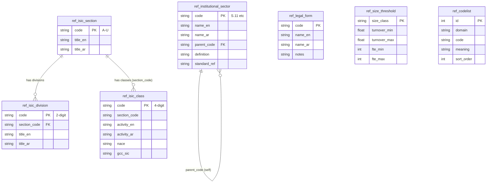
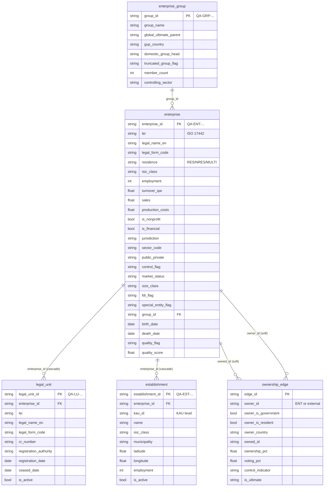
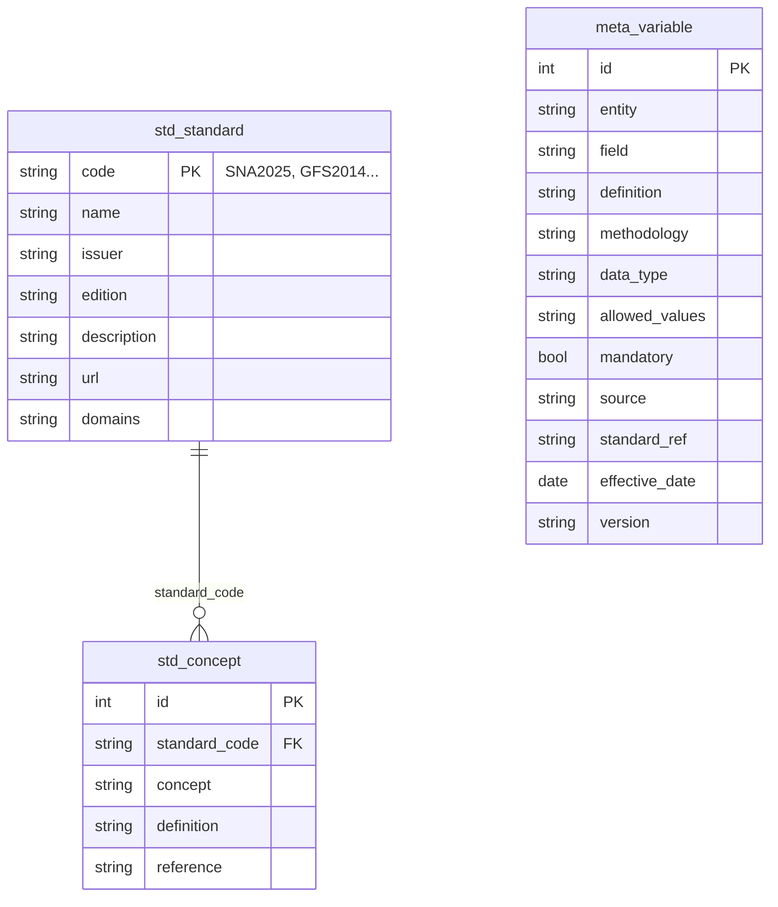
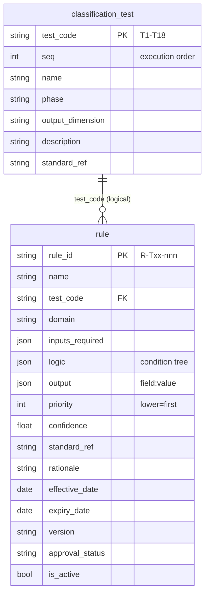
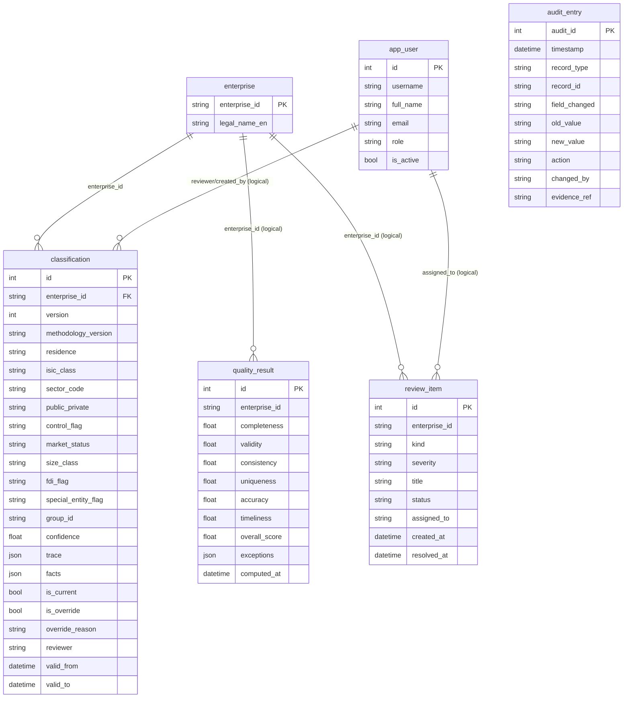

# NEICS — Entity-Relationship Diagrams

**National Enterprise Intelligence and Classification System**
State of Qatar · National Statistics Office (NSO)

| | |
|---|---|
| **Document** | 06 — Entity-Relationship Diagrams |
| **Status** | STAGING / UAT — pre-pilot review draft |
| **Audience** | Senior statisticians, enterprise architects, data-governance specialists |
| **Classification** | Official — Internal (subject to Qatar Statistics Law) |
| **Owner** | National Statistics Office (NSO), Statistical Methodology & Business Register Programme |
| **Date** | 2026-06-18 |
| **Related** | [`./05_enterprise_data_model.md`](./05_enterprise_data_model.md) · [`./07_data_dictionary.md`](./07_data_dictionary.md) · [`./08_metadata_model.md`](./08_metadata_model.md) · [`./10_rules_repository_design.md`](./10_rules_repository_design.md) · [`./INDEX.md`](./INDEX.md) |

---

## 1. Purpose

This document presents the entity-relationship diagrams for the NEICS persistence layer
described in [`./05_enterprise_data_model.md`](./05_enterprise_data_model.md). To keep each
diagram legible for review, the model is decomposed into five subject-area ERDs — reference /
codelist, MDM core, standards & metadata, rules, and governance — followed by a high-level
overview ERD that shows the principal cross-subject relationships.

**Reading the diagrams.** Crow's-foot cardinality is used throughout:

- `||--o{` — one (mandatory) to zero-or-many.
- `||--|{` — one (mandatory) to one-or-many.
- `}o--||` — zero-or-many to one.
- Relationships rendered as labelled edges marked *(logical)* are enforced at the application /
  codelist layer rather than by a database foreign key (see §11 of document 05). Ownership-edge
  endpoints are *soft references* and are shown as dashed-intent labels because an endpoint may be
  an external party that is not a register row.

PK / FK markers and the most decision-relevant attributes are shown; the exhaustive column list
lives in document 05 and the allowed values in document 07.

---

## 2. Subject-area ERD — Reference / codelists

The controlled vocabularies. ISIC forms a section → division → class hierarchy; institutional
sectors form a self-referencing hierarchy; size thresholds, legal forms and the generic codelist
are flat.

---

## 3. Subject-area ERD — MDM core (golden record)

The statistical-unit hierarchy and the ownership graph. `enterprise` is the golden record;
`legal_unit` and `establishment` hang off it; `ownership_edge` is the directed share-by-share
graph whose endpoints soft-reference enterprises or external parties.

> **Note on the two `enterprise → ownership_edge` edges.** An enterprise may appear as the
> `owner_id` of some edges and the `owned_id` of others. Both relationships are *soft* — the
> endpoint columns are not declared foreign keys because an endpoint may be an external party
> token such as `STATE-QA` or `FOREIGN-PARENT-01` that has no register row.

---

## 4. Subject-area ERD — Standards & metadata repositories

`meta_variable` is a standalone catalogue: each row documents one `(entity, field)` of the data
model and references a standard via the free-text `standard_ref`. It is detailed in
[`./08_metadata_model.md`](./08_metadata_model.md).

---

## 5. Subject-area ERD — Rules repository

Tests are ordered by `seq` (not by numeric label); **T7 and T8 execute before T5 and T6**.
Within a test, rules fire in ascending `priority`. See
[`./10_rules_repository_design.md`](./10_rules_repository_design.md).

---

## 6. Subject-area ERD — Governance

`audit_entry` is rendered without crow's-foot edges because it references **any** record via the
generic `(record_type, record_id)` pair rather than a typed foreign key; it is an append-only log
spanning all entities.

---

## 7. Overview ERD — principal cross-subject relationships

A single consolidated view of the load-bearing relationships across all five subject areas.
Attributes are elided here for legibility; full attribute lists are in the subject-area diagrams
above and in document 05.

```mermaid
erDiagram
    enterprise_group ||--o{ enterprise : "group_id"
    enterprise ||--o{ legal_unit : "enterprise_id"
    enterprise ||--o{ establishment : "enterprise_id"
    enterprise ||--o{ ownership_edge : "owned_id (soft)"
    enterprise ||--o{ ownership_edge : "owner_id (soft)"
    enterprise ||--o{ classification : "enterprise_id"
    enterprise ||--o{ quality_result : "enterprise_id"
    enterprise ||--o{ review_item : "enterprise_id"

    ref_institutional_sector ||--o{ ref_institutional_sector : "parent_code"
    ref_institutional_sector ||--o{ enterprise : "sector_code (logical)"
    ref_institutional_sector ||--o{ classification : "sector_code (logical)"
    ref_isic_section ||--o{ ref_isic_division : "section_code"
    ref_isic_section ||--o{ ref_isic_class : "section_code"
    ref_isic_class ||--o{ enterprise : "isic_class (logical)"
    ref_isic_class ||--o{ establishment : "isic_class (logical)"
    ref_isic_class ||--o{ classification : "isic_class (logical)"
    ref_legal_form ||--o{ enterprise : "legal_form_code (logical)"
    ref_legal_form ||--o{ legal_unit : "legal_form_code (logical)"
    ref_size_threshold ||--o{ enterprise : "size_class (logical)"

    classification_test ||--o{ rule : "test_code (logical)"
    rule }o--o{ classification : "produces trace entries"
    std_standard ||--o{ std_concept : "standard_code"
    std_standard ||--o{ rule : "standard_ref (logical)"
    std_standard ||--o{ meta_variable : "standard_ref (logical)"

    app_user ||--o{ classification : "reviewer (logical)"
    app_user ||--o{ review_item : "assigned_to (logical)"

    enterprise_group {
        string group_id PK
    }
    enterprise {
        string enterprise_id PK
        string group_id FK
        string sector_code
        string isic_class
        string size_class
    }
    legal_unit {
        string legal_unit_id PK
        string enterprise_id FK
    }
    establishment {
        string establishment_id PK
        string enterprise_id FK
    }
    ownership_edge {
        string edge_id PK
        string owner_id
        string owned_id
    }
    classification {
        int id PK
        string enterprise_id FK
        int version
        bool is_current
    }
    quality_result {
        int id PK
        string enterprise_id
    }
    review_item {
        int id PK
        string enterprise_id
    }
    ref_institutional_sector {
        string code PK
        string parent_code FK
    }
    ref_isic_section {
        string code PK
    }
    ref_isic_division {
        string code PK
        string section_code FK
    }
    ref_isic_class {
        string code PK
    }
    ref_legal_form {
        string code PK
    }
    ref_size_threshold {
        string size_class PK
    }
    classification_test {
        string test_code PK
    }
    rule {
        string rule_id PK
        string test_code FK
    }
    std_standard {
        string code PK
    }
    std_concept {
        int id PK
        string standard_code FK
    }
    meta_variable {
        int id PK
    }
    app_user {
        int id PK
    }
```

---

## 8. Cardinality and key catalogue

| Relationship | Cardinality | Mechanism |
|---|---|---|
| `enterprise_group` → `enterprise` | 1 : 0..N | DB FK `enterprise.group_id` |
| `enterprise` → `legal_unit` | 1 : 0..N | DB FK `legal_unit.enterprise_id` (cascade delete-orphan) |
| `enterprise` → `establishment` | 1 : 0..N | DB FK `establishment.enterprise_id` (cascade delete-orphan) |
| `enterprise` → `classification` | 1 : 1..N | DB FK `classification.enterprise_id`; exactly one `is_current=TRUE` |
| `enterprise` → `quality_result` | 1 : 0..N | Logical FK |
| `enterprise` → `review_item` | 1 : 0..N | Logical FK |
| `enterprise` ↔ `ownership_edge` | 1 : 0..N (as owner and as owned) | Soft reference |
| `ref_isic_section` → `ref_isic_division` | 1 : 0..N | DB FK |
| `ref_isic_section` → `ref_isic_class` | 1 : 0..N | `section_code` denormalised |
| `ref_institutional_sector` → `ref_institutional_sector` | 1 : 0..N | Self-FK `parent_code` |
| `std_standard` → `std_concept` | 1 : 0..N | DB FK |
| `classification_test` → `rule` | 1 : 0..N | Logical FK `rule.test_code` |
| `ref_isic_class` / `ref_institutional_sector` / `ref_legal_form` / `ref_size_threshold` → MDM tables | 1 : 0..N | Logical FK (codelist) |
| `app_user` → `classification` / `review_item` | 1 : 0..N | Logical FK (string actor) |

---

## 9. Cross-references

- Logical & physical model: [`./05_enterprise_data_model.md`](./05_enterprise_data_model.md)
- Field-level data dictionary: [`./07_data_dictionary.md`](./07_data_dictionary.md)
- Metadata model: [`./08_metadata_model.md`](./08_metadata_model.md)
- Rules repository design: [`./10_rules_repository_design.md`](./10_rules_repository_design.md)
- Document index: [`./INDEX.md`](./INDEX.md)

*End of document 06 — Entity-Relationship Diagrams.*
