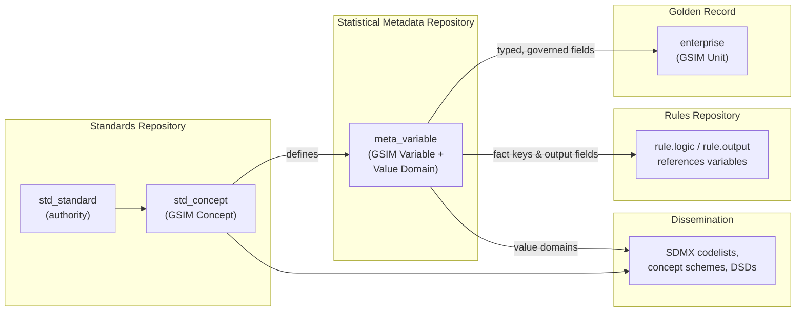
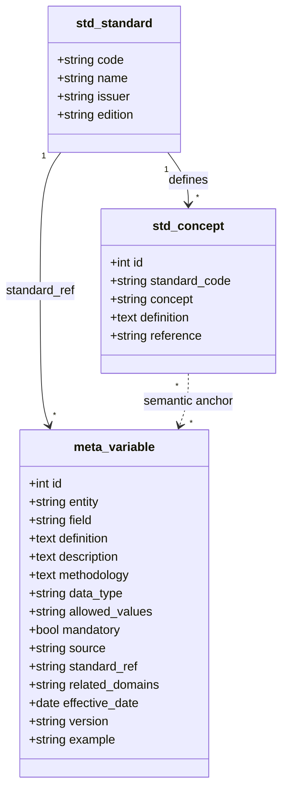
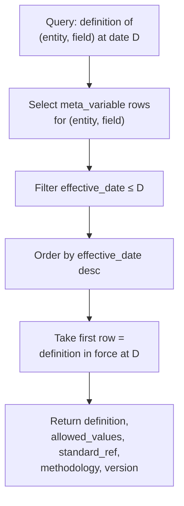

# 08 — Statistical Metadata Model

> **National Enterprise Intelligence and Classification System (NEICS)**
> National Statistics Office (NSO) — State of Qatar
> **Environment: STAGING / UAT.** Isolated from production and from live data providers.
> Document status: For review by senior statisticians, enterprise architects and data-governance specialists.

| | |
|---|---|
| **Document** | 08 — Statistical Metadata Model |
| **Status** | STAGING / UAT — pre-pilot review draft |
| **Audience** | Senior statisticians, enterprise architects, data-governance specialists |
| **Classification** | Official — Internal (subject to Qatar Statistics Law) |
| **Owner** | NSO, Statistical Methodology & Business Register Programme |
| **Date** | 2026-06-18 |
| **Related** | [`./05_enterprise_data_model.md`](./05_enterprise_data_model.md) · [`./09_standards_repository_design.md`](./09_standards_repository_design.md) · [`./10_rules_repository_design.md`](./10_rules_repository_design.md) · [`./11_classification_logic_maps.md`](./11_classification_logic_maps.md) · [`./16_simulation_framework.md`](./16_simulation_framework.md) · [`./INDEX.md`](./INDEX.md) |

---

## 1. Purpose and scope

This document specifies the **statistical metadata model** of NEICS: the layer that gives
every data element in the platform a *named, defined, governed and standard-anchored*
identity. It describes how NEICS aligns to the **Generic Statistical Information Model
(GSIM)** and to **SDMX** (Statistical Data and Metadata eXchange), how it positions its
processes against the **Generic Statistical Business Process Model (GSBPM)**, and how the
metadata is physically realised in the **`meta_variable`** variable catalog, including its
**versioning and effective-dating** mechanics.

The metadata model is not decorative documentation. It is an operational asset:

- Every fact consumed by the Rules Engine ([`./10_rules_repository_design.md`](./10_rules_repository_design.md))
  is a *variable* with a catalog entry.
- Every classification output dimension is a *variable* with allowed values and a standard
  reference.
- Every `/explain` response cites the metadata definitions of the fields it used.
- Every dissemination artefact is generated against SDMX-aligned codelists derived from the
  catalog.

In short, the variable catalog is the **semantic contract** that binds the data model
([`./05_enterprise_data_model.md`](./05_enterprise_data_model.md)), the standards repository
([`./09_standards_repository_design.md`](./09_standards_repository_design.md)) and the rules
repository ([`./10_rules_repository_design.md`](./10_rules_repository_design.md)) into one
coherent, auditable system.

---

## 2. Why a formal metadata model

A National Statistics Office cannot defend a classification it cannot define. The credibility
of an official statistic rests on the ability to answer, for any published figure:

1. **What exactly is this variable?** (definition)
2. **How was it measured or derived?** (methodology)
3. **What values may it take?** (value domain / codelist)
4. **Which standard authorises it?** (standard reference)
5. **From when does this definition apply, and what did it replace?** (effective dating /
   versioning)
6. **Where did the value come from?** (provenance / source)

NEICS answers all six for every variable, by construction, through the metadata model. This
is the metadata discipline mandated by **DAMA-DMBOK** (data management body of knowledge),
expressed in the vocabulary of official statistics (**GSIM**, **SDMX**, **GSBPM**) and bound
to the international and national standards catalogue.

---

## 3. Alignment to GSIM, SDMX and GSBPM

### 3.1 GSIM information objects

GSIM provides a reference vocabulary of information objects that flow through a statistical
production process. NEICS does not attempt to implement GSIM in full; it adopts the GSIM
*concepts* that are load-bearing for an enterprise classification register and maps its own
physical structures onto them. The principal correspondences are:

| GSIM information object | NEICS realisation | Notes |
|---|---|---|
| **Concept** | `std_concept` rows in the Standards Repository | A definitional concept (e.g. *Institutional unit*, *Market producer*, *Residence*) anchored to a standard. |
| **Represented Variable / Variable** | `meta_variable` rows | A measured or derived characteristic of a unit, with a value domain and a standard reference. |
| **Value Domain** | `meta_variable.allowed_values` + SDMX codelists | The permitted set of values (enumerated or described). |
| **Unit Type** | The 10 statistical-unit types resolved by T1 | Enterprise, Enterprise Group, KAU, Establishment / Local Unit, etc. |
| **Population / Unit** | `enterprise` rows (the golden record) | The statistical units under management. |
| **Classification / Code Item** | ISIC Rev.4, CPC, COFOG, ICSE codelists | Externally governed classifications referenced by variables. |
| **Process Step** | The 18 sequenced classification tests (T1–T18) | Each test is a process step producing or consuming variables. |
| **Provenance / Process Execution** | The classification *trace* and recorded *fact set* | The auditable record of which variables fed which step. |

The design intent is that a reviewer fluent in GSIM can read the NEICS data dictionary and
recognise the objects without translation, while implementers retain a pragmatic relational
schema.

### 3.2 SDMX for dissemination and codelists

SDMX is used at the **dissemination boundary**, not as the internal storage format. Internally
NEICS stores classification results in the relational golden record; for exchange and
publication it projects those results onto SDMX structures:

- **Codelists** — the value domains of classification variables (e.g. institutional sector
  S.11–S.15/S.2, `public_private`, `size_class`, `fdi_flag`) are expressed as SDMX codelists
  with stable code identifiers.
- **Concept schemes** — derived from `std_concept`, providing the conceptual definitions that
  accompany each dimension.
- **Data Structure Definitions (DSD)** — assembled from the catalog so that aggregate outputs
  (e.g. enterprise counts by sector and size band) carry their dimensions, attributes and
  measures in a machine-readable, internationally interpretable form.

This separation — relational internally, SDMX at the edge — keeps the operational system
simple while ensuring NEICS outputs are interoperable with downstream national-accounts,
business-statistics and balance-of-payments programmes.

### 3.3 GSBPM process positioning

NEICS supports several GSBPM phases. The classification engine is concentrated in *Process*
and *Analyse*, but the metadata model spans the lifecycle:

| GSBPM phase | NEICS activity | Metadata role |
|---|---|---|
| 2. Design | Define variables, value domains, standard anchors | Author `meta_variable` and `std_concept` entries |
| 3. Build | Seed catalog, codelists, rules | Catalog is a build artefact under version control |
| 4. Collect | Ingest administrative & survey sources | Each inbound field maps to a catalog variable + source |
| 5. Process | Build fact set; run 18 tests | Facts are catalog variables; outputs are catalog variables |
| 6. Analyse | Validate, score quality, review | Variables carry methodology + QA metadata |
| 7. Disseminate | Project to SDMX | Codelists & DSDs derived from catalog |
| 8. Evaluate | Audit, reproduce historical results | Effective dating supports point-in-time reproduction |

---

## 4. The variable catalog — `meta_variable`

The Statistical Metadata Repository is realised as the **`meta_variable`** table. It is the
GSIM-aligned variable catalog: one row per *(entity, field)* characteristic managed anywhere in
the platform — golden-record attributes, derived facts, and classification outputs alike.

### 4.1 Logical structure

### 4.2 Column semantics

| Column | GSIM/SDMX role | Description |
|---|---|---|
| `id` | Identifier | Surrogate key for the catalog entry. |
| `entity` | Unit Type / dataset scope | The table or dataset the variable belongs to (e.g. `enterprise`, `facts`, `classification`). |
| `field` | Variable name | The physical field / fact key the variable describes. The pair *(entity, field)* is the business identifier. |
| `definition` | Concept definition | The authoritative, citable definition of the variable. |
| `description` | Annotation | Implementation notes, scope qualifiers, edge cases. |
| `methodology` | Process metadata | How the variable is derived or measured (e.g. *"effective ownership computed over the consolidated edge set"*). |
| `data_type` | Representation | Physical type (string, numeric, boolean, date, enum). |
| `allowed_values` | Value Domain | The enumerated value domain or a constraint expression; the seed of an SDMX codelist for classification dimensions. |
| `mandatory` | Obligation | Whether the variable must be populated for a valid record. |
| `source` | Provenance | Authoritative source / data-source class (cross-references the T14 data-source hierarchy). |
| `standard_ref` | Standard anchor | The standard code(s) authorising the variable (FK-by-convention to `std_standard.code`). |
| `related_domains` | Statistical domains | Comma-separated domains the variable serves (e.g. *National Accounts, Business Statistics, BoP*). |
| `effective_date` | Validity start | The date from which this version of the definition is in force. |
| `version` | Version tag | Semantic version of the definition (e.g. `1.0.0`). |
| `example` | Illustration | A concrete sample value to aid stewards. |

### 4.3 Variable categories

The catalog deliberately covers three kinds of variable, because all three must be defined and
defended to the same standard:

1. **Source / observed variables** — characteristics captured from administrative or survey
   sources and stored on the golden record (`employment`, `turnover_qar`, `legal_form_code`,
   `residence`, `sales`, `production_costs`, …). These carry a `source` and a `standard_ref`.

2. **Derived facts** — variables computed during fact assembly and consumed by the Rules
   Engine. These include the economically significant derivations such as
   `sales_cover_pct` (sales as a percentage of production costs), and the ownership-analysis
   outputs such as `government_ownership_pct`, `foreign_ownership_pct`,
   `representative_control_flag` and `government_control`. Their `methodology` field documents
   the computation; their `source` is *"NEICS Ownership Intelligence Engine (derived)"*.

3. **Classification outputs** — the result dimensions assigned by the 18 tests:
   `residence`, `isic_class`, `sector_code`, `market_status`, `control_flag`,
   `public_private`, `size_class`, `fdi_flag`, `special_entity_flag`. These have tightly
   enumerated `allowed_values` and are the primary inputs to SDMX codelist generation.

This three-way coverage is what lets the `/explain` endpoint cite, for any decision, both the
*input* variables (with their definitions and sources) and the *output* variable (with its
value domain and standard).

### 4.4 Worked catalog entries

The following entries illustrate the catalog discipline. They are representative of how
load-bearing variables are documented (values shown are illustrative of the seeded catalog).

**Derived fact — `sales_cover_pct`**

| Attribute | Value |
|---|---|
| `entity` | `facts` |
| `field` | `sales_cover_pct` |
| `definition` | Sales (market output) expressed as a percentage of production costs, used in the economically-significant-prices (50%) test. |
| `methodology` | `100 × (sales ÷ production_costs)` where `production_costs > 0`; null when production costs are zero or absent. Assessed over a sustained period, not a single observation. |
| `data_type` | numeric (percent) |
| `allowed_values` | `0` … unbounded; null permitted |
| `mandatory` | false |
| `source` | NEICS fact assembly (derived from `sales`, `production_costs`) |
| `standard_ref` | `SNA2025` |
| `related_domains` | National Accounts, Business Statistics |
| `effective_date` | 2026-01-01 |
| `version` | 1.0.0 |
| `example` | `42.0` |

**Classification output — `public_private`**

| Attribute | Value |
|---|---|
| `entity` | `classification` |
| `field` | `public_private` |
| `definition` | Position of the institutional unit relative to the public-sector boundary. |
| `methodology` | Assigned by Test T6 from `government_control` and `market_status`; private if no government effective control. |
| `data_type` | enum |
| `allowed_values` | `GG`, `PUB-FC`, `PUB-NFC`, `NPISH`, `FCC`, `PRV-FC`, `PRV-NFC` |
| `mandatory` | true |
| `source` | NEICS Rules Engine (T6) |
| `standard_ref` | `GFS2014`, `SNA2025` |
| `related_domains` | National Accounts, Government Finance Statistics |
| `effective_date` | 2026-01-01 |
| `version` | 1.0.0 |
| `example` | `PUB-NFC` |

**Classification output — `fdi_flag`**

| Attribute | Value |
|---|---|
| `entity` | `classification` |
| `field` | `fdi_flag` |
| `definition` | Foreign-direct-investment relationship of the unit on the directional principle. |
| `methodology` | Assigned by T12 from `foreign_ownership_pct` against the 10% / 50% thresholds, with round-trip detection. |
| `data_type` | enum |
| `allowed_values` | `INWARD-FULL`, `INWARD-ASSOC`, `ROUND-TRIP`, `NONE` |
| `mandatory` | true |
| `source` | NEICS Rules Engine (T12) |
| `standard_ref` | `BD4`, `BPM6` |
| `related_domains` | Balance of Payments, FDI Statistics |
| `effective_date` | 2026-01-01 |
| `version` | 1.0.0 |
| `example` | `INWARD-ASSOC` |

---

## 5. Versioning and effective dating

### 5.1 The reproducibility requirement

A classification published in 2026 must remain *explicable in the terms that were in force in
2026*, even after the definitions evolve. If, for example, the definition of *market producer*
is refined, or a size band threshold is revised, the historical classification must still be
reproducible against the metadata that governed it at the time. NEICS therefore treats variable
definitions as **temporally versioned facts**, never as mutable rows to be overwritten.

### 5.2 Mechanics

Two fields carry the temporal contract on each catalog entry:

- **`version`** — a semantic version tag (`MAJOR.MINOR.PATCH`). A change of `definition`,
  `allowed_values`, `methodology` or `standard_ref` that alters meaning increments `MAJOR` or
  `MINOR`; clarifications increment `PATCH`.
- **`effective_date`** — the date from which that version is authoritative.

A definitional change is applied **additively**: a new `meta_variable` row is created for the
same *(entity, field)* with an incremented `version` and a later `effective_date`. The prior
row is retained. The *current* definition of a variable is the row with the latest
`effective_date` not in the future; the *applicable* definition for a historical classification
is the row whose `effective_date` is the latest one on or before that classification's
reference date.

### 5.3 Coordination with the standards and rules repositories

Effective dating is consistent across the three governed repositories:

- **`meta_variable`** versions a *definition*.
- **`std_standard`** / **`std_concept`** version the *authority* behind a definition (see
  [`./09_standards_repository_design.md`](./09_standards_repository_design.md), e.g. the SNA
  2008 → SNA 2025 transition).
- **`rule`** versions the *logic* that produces a value (see
  [`./10_rules_repository_design.md`](./10_rules_repository_design.md), via `version`,
  `effective_date`, `expiry_date`).

Because all three are effective-dated on the same calendar, a point-in-time query against
date `D` resolves a coherent triple: *the rule that fired*, *the standard it cited*, and *the
variable definitions of every field it used* — all as they stood on `D`. This is the
foundation of NEICS reproducibility and is exercised directly by the simulation framework
([`./16_simulation_framework.md`](./16_simulation_framework.md)).

### 5.4 Governance of catalog change

Catalog entries are governed artefacts. A change to a variable definition follows the same
authority model as a rule change: a methodologist proposes the new version with its rationale
and standard anchor; the Technical Classification Committee reviews and approves; the new
`version` / `effective_date` is committed. Because entries are seeded from version-controlled
definitions, every catalog state is reproducible from source control as well as from the
database.

---

## 6. The catalog in the runtime

### 6.1 Fact assembly contract

The fact set assembled for each enterprise is, by design, a set of catalog variables. Every key
in the flat fact dictionary consumed by the Rules Engine should have a corresponding
`meta_variable` entry. This gives two guarantees:

1. **No silent fields.** A rule cannot reference a fact that is not defined in the catalog
   without that gap being visible to governance.
2. **Self-describing provenance.** When a classification records its fact set (as it does, in
   full), each recorded field is resolvable to its definition, source and standard.

### 6.2 Explainability

The `/explain` response for a classification draws on the catalog to present, for each applied
test: the *fields used* (with their catalog definitions and sources), the *rule that fired*,
the *standard referenced*, the *rationale*, the *confidence*, any *reviewer override*, and the
*methodology version* in force. The catalog is therefore not merely documentation — it is the
data dictionary that the explainability surface renders at request time.

### 6.3 Dissemination

For dissemination, the catalog's classification-output entries (their `allowed_values` and the
`std_concept` definitions behind them) are projected to SDMX codelists and concept schemes, and
assembled into Data Structure Definitions for aggregate outputs. Because the value domains are
governed and versioned in one place, the disseminated codelists are guaranteed consistent with
the operational classification logic.

---

## 7. Conformance and assurance summary

| Concern | Mechanism |
|---|---|
| Standard anchoring | Every variable carries `standard_ref` to `std_standard`. |
| Definition authority | `std_concept` provides citable definitions per standard. |
| Value-domain control | `allowed_values` governs enumerations; projected to SDMX codelists. |
| Provenance | `source` records the authoritative origin; recorded in fact sets. |
| Reproducibility | `version` + `effective_date` enable point-in-time resolution. |
| Interoperability | GSIM information-object alignment; SDMX at the dissemination boundary. |
| Process alignment | GSBPM phase mapping ties variables to the production lifecycle. |
| Governance | Catalog change follows the methodologist → Committee approval workflow. |

---

## 8. Related documents

- [`./05_enterprise_data_model.md`](./05_enterprise_data_model.md) — the physical golden-record
  schema whose fields the catalog defines.
- [`./09_standards_repository_design.md`](./09_standards_repository_design.md) — the standards
  and concepts the catalog anchors to.
- [`./10_rules_repository_design.md`](./10_rules_repository_design.md) — the rules that consume
  catalog facts and produce catalog outputs.
- [`./11_classification_logic_maps.md`](./11_classification_logic_maps.md) — the decision maps
  that visualise how variables flow through the 18 tests.
- [`./16_simulation_framework.md`](./16_simulation_framework.md) — point-in-time reproduction
  using effective-dated catalog, standards and rules.
- [`./INDEX.md`](./INDEX.md) — architecture documentation index.
