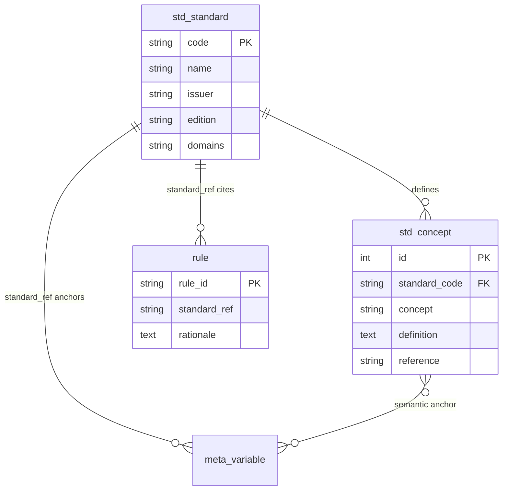
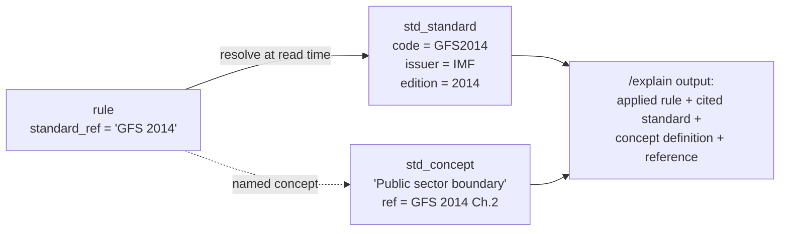
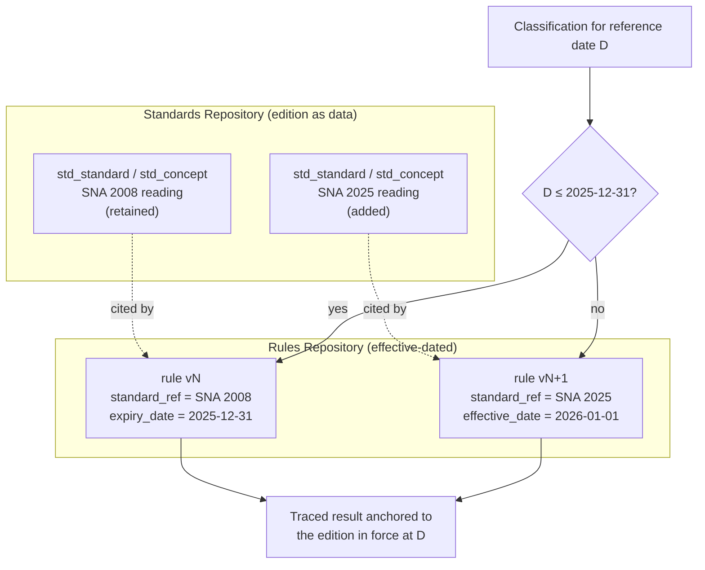

# 09 — Standards & Concepts Repository Design

> **National Enterprise Intelligence and Classification System (NEICS)**
> National Statistics Office (NSO) — State of Qatar
> **Environment: STAGING / UAT.** Isolated from production and from live data providers.
> Document status: For review by senior statisticians, enterprise architects and data-governance specialists.

| | |
|---|---|
| **Document** | 09 — Standards & Concepts Repository Design |
| **Status** | STAGING / UAT — pre-pilot review draft |
| **Audience** | Senior statisticians, enterprise architects, data-governance specialists |
| **Classification** | Official — Internal (subject to Qatar Statistics Law) |
| **Owner** | NSO, Statistical Methodology & Business Register Programme |
| **Date** | 2026-06-18 |
| **Related** | [`./05_enterprise_data_model.md`](./05_enterprise_data_model.md) · [`./08_metadata_model.md`](./08_metadata_model.md) · [`./10_rules_repository_design.md`](./10_rules_repository_design.md) · [`./11_classification_logic_maps.md`](./11_classification_logic_maps.md) · [`./16_simulation_framework.md`](./16_simulation_framework.md) · [`./INDEX.md`](./INDEX.md) |

---

## 1. Purpose and scope

This document specifies the **Standards & Concepts Repository** of NEICS: the governed catalogue
of the international and national statistical standards to which the platform is anchored, and
the concepts (definitions) those standards establish. It explains the two tables that realise
the repository — **`std_standard`** and **`std_concept`** — how the Rules Engine references
standards through the **`standard_ref`** mechanism, and how the design accommodates **future
standard revisions (for example the SNA 2008 → SNA 2025 transition)** without any structural
redesign.

The animating principle of NEICS is *economic reality over legal form, every decision traced to
a standard*. The Standards Repository is the institutional memory that makes the second half of
that principle true: it is the place where the platform records **what authority justifies each
classification rule**. Without it, the Rules Engine would be a set of opinions; with it, every
rule is an application of a recognised, citable standard.

---

## 2. Design goals

The repository is designed to satisfy five goals:

1. **Single source of authority.** One governed list of standards, each with issuer, edition
   and the statistical domains it serves.
2. **Citable concepts.** A definition store, where each concept carries its authoritative
   definition and a precise paragraph/chapter reference.
3. **Referenceability.** A stable, lightweight referencing mechanism (`standard_ref`) that the
   Rules Repository, the Metadata Repository and classification traces all use to point at a
   standard.
4. **Revision tolerance.** The ability to introduce new editions of a standard (and to model a
   transition between editions) without changing the schema and without rewriting rules.
5. **Auditable traceability.** The guarantee that *every classification rule traces to one or
   more standards*, and that the trace survives in the explainability record.

---

## 3. Repository structure

### 3.1 `std_standard` — the authority list

`std_standard` holds one row per standard the framework is anchored to. The primary key is a
short, stable **code** (for example `SNA2025`, `GFS2014`, `BD4`) used everywhere a standard is
referenced.

| Column | Description |
|---|---|
| `code` | Primary key — short stable identifier (e.g. `SNA2025`, `BPM6`, `ISIC4`). |
| `name` | Full title of the standard. |
| `issuer` | Issuing authority (e.g. United Nations, IMF, OECD, UNECE, NSO Qatar). |
| `edition` | Edition / version of the standard (e.g. *2025*, *Rev.4*, *6th edition*). |
| `description` | Scope and role of the standard in NEICS. |
| `url` | Canonical reference URL where available. |
| `domains` | Comma-separated statistical domains the standard governs. |

### 3.2 `std_concept` — the definition store

`std_concept` holds the concepts (definitions) that belong to standards. Each row links a named
concept to the standard that establishes it, with the authoritative definition text and a
precise reference.

| Column | Description |
|---|---|
| `id` | Surrogate primary key. |
| `standard_code` | Foreign key to `std_standard.code` — the owning standard. |
| `concept` | The concept name (e.g. *Institutional unit*, *Market producer*, *Residence*, *Direct investment relationship*, *Ultimate Controlling Institutional Unit*). |
| `definition` | The authoritative, citable definition. |
| `reference` | Paragraph / chapter reference within the standard (e.g. *SNA 2025 Ch.4 / BPM6 Ch.4*, *BD4 §117*). |

### 3.3 The anchored standards

NEICS is anchored to the following catalogue. Each is recorded in `std_standard`; the principal
concepts of the most load-bearing standards are recorded in `std_concept`.

| Code | Standard | Issuer | Role in NEICS |
|---|---|---|---|
| `SNA2025` | System of National Accounts 2025 (with SNA 2008 transition) | UN / Eurostat / IMF / OECD / World Bank | Institutional units, sectors, market/non-market producer, residence. |
| `GFS2014` | Government Finance Statistics Manual | IMF | Public-sector boundary; general government vs public corporations. |
| `BPM6` | Balance of Payments and IIP Manual | IMF | Residence; directional FDI principle; cross-border units. |
| `BD4` | OECD Benchmark Definition of FDI (4th edition) | OECD | 10% FDI threshold; UCI; round-tripping. |
| `ISIC4` | International Standard Industrial Classification, Rev.4 | UNSD | Principal economic activity by value added. |
| `CPC` | Central Product Classification | UNSD | Products, cross-walked to ISIC. |
| `COFOG` | Classification of the Functions of Government | UN/OECD | Government function tagging. |
| `ICSE` | International Classification of Status in Employment | ILO | Employment-status concepts. |
| `SEEA` | System of Environmental-Economic Accounting | UN | Environmental-economic accounting domain. |
| `LEI` | Legal Entity Identifier (ISO 17442) | GLEIF / ISO | Global entity identification. |
| `SDMX` | Statistical Data and Metadata eXchange | SDMX Initiative | Dissemination, codelists, DSDs. |
| `GSIM` | Generic Statistical Information Model | UNECE | Information-object alignment. |
| `GSBPM` | Generic Statistical Business Process Model | UNECE | Process-phase alignment. |
| `DMBOK` | DAMA Data Management Body of Knowledge | DAMA International | Data-governance discipline. |
| `BR-RECS` | UNSD / Eurostat Business Register recommendations | UNSD / Eurostat | Statistical business register practice. |
| `QNCS` | National Classification Standards of Qatar | NSO — State of Qatar | National thresholds, governance, size bands, conflict resolution. |

---

## 4. How rules reference standards — `standard_ref`

### 4.1 The referencing mechanism

A NEICS classification rule (see [`./10_rules_repository_design.md`](./10_rules_repository_design.md))
carries a **`standard_ref`** column. This is the bridge from the Rules Repository to the
Standards Repository. It records the standard authority (one or more) that justifies the rule.
The same `standard_ref` mechanism appears on `meta_variable` (anchoring a variable definition)
so that *both* what a variable means *and* how it is classified trace to the same authority list.

The reference is intentionally a **soft, code-based reference** rather than a hard foreign-key
constraint, for three reasons:

1. A single rule frequently rests on **more than one** standard (e.g. the public-sector boundary
   rules cite both `GFS 2014` and `SNA 2025`). A soft reference can carry a composite citation
   such as `"GFS 2014"`, `"SNA 2025 / OECD BD4"`, or `"QNCS / EU 2003/361/EC"`.
2. A rule may need to cite a **specific paragraph** (`BD4 §117`) that lives at the `std_concept`
   granularity, not merely the standard.
3. Soft references let rules and standards evolve on independent release cadences without
   migration locks — important for revision tolerance (Section 5).

Resolution is performed at read time: the explainability service resolves a rule's
`standard_ref` against `std_standard` (and, where a concept is named, against `std_concept`) to
render the full citation, issuer, edition and definition in the `/explain` response.

### 4.2 Worked references

The seeded rule base demonstrates the citation discipline. Each rule's `standard_ref` points at
the authority that makes the classification defensible:

| Test | Rule (illustrative) | `standard_ref` | Concept cited |
|---|---|---|---|
| T7 — Market vs Non-Market | Sales cover ≤ 50% of production costs → NON-MARKET | `SNA 2025` | *Market producer* (economically significant prices) |
| T8 — Ownership & Control | Effective-control mechanism (9 indicators) | `SNA 2025 / OECD BD4` | *Effective control* |
| T6 — Public-sector boundary | Government-controlled market producer → PUB-NFC | `GFS 2014` | *Public sector boundary* |
| T10 — Enterprise size | Large enterprise (≥250 FTE or >QAR 200m) | `QNCS / EU 2003/361/EC` | National size bands |
| T12 — FDI | Inward FDI — associate (10–50%) | `OECD BD4` | *Direct investment relationship* (§117) |

Because the citation is stored on the rule, the trace produced for every classification carries
the `standard_ref` of each rule that fired. This is what allows NEICS to assert, for any
enterprise, that **every dimension of its classification is anchored to a recognised standard**.

### 4.3 The traceability guarantee

The platform enforces — by methodology and by review — that *no rule may be approved without a
`standard_ref`*. Combined with the recorded trace (rule_id, output, standard_ref, rationale per
test) and the recorded fact set, this yields an end-to-end audit chain:

> classification dimension → rule that produced it → standard that authorises the rule →
> concept definition and paragraph reference.

This chain is the substance of the explainability requirement: it is reproducible, citable, and
intelligible to a reviewing statistician without access to the source code.

---

## 5. Supporting future standard revisions without redesign

### 5.1 The problem

Statistical standards are revised. The most significant near-term example is the **transition
from SNA 2008 to SNA 2025**: a new edition that refines and in places re-frames the institutional
sector, market-producer and other concepts that NEICS classification depends upon. A register
platform must be able to (a) adopt a new edition, (b) keep classifying historical periods under
the edition that governed them, and (c) explain both — *without re-architecting*.

### 5.2 The design response

The repository accommodates revision through **edition-bearing standard rows plus transition
modelling**, leveraging the soft `standard_ref` and the effective-dating used across the rules
and metadata repositories. There are three complementary techniques, none of which alters the
schema:

**(1) Edition as data, not structure.** The `edition` column on `std_standard` distinguishes
editions. A revision is a *data* event: a new row (or an updated edition value plus a new set of
`std_concept` rows) — never a schema migration. NEICS records the SNA 2025 edition while
explicitly noting the *SNA 2008 transition* in its `name`/`description`, so the heritage is part
of the catalogue rather than lost.

**(2) Concept versioning under a standard.** When a concept's definition changes between
editions, a new `std_concept` row captures the revised definition and reference, while the prior
definition is retained. Concepts are therefore additive, exactly as variable definitions are in
[`./08_metadata_model.md`](./08_metadata_model.md). The repository can hold both the SNA 2008 and
the SNA 2025 reading of *market producer* side by side.

**(3) Effective-dated rules cite the relevant edition.** When a standard revision changes how a
unit should be classified, the methodologist authors a *new version* of the affected rule with
the new `standard_ref` / concept and a future `effective_date`; the prior rule is given an
`expiry_date`. Because the engine selects only rules in force on the relevant date, a
classification run for a 2024 reference period naturally applies the SNA-2008-anchored rule,
while a run for a 2027 reference period applies the SNA-2025-anchored rule — from the *same*
rule table, with *no* code change.

### 5.3 Why no redesign is needed

The transition is absorbed entirely within the existing primitives:

- New standard / edition → **new data rows** in `std_standard` / `std_concept`.
- New authoritative reading → **new `std_concept`** rows; old ones retained.
- New classification behaviour → **new rule versions** with `standard_ref` updated and
  `effective_date` / `expiry_date` set.
- Historical reproducibility → guaranteed by **effective-dated selection** already implemented in
  the engine and used by the simulation framework
  ([`./16_simulation_framework.md`](./16_simulation_framework.md)).

No table is altered; no constraint is dropped; no rule is destructively edited. The same pattern
serves any future revision — a new edition of GFS, a revision of the OECD Benchmark Definition,
or an update to the Qatar National Classification Standards.

### 5.4 Governance of a revision

A standard revision is a governed event coordinated across the three repositories:

1. **Catalogue update** — the new edition and its revised concepts are entered into
   `std_standard` / `std_concept` with their references.
2. **Impact analysis** — the methodology team identifies which rules and which variable
   definitions are affected.
3. **Proposal** — new rule versions and (where needed) new `meta_variable` versions are authored
   with the new `standard_ref` and a coordinated `effective_date`.
4. **Approval** — the Technical Classification Committee approves the revision set as a release
   (see the approval workflow in [`./10_rules_repository_design.md`](./10_rules_repository_design.md)).
5. **Activation** — the new versions take effect on the agreed date; prior versions are expired,
   not deleted, preserving reproducibility.

---

## 6. Interaction with the rest of the architecture

| Consumer | How it uses the Standards Repository |
|---|---|
| Rules Engine | Each rule carries `standard_ref`; the trace records it per fired rule. |
| Metadata Repository | Each `meta_variable` carries `standard_ref`; concepts anchor definitions. |
| `/explain` service | Resolves `standard_ref` to issuer, edition, concept definition and paragraph reference for the audit narrative. |
| Dissemination (SDMX) | Concept schemes are derived from `std_concept`. |
| Simulation framework | Point-in-time runs select the edition / concept in force at the reference date. |

---

## 7. Assurance summary

| Concern | Mechanism |
|---|---|
| Authority of every rule | Mandatory `standard_ref`; no approval without it. |
| Composite citation | Soft, code-based reference supporting multi-standard and paragraph-level citation. |
| Concept definitions | `std_concept` with precise references, additive across editions. |
| Revision tolerance | Edition-as-data + concept versioning + effective-dated rules — no schema change. |
| Historical reproducibility | Edition / rule in force selected by reference date. |
| Governance | Coordinated catalogue/rule/variable release approved by the Committee. |

---

## 8. Related documents

- [`./05_enterprise_data_model.md`](./05_enterprise_data_model.md) — the golden-record schema.
- [`./08_metadata_model.md`](./08_metadata_model.md) — the variable catalog that shares the
  `standard_ref` mechanism.
- [`./10_rules_repository_design.md`](./10_rules_repository_design.md) — the rules that cite
  standards through `standard_ref`.
- [`./11_classification_logic_maps.md`](./11_classification_logic_maps.md) — decision maps for
  the standard-anchored tests.
- [`./16_simulation_framework.md`](./16_simulation_framework.md) — point-in-time reproduction
  across standard editions.
- [`./INDEX.md`](./INDEX.md) — architecture documentation index.
