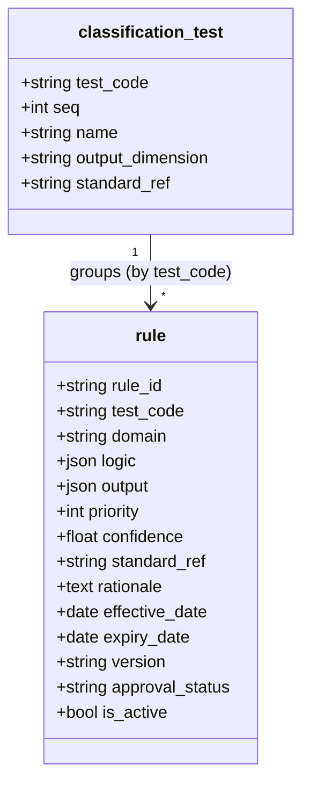
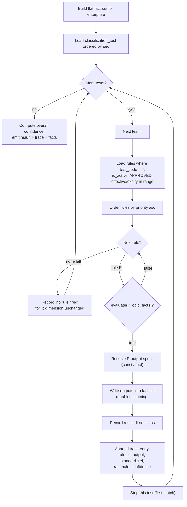
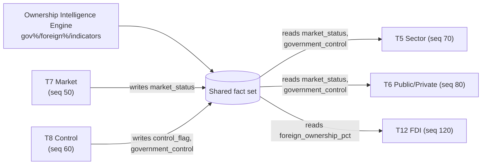
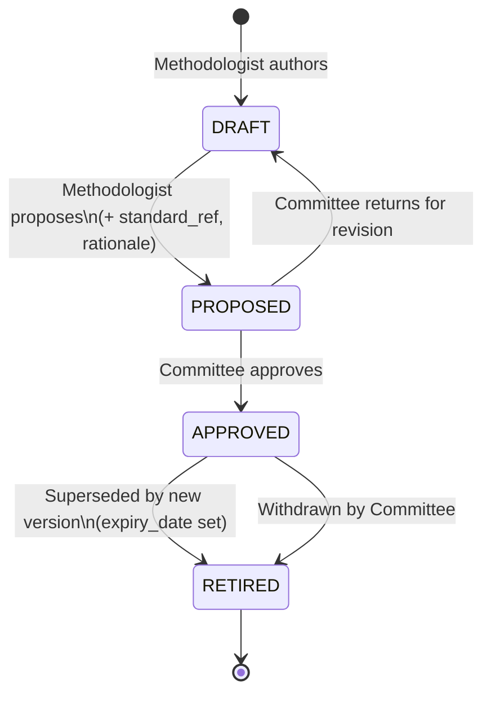
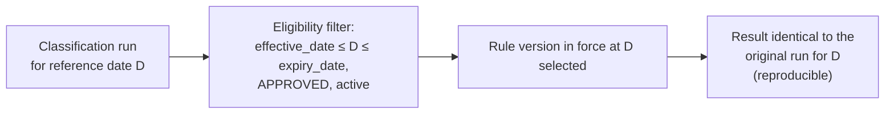
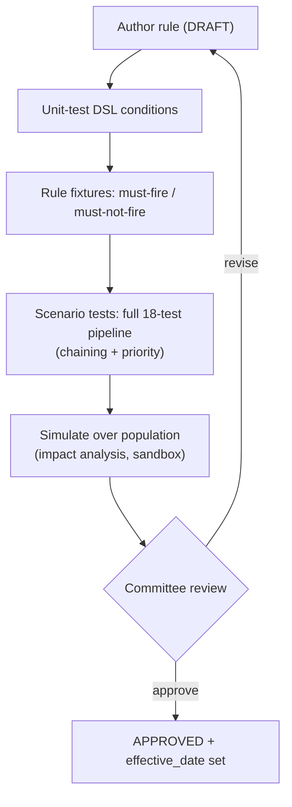

# 10 — Rules Repository Design (Database-Driven Rules Engine)

> **National Enterprise Intelligence and Classification System (NEICS)**
> National Statistics Office (NSO) — State of Qatar
> **Environment: STAGING / UAT.** Isolated from production and from live data providers.
> Document status: For review by senior statisticians, enterprise architects and data-governance specialists.

| | |
|---|---|
| **Document** | 10 — Rules Repository Design |
| **Status** | STAGING / UAT — pre-pilot review draft |
| **Audience** | Senior statisticians, enterprise architects, data-governance specialists |
| **Classification** | Official — Internal (subject to Qatar Statistics Law) |
| **Owner** | NSO, Statistical Methodology & Business Register Programme |
| **Date** | 2026-06-18 |
| **Related** | [`./05_enterprise_data_model.md`](./05_enterprise_data_model.md) · [`./08_metadata_model.md`](./08_metadata_model.md) · [`./09_standards_repository_design.md`](./09_standards_repository_design.md) · [`./11_classification_logic_maps.md`](./11_classification_logic_maps.md) · [`./16_simulation_framework.md`](./16_simulation_framework.md) · [`./INDEX.md`](./INDEX.md) |

---

## 1. Purpose and scope

This is the flagship technical document of the NEICS architecture set. It specifies the
**database-driven Rules Engine** in depth: the rule schema, the **JSON condition DSL** with
**worked examples drawn from the real seeded rule base**, **priority and conflict resolution**,
**chaining** (facts produced by earlier tests feeding later tests), **versioning**, the
**approval workflow**, and **rule testing and simulation**.

The central architectural commitment is stated once and enforced everywhere:

> **The classification methodology is data, not code.** Every classification rule is a *row* in
> the `rule` table. There are **no hard-coded rules**. The engine is a small, safe interpreter;
> the methodology lives in the database, where it can be authored, versioned, approved, audited
> and reproduced. Approximately **40 seeded rules** implement the 18-test methodology.

This separation is what makes NEICS a *statistical instrument* rather than a software product:
methodologists — not developers — own the methodology, and they change it by changing data under
governance, never by changing code.

---

## 2. The `rule` table

A rule is a single configurable classification decision. Its `logic` column holds a JSON
condition tree evaluated against an enterprise's fact set; its `output` column declares the
classification field and value assigned when the rule fires; it belongs to one of the 18 tests
and to an output `domain`.

### 2.1 Schema

| Column | Type | Meaning |
|---|---|---|
| `rule_id` | string (PK) | Stable identifier, e.g. `R-T07-030`, `R-T12-020`. |
| `name` | string | Human-readable rule name. |
| `description` | text | Extended explanation. |
| `test_code` | string (`T1`…`T18`) | The test this rule belongs to. |
| `domain` | string | The output dimension (e.g. `market_status`, `fdi_flag`). |
| `inputs_required` | JSON list | Fact keys the rule depends on (for validation / completeness). |
| `logic` | JSON | The condition tree (the DSL). `null` / `{}` means *always matches*. |
| `output` | JSON | `{field: spec}` — the assignment(s) made when the rule fires. |
| `priority` | int | Lower value evaluated first (first-match-by-priority within the test). |
| `confidence` | float | Confidence weight contributed to the overall result. |
| `standard_ref` | string | Standard authority (see [`./09_standards_repository_design.md`](./09_standards_repository_design.md)). |
| `rationale` | text | The human-readable *why* recorded in the trace. |
| `effective_date` | date | First date the rule is in force (nullable = always). |
| `expiry_date` | date | Last date the rule is in force (nullable = never expires). |
| `version` | string | Semantic version of the rule (e.g. `1.0.0`). |
| `author` | string | Authoring methodologist. |
| `approval_status` | string | `DRAFT` / `PROPOSED` / `APPROVED` / `RETIRED` (superseded). |
| `is_active` | bool | Operational on/off switch. |
| `created_at` | datetime | Audit timestamp. |

### 2.2 The output spec

The `output` value is a mapping of *field → spec*. A spec is resolved at fire time in one of
three forms:

- `{"const": X}` — assign the constant `X` (the common case for classification labels).
- `{"fact": "name"}` — assign the current value of fact `name` (used to surface a derived fact
  as an output, e.g. T8 publishing the representative control flag).
- a bare value — assigned directly.

When a rule fires, **every** field in its `output` is written back into the live fact set, and
those that are result dimensions are also recorded in the classification result. Writing outputs
back into the fact set is the mechanism that enables **chaining** (Section 6).

### 2.3 The 18 tests and their sequence

Rules belong to tests; tests are sequenced by a `seq` field on `classification_test`. The
sequence is methodologically significant: **T7 (market) and T8 (control) run before T5 (sector)
and T6 (public/private)** so that the facts they produce are available to the later tests.

| Test | Name | `seq` | Output dimension |
|---|---|---|---|
| T1 | Statistical Unit | 10 | — |
| T2 | Institutional Unit | 20 | — |
| T3 | Residence | 30 | `residence` |
| T4 | Economic Activity (ISIC) | 40 | `isic_class` |
| **T7** | **Market vs Non-Market** | **50** | `market_status` |
| **T8** | **Ownership & Effective Control** | **60** | `control_flag` |
| T5 | Institutional Sector | 70 | `sector_code` |
| **T6** | **Public Sector Boundary** | **80** | `public_private` |
| T9 | Listed Company | 90 | — |
| T10 | Enterprise Size | 100 | `size_class` |
| T11 | Enterprise Group & Consolidation | 110 | — |
| T12 | Foreign Ownership & FDI | 120 | `fdi_flag` |
| T13 | Special Entity | 130 | `special_entity_flag` |
| T14 | Data Source Hierarchy | 140 | — |
| T15 | Conflict Resolution | 150 | — |
| T16 | Governance | 160 | — |
| T17 | Quality Assurance | 170 | — |
| T18 | Final Classification Record | 180 | — |

The deliberate reordering of T5/T6 *after* T7/T8 is the visible signature of the chaining
design: sectorisation and the public-sector boundary cannot be decided until market status and
effective control are known.



---

## 3. The JSON condition DSL

### 3.1 Design rationale

Rules must be (a) expressive enough to encode the methodology, (b) **safe** to evaluate (no code
execution, ever), and (c) **inspectable** by a statistician. NEICS therefore expresses rule
logic as a **JSON condition tree** evaluated by a small, dedicated interpreter against a **flat
fact set**. The interpreter never calls `eval`; it walks a tree of well-known operators. This is
the single most important safety property of the engine: a malicious or malformed rule cannot do
anything other than evaluate to true or false (or be rejected as malformed).

### 3.2 Grammar

A condition is a JSON object with exactly one of the following shapes.

**Boolean combinators**

```json
{ "all": [ <cond>, <cond>, ... ] }   // logical AND  (true if every child is true)
{ "any": [ <cond>, <cond>, ... ] }   // logical OR   (true if any child is true)
{ "not": <cond> }                    // negation
```

**Leaf comparisons** — each references a `field` (resolved against the flat fact set) and,
where applicable, a `value`:

```json
{ "op": "eq",      "field": "f", "value": v }   // f == v
{ "op": "ne",      "field": "f", "value": v }   // f != v
{ "op": "gt",      "field": "f", "value": v }   // f >  v   (numeric)
{ "op": "gte",     "field": "f", "value": v }   // f >= v   (numeric)
{ "op": "lt",      "field": "f", "value": v }   // f <  v   (numeric)
{ "op": "lte",     "field": "f", "value": v }   // f <= v   (numeric)
{ "op": "in",      "field": "f", "value": [..] }// f is a member of the list
{ "op": "between", "field": "f", "value": [lo, hi] } // lo <= f < hi  (hi may be null)
{ "op": "exists",  "field": "f" }               // f present and non-null
{ "op": "truthy",  "field": "f" }               // bool(f) is true
```

### 3.3 Evaluation semantics (precise)

The interpreter's behaviour is fully specified so that rule authors can reason about edge cases:

- **Empty condition.** A `null` or `{}` `logic` is treated as **always true**. This is how
  *default* / *catch-all* rules are written (they always match and are placed at the highest
  priority value so they fire only when nothing more specific did).
- **Numeric comparisons** (`gt`, `gte`, `lt`, `lte`, `between`) coerce both operands to numbers.
  If either side is non-numeric or missing, the comparison is **false** (it does not raise).
  This makes rules robust to absent facts: a numeric test on a missing field simply does not
  match.
- **`between`** is **half-open**: `lo <= f < hi`. Either bound may be `null` (open-ended). This
  is precisely what the size-band rules need so bands tile the number line without overlap.
- **`in`** tests membership in the provided list; an absent list is treated as empty.
- **`exists`** is true only when the field is present *and* non-null; **`truthy`** applies
  Python truthiness to the value.
- **`eq` / `ne`** use direct equality (not numeric coercion), so they are appropriate for codes
  and enumerations.
- **Malformed condition** (no recognised combinator or `op`) raises — caught at authoring/test
  time, never silently ignored.

### 3.4 The fact set

The DSL evaluates against a **flat dictionary of facts** assembled per enterprise (see
[`./08_metadata_model.md`](./08_metadata_model.md), Section 6.1, and the fact-assembly contract).
Representative fact keys used by the worked examples below:

| Fact key | Meaning |
|---|---|
| `legal_form_code` | Registered legal form (e.g. `GOV`, `LLC`). |
| `is_nonprofit`, `is_financial` | Boolean unit characteristics. |
| `sales`, `production_costs` | Market output and costs. |
| `sales_cover_pct` | `100 × sales / production_costs` (null if costs ≤ 0). |
| `employment` | Full-time-equivalent headcount (FTE). |
| `turnover_qar` | Annual turnover in QAR. |
| `government_ownership_pct` | Effective government ownership %. |
| `government_control` | Boolean: government has effective control. |
| `representative_control_flag` | Strongest control indicator (`MAJ-VOTE`…`NONE`). |
| `foreign_ownership_pct` | Effective foreign ownership %. |
| `market_status` | Produced by T7; consumed by T5/T6 (chaining). |
| `control_flag` | Produced by T8; consumed by T6 (chaining). |

---

## 4. Worked examples from the real rule base

The following are drawn from the ~40 seeded rules that implement the methodology. They show the
DSL in operation and demonstrate first-match-by-priority within each test.

### 4.1 T7 — Market vs Non-Market (the 50% rule)

T7 decides `market_status`. The methodological heart is the **economically-significant-prices
(50%) test**: a producer whose sales do not cover a sustained majority of its production costs is
a **non-market** producer. The seeded rules, in priority order:

```json
// R-T07-010  priority 10  standard_ref "GFS 2014"
{ "op": "eq", "field": "legal_form_code", "value": "GOV" }
// output → { "market_status": { "const": "NON-MARKET" } }
// rationale: Government bodies produce non-market output financed by levies.
```

```json
// R-T07-020  priority 20  standard_ref "SNA 2025"
{ "all": [
    { "op": "truthy", "field": "is_nonprofit" },
    { "op": "lt", "field": "sales_cover_pct", "value": 50 }
] }
// output → { "market_status": { "const": "NON-MARKET" } }
// rationale: A non-profit not covering >50% of costs from sales is non-market.
```

```json
// R-T07-030  priority 30  standard_ref "SNA 2025"
{ "op": "gt", "field": "sales_cover_pct", "value": 50 }
// output → { "market_status": { "const": "MARKET" } }
// rationale: Sales cover more than 50% of production costs → market producer.
```

```json
// R-T07-040  priority 40  standard_ref "SNA 2025"
{ "op": "exists", "field": "sales_cover_pct" }
// output → { "market_status": { "const": "NON-MARKET" } }
// rationale: Cost cover is measurable and is ≤ 50% → non-market.
```

```json
// R-T07-100  priority 100  standard_ref "SNA 2025"   (catch-all)
null
// output → { "market_status": { "const": "MARKET" } }
// rationale: Default treatment where cost cover cannot be measured.
```

**Reading the ladder.** Rules are evaluated in ascending `priority`. The first to match fires
and T7 stops. So: a `GOV` unit is non-market regardless of ratios (priority 10). Otherwise a
loss-making non-profit is non-market (20). Otherwise a unit covering >50% is market (30).
Otherwise — `sales_cover_pct` exists but is ≤ 50 — non-market (40). If cost cover could not be
measured at all (the field is absent, so 30 and 40 both fail), the catch-all (100) defaults to
market. The half-open ordering of 30 (`>50`) and 40 (`exists`, i.e. the residual ≤50) cleanly
partitions the measurable population.

### 4.2 T8 — Ownership & Effective Control (nine indicators)

T8 decides `control_flag` from **nine effective-control indicators** evaluated by the Ownership
Intelligence Engine over the consolidated ownership graph: majority voting (`MAJ-VOTE`), board
appointment rights (`BOARD`), golden share / veto (`GOLDEN`), contractual control (`CONTRACT`),
financing dependency (`FINANCING`), dominant customer/supplier (`DOMINANT`), regulatory control
(`REGULATORY`), beneficial-ownership chain (`BO-CHAIN`), key-personnel appointment (`KEY-PERS`),
or `NONE`. The engine computes the *representative* (strongest) indicator as the fact
`representative_control_flag`; the T8 rule surfaces it as the output:

```json
// R-T08-001  priority 100  standard_ref "SNA 2025 / OECD BD4"
null
// output → { "control_flag": { "fact": "representative_control_flag" } }
// rationale: Effective control determined by the nine-indicator mechanism; substance over form.
```

This rule illustrates the `{"fact": ...}` output spec: T8 publishes a *derived* fact as the
classification dimension, and — critically — writes `control_flag` (and the supporting facts
`government_control`, `government_ownership_pct`) back into the fact set for the **later** T6 test
to consume. This is chaining in action (Section 6).

### 4.3 T10 — Enterprise Size (size bands)

T10 decides `size_class` using the national size bands, where the **higher criterion governs**
(an enterprise qualifies for a band on FTE *or* turnover, whichever is larger). The seeded ladder
uses `between` for the bands and a catch-all for the smallest:

```json
// R-T10-010  priority 10  standard_ref "QNCS / EU 2003/361/EC"   LARGE
{ "any": [
    { "op": "gte", "field": "employment",  "value": 250 },
    { "op": "gt",  "field": "turnover_qar", "value": 200000000 }
] }
// output → { "size_class": { "const": "LARGE" } }
```

```json
// R-T10-020  priority 20  standard_ref "QNCS"   MEDIUM
{ "any": [
    { "op": "between", "field": "employment",  "value": [50, 250] },
    { "op": "between", "field": "turnover_qar", "value": [30000000, 200000000] }
] }
// output → { "size_class": { "const": "MEDIUM" } }
```

```json
// R-T10-030  priority 30  standard_ref "QNCS"   SMALL
{ "any": [
    { "op": "between", "field": "employment",  "value": [10, 50] },
    { "op": "between", "field": "turnover_qar", "value": [3000000, 30000000] }
] }
// output → { "size_class": { "const": "SMALL" } }
```

```json
// R-T10-100  priority 100  standard_ref "QNCS"   MICRO  (catch-all)
null
// output → { "size_class": { "const": "MICRO" } }
// rationale: 1–9 FTE; up to QAR 3m turnover.
```

**Why "higher criterion governs" falls out naturally.** Because the bands are tested from the
top down (LARGE first) and combined with `any`, a unit that is LARGE on *either* axis is LARGE,
even if small on the other. A firm with 12 FTE but QAR 250m turnover matches R-T10-010 (turnover
> 200m) and is classified LARGE — exactly the "higher criterion governs" rule. The half-open
`between` bounds (`[50, 250)`, `[10, 50)`, etc.) tile the FTE and turnover scales without overlap
or gap. The MICRO band needs no condition: anything that did not match LARGE/MEDIUM/SMALL is, by
elimination, MICRO.

| Band | FTE | Turnover (QAR) |
|---|---|---|
| MICRO | 1–9 | ≤ 3m |
| SMALL | 10–49 | 3–30m |
| MEDIUM | 50–249 | 30–200m |
| LARGE | 250+ | > 200m |

### 4.4 T12 — Foreign Ownership & FDI (the 10% rule)

T12 decides `fdi_flag` from `foreign_ownership_pct` against the **OECD BD4 10% threshold**, the
**50% control threshold**, and **round-trip detection**:

```json
// R-T12-010  priority 10  standard_ref "OECD BD4"   ROUND-TRIP
{ "all": [
    { "op": "gte",   "field": "foreign_ownership_pct", "value": 10 },
    { "op": "truthy","field": "round_trip_suspected" }
] }
// output → { "fdi_flag": { "const": "ROUND-TRIP" } }
// rationale: Apparent inward FDI through a non-resident vehicle, ultimately Qatari-controlled.
```

```json
// R-T12-020  priority 20  standard_ref "OECD BD4 / BPM6"   INWARD-FULL
{ "op": "gt", "field": "foreign_ownership_pct", "value": 50 }
// output → { "fdi_flag": { "const": "INWARD-FULL" } }
// rationale: Foreign controlling interest (> 50%).
```

```json
// R-T12-030  priority 30  standard_ref "OECD BD4"   INWARD-ASSOC
{ "op": "gte", "field": "foreign_ownership_pct", "value": 10 }
// output → { "fdi_flag": { "const": "INWARD-ASSOC" } }
// rationale: Direct investment relationship at the 10% threshold (associate, 10–50%).
```

```json
// R-T12-100  priority 100  standard_ref "OECD BD4"   NONE  (catch-all)
null
// output → { "fdi_flag": { "const": "NONE" } }
// rationale: Foreign ownership below the 10% threshold.
```

**Reading the ladder.** Round-trip is checked first (priority 10) because it overrides the naïve
reading of a foreign stake: an apparently inward investment that is ultimately Qatari-controlled
must not inflate inward FDI. Failing that, > 50% is INWARD-FULL (20); ≥ 10% (so 10–50%) is
INWARD-ASSOC (30); below 10% is NONE (100). The priority order is what encodes the directional
and threshold logic of BD4 — not any branching in code.

### 4.5 T6 — Public / Private composition (chained on T7 and T8)

T6 decides `public_private` from **government effective control** (`government_control`, itself
derived from any control indicator OR > 50% government ownership) combined with **`market_status`
produced by T7** and the financial/non-profit character of the unit:

```json
// R-T06-005  priority 5  standard_ref "GFS 2014"   GG
{ "op": "eq", "field": "legal_form_code", "value": "GOV" }
// output → { "public_private": { "const": "GG" } }
```

```json
// R-T06-010  priority 10  standard_ref "GFS 2014"   PUB-FC
{ "all": [
    { "op": "truthy", "field": "government_control" },
    { "op": "truthy", "field": "is_financial" },
    { "op": "eq",     "field": "market_status", "value": "MARKET" }
] }
// output → { "public_private": { "const": "PUB-FC" } }   // public financial corporation
```

```json
// R-T06-020  priority 20  standard_ref "GFS 2014"   PUB-NFC
{ "all": [
    { "op": "truthy", "field": "government_control" },
    { "op": "eq",     "field": "market_status", "value": "MARKET" }
] }
// output → { "public_private": { "const": "PUB-NFC" } }  // public non-financial corporation
```

```json
// R-T06-030  priority 30  standard_ref "GFS 2014"   GG
{ "all": [
    { "op": "truthy", "field": "government_control" },
    { "op": "eq",     "field": "market_status", "value": "NON-MARKET" }
] }
// output → { "public_private": { "const": "GG" } }       // inside general government
```

```json
// R-T06-035  priority 35  standard_ref "SNA 2025"   NPISH
{ "all": [
    { "op": "truthy", "field": "is_nonprofit" },
    { "op": "eq",     "field": "market_status", "value": "NON-MARKET" }
] }
// output → { "public_private": { "const": "NPISH" } }
```

```json
// R-T06-040  priority 40  standard_ref "OECD BD4"   FCC
{ "op": "gt", "field": "foreign_ownership_pct", "value": 50 }
// output → { "public_private": { "const": "FCC" } }      // foreign-controlled corporation
```

```json
// R-T06-050  priority 50  standard_ref "SNA 2025"   PRV-FC
{ "op": "truthy", "field": "is_financial" }
// output → { "public_private": { "const": "PRV-FC" } }
```

```json
// R-T06-100  priority 100  standard_ref "SNA 2025"   PRV-NFC  (catch-all)
null
// output → { "public_private": { "const": "PRV-NFC" } }
```

This test is the clearest demonstration of chaining: **none of R-T06-010/020/030 can be decided
without `market_status` (from T7) and `government_control` (from T8)**, which is exactly why T7
and T8 are sequenced ahead of T6.

---

## 5. Priority and conflict resolution

### 5.1 First-match-by-priority

Within each test, conflict resolution is **first-match-by-priority**. The engine selects the
rules for the test, orders them by ascending `priority` (lower = first), and fires the **first**
rule whose `logic` evaluates true against the current fact set. Evaluation of that test then
stops. This is the implementation of framework **Test 15 (Conflict Resolution)** at the
per-test level.

The consequences are precise and desirable:

- **Determinism.** For a given fact set and rule version set, the outcome is fully determined.
  There is no ambiguity about which of several matching rules wins — it is always the
  lowest-priority-number match.
- **Specificity ordering.** Authors place more specific rules at lower priority numbers and the
  catch-all at the highest, so specific cases pre-empt the default.
- **No accidental double assignment** within a dimension: exactly one rule fires per test.

### 5.2 Eligibility filter

Before ordering, the engine filters to rules that are **eligible** on the run date:

- `is_active` is true; and
- `approval_status == "APPROVED"`; and
- `effective_date` is null or ≤ run date; and
- `expiry_date` is null or ≥ run date.

A draft, proposed, retired, future-dated or expired rule is invisible to the engine. This single
filter is what binds the approval workflow (Section 7) and versioning (Section 8) to runtime
behaviour.

### 5.3 Evaluation flow



---

## 6. Chaining — facts produced by earlier tests feed later tests

### 6.1 The mechanism

When a rule fires, **all** of its `output` fields are written back into the live fact set, not
only the recorded result dimensions. Because tests run in `seq` order over a *shared, mutating*
fact set, a fact produced by an earlier test is available to every later test's conditions. This
is **chaining**, and it is how the methodology composes multi-step reasoning out of single,
self-contained rules.

### 6.2 The principal chains

- **T7 → T5/T6.** T7 writes `market_status` (MARKET / NON-MARKET). T5 (sector) and T6
  (public/private) read it: a government-controlled MARKET producer is a public corporation
  (PUB-NFC / PUB-FC), whereas a government-controlled NON-MARKET producer is general government
  (GG).
- **T8 → T6.** T8 writes `control_flag` and the supporting facts `government_control` and
  `government_ownership_pct`. T6 reads `government_control` to decide whether the unit is inside
  the public sector at all.
- **Ownership facts → T6/T12.** The Ownership Intelligence Engine contributes
  `government_ownership_pct`, `foreign_ownership_pct`, `representative_control_flag` and
  `round_trip_suspected` to the initial fact set; these feed T6 and T12.



### 6.3 Why ordering matters

The reordering of the tests (T7, T8 *before* T5, T6 — see Section 2.3) exists solely to make the
chains resolve in one forward pass. Because the engine never revisits a test, every fact a test
needs must already be in the fact set when the test runs. The `seq` field is therefore not
cosmetic: it encodes the methodological dependency graph, and changing it changes which facts are
available to which tests.

---

## 7. Approval workflow

### 7.1 Roles and states

Rules are governed artefacts. A rule moves through a lifecycle expressed by `approval_status`,
under a two-role separation of duties:

- **Methodologist** — authors a rule, attaches its `standard_ref` and `rationale`, and
  **proposes** it for adoption.
- **Technical Classification Committee** — reviews and **approves** (or rejects) the proposal.
  Approval is the act that makes a rule eligible for the engine.

States:

| State | Meaning | Engine eligible? |
|---|---|---|
| `DRAFT` | Authored, under construction. | No |
| `PROPOSED` | Submitted to the Committee for decision. | No |
| `APPROVED` | Adopted; active subject to effective/expiry dates. | Yes (within dates) |
| `RETIRED` / superseded | Replaced by a newer version, or withdrawn. | No |



### 7.2 Separation of duties

The author cannot approve their own rule; approval is the Committee's act. This separation is the
governance control that distinguishes a *methodological decision* (which the Committee owns) from
*authoring work* (which the methodologist owns). It also means the eligibility filter (Section
5.2) doubles as an access control: an unapproved rule simply cannot influence any classification.

### 7.3 Coordinated releases

Standard revisions (Section 8 and [`./09_standards_repository_design.md`](./09_standards_repository_design.md))
are approved as a *set* — the new rule versions, their updated `standard_ref`, and any new
variable definitions — so the methodology moves coherently from one date to the next.

---

## 8. Versioning and reproducibility

### 8.1 Versioning model

Rules are versioned with `version` plus `effective_date` / `expiry_date`. A change to a rule's
logic is made **additively**: a new rule version is authored (typically a new `rule_id` or an
incremented `version`) with a future `effective_date`; the prior version is given an
`expiry_date` of the day before. The prior version is **retired, never deleted**.

### 8.2 Point-in-time reproducibility

Because the engine's eligibility filter selects only rules in force on the run date, a
classification run for a historical reference date applies exactly the rule version that governed
that date. A 2024 classification remains reproducible against the 2024 rules even after the rules
are revised for 2026. This is the property that makes NEICS defensible: a published figure can be
re-derived, years later, under the methodology that produced it.



### 8.3 The recorded trace

Every classification stores, in order, **every test and the rule that fired** for it:
`rule_id`, the `output` applied, the `standard_ref`, the `rationale`, and the `confidence`,
together with the **full fact set** used. Tests where no rule fired are recorded too (with a note
and the dimension left unchanged). The overall confidence is the mean of the fired rules'
confidences.

The `/explain` endpoint renders this trace as the audit narrative: the **applied rules**, the
**fields used** (with their catalog definitions — see [`./08_metadata_model.md`](./08_metadata_model.md)),
the **data sources**, the **confidence**, any **reviewer / override**, and the **methodology
version** in force. Because the trace embeds `standard_ref` per rule, the narrative resolves each
decision to its standard (see [`./09_standards_repository_design.md`](./09_standards_repository_design.md)).

---

## 9. Rule testing and simulation

A database-driven methodology must be testable as data. NEICS supports four layers of assurance
before a rule influences any official classification:

### 9.1 Unit evaluation of the DSL

The interpreter is exercised directly: a condition tree plus a synthetic fact set yields a known
boolean. Edge cases are pinned — missing facts under numeric operators evaluate false; `between`
is half-open; empty `logic` is always true; malformed conditions raise. This guarantees the
*engine* is correct independently of any particular rule.

### 9.2 Rule-level fixtures

Each seeded rule has fixtures: fact sets that should and should not fire it. For example, T7
fixtures assert that `sales_cover_pct = 51` fires R-T07-030 (MARKET) while `49` falls through to
R-T07-040 (NON-MARKET); T10 fixtures assert that `(employment=12, turnover_qar=250m)` classifies
LARGE (higher criterion governs); T12 fixtures assert the 10% and 50% boundaries.

### 9.3 Scenario / golden-record tests

Whole enterprises with known expected classifications are run end-to-end through all 18 tests.
These tests exercise **chaining** (e.g. a government-controlled non-market producer must resolve
to GG via the T7 → T8 → T6 chain) and **first-match-by-priority** (a unit matching several T6
rules must take the lowest-priority match).

### 9.4 Simulation and what-if

Before adoption, a proposed rule (in `DRAFT` / `PROPOSED`) can be evaluated against the existing
population in a sandbox to quantify its impact — how many enterprises change classification, in
which dimensions — without affecting any committed result. Combined with point-in-time
reproducibility (Section 8.2), this lets the Committee see the consequences of a methodology
change before approving it. The simulation framework is specified in
[`./16_simulation_framework.md`](./16_simulation_framework.md).



---

## 10. End-to-end illustration

A concrete pass for a government-controlled airport operator with sales covering 60% of costs,
no foreign ownership, 400 FTE:

| seq | Test | Rule fired | Output written to facts | Recorded dimension |
|---|---|---|---|---|
| 50 | T7 Market | R-T07-030 (>50%) | `market_status = MARKET` | `market_status = MARKET` |
| 60 | T8 Control | R-T08-001 | `control_flag = MAJ-VOTE`, `government_control = true` | `control_flag = MAJ-VOTE` |
| 70 | T5 Sector | (sector rule) | `sector_code = S.11` | `sector_code = S.11` |
| 80 | T6 Public/Private | R-T06-020 (gov control + MARKET) | `public_private = PUB-NFC` | `public_private = PUB-NFC` |
| 100 | T10 Size | R-T10-010 (≥250 FTE) | `size_class = LARGE` | `size_class = LARGE` |
| 120 | T12 FDI | R-T12-100 (default) | `fdi_flag = NONE` | `fdi_flag = NONE` |

The trace records each fired rule with its `standard_ref` (GFS 2014 for T6, SNA 2025 for T7, QNCS
for T10, OECD BD4 for T12) and rationale; the result is **PUB-NFC, MARKET, LARGE, no FDI** — a
public non-financial corporation. Every step is reproducible, standard-anchored and explained,
and the result emerged entirely from data in the `rule` table, with no hard-coded logic.

---

## 11. Assurance summary

| Concern | Mechanism |
|---|---|
| No hard-coded rules | All rules are rows in `rule`; engine is a generic interpreter. |
| Safety | JSON DSL evaluated by a non-`eval` interpreter; bounded operators. |
| Determinism | First-match-by-priority within each test. |
| Composition | Chaining via outputs written back into the shared fact set. |
| Authority | Mandatory `standard_ref` per rule, recorded in the trace. |
| Governance | Methodologist proposes; Committee approves; eligibility filter enforces. |
| Reproducibility | `version` + `effective_date`/`expiry_date`; point-in-time selection. |
| Explainability | Ordered trace + full fact set; rendered by `/explain`. |
| Testability | DSL unit tests, rule fixtures, scenario tests, population simulation. |

---

## 12. Related documents

- [`./05_enterprise_data_model.md`](./05_enterprise_data_model.md) — the golden record the engine classifies.
- [`./08_metadata_model.md`](./08_metadata_model.md) — the variable catalog defining facts and outputs.
- [`./09_standards_repository_design.md`](./09_standards_repository_design.md) — standards cited via `standard_ref`.
- [`./11_classification_logic_maps.md`](./11_classification_logic_maps.md) — decision maps for the 18 tests.
- [`./16_simulation_framework.md`](./16_simulation_framework.md) — rule simulation and point-in-time reproduction.
- [`./INDEX.md`](./INDEX.md) — architecture documentation index.
