# NEICS — Classification Logic Maps

**National Enterprise Intelligence and Classification System**
State of Qatar · National Statistics Office (NSO)

| | |
|---|---|
| **Document** | 11 — Classification Logic Maps |
| **Status** | STAGING / UAT — pre-pilot review draft |
| **Audience** | Senior statisticians, enterprise architects, data-governance specialists |
| **Classification** | Official — Internal (subject to Qatar Statistics Law) |
| **Owner** | National Statistics Office (NSO), Statistical Methodology & Business Register Programme |
| **Date** | 2026-06-18 |
| **Related** | [`./05_enterprise_data_model.md`](./05_enterprise_data_model.md) · [`./08_metadata_model.md`](./08_metadata_model.md) · [`./10_rules_repository_design.md`](./10_rules_repository_design.md) · [`./13_data_quality_framework.md`](./13_data_quality_framework.md) · [`./14_audit_and_lineage_framework.md`](./14_audit_and_lineage_framework.md) · [`./15_ai_review_framework.md`](./15_ai_review_framework.md) · [`./INDEX.md`](./INDEX.md) |

---

## 1. Purpose and scope

This document is the **flagship visual reference** for the NEICS classification methodology. It
renders the **18 sequenced classification tests** (Framework Part III) as decision maps —
flowcharts and decision trees — so that statisticians can read the logic exactly as the
Classification Engine executes it, and so that enterprise architects can trace each branch back to
a rule in the repository.

Where [`./10_rules_repository_design.md`](./10_rules_repository_design.md) describes *how rules are
stored and evaluated* (condition trees, priorities, versioning) and
[`./05_enterprise_data_model.md`](./05_enterprise_data_model.md) describes *the data the tests
consume and produce*, this document describes **the decision logic itself**: the order tests run
in, the questions each test asks, and the branches that lead to each output value.

The cardinal point — repeated throughout because it is the most common source of misreading — is
the **execution order**. The tests are *not* run in numeric label order. They are run in
**`seq` order**, an explicit sequence field on `classification_test` that resolves dependencies.
In particular:

> **T7 (Market vs Non-Market) and T8 (Ownership & Effective Control) run BEFORE
> T5 (Institutional Sector) and T6 (Public Sector Boundary).**

This is because both the sector decision (T5) and the public/private decision (T6) *consume* the
market status produced by T7 and the control determination produced by T8. A sector cannot be
assigned before it is known whether the unit is market or non-market and who effectively controls
it.

---

## 2. How to read these maps

Each logic map uses a small, consistent visual vocabulary.

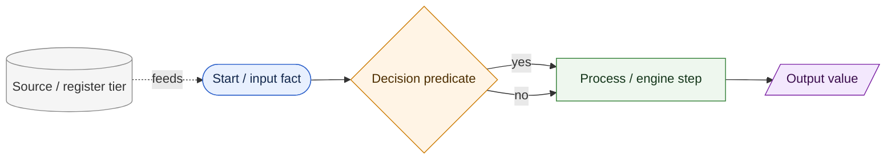

| Shape | Meaning |
|---|---|
| Rounded `([...])` | An input fact or the start of a flow |
| Diamond `{...}` | A decision predicate evaluated by a rule (first-match-by-priority within the test) |
| Rectangle `[...]` | An engine process step |
| Parallelogram `[/.../]` | An emitted output value written to the classification record |
| Cylinder `[(...)]` | A data source / register tier feeding facts |

**Conflict resolution within a test.** Where more than one branch could match, NEICS applies
**first-match-by-priority**: rule conditions are ordered by priority within the test, and the
**first** condition that evaluates true wins. This makes every map deterministic and replayable.

---

## 3. The 18 tests at a glance

The tests fall into four logical bands. The *label* number (T1…T18) is the methodological
identity; the *`seq`* number is the execution rank.

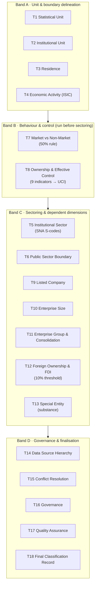

| Label | Test | Primary output | Depends on |
|---|---|---|---|
| T1 | Statistical Unit | unit type | — |
| T2 | Institutional Unit | autonomy flag | T1 |
| T3 | Residence | `residence` (RES/NRES/MULTI) | T1, T2 |
| T4 | Economic Activity | `isic_class` (ISIC Rev.4 4-digit) | T1 |
| T7 | Market vs Non-Market | `market_status` (MARKET/NON-MARKET) | T2, T4 |
| T8 | Ownership & Effective Control | `control_flag`, UCI, effective % | T2, T3 |
| T5 | Institutional Sector | `sector_code` (S.1x) | T3, T4, **T7**, **T8** |
| T6 | Public Sector Boundary | `public_private` | T3, **T7**, **T8** |
| T9 | Listed Company | listed flag | T8 |
| T10 | Enterprise Size | `size_class` | T1 |
| T11 | Enterprise Group & Consolidation | group key | T8 |
| T12 | Foreign Ownership & FDI | `fdi_flag` | T3, T8 |
| T13 | Special Entity | `special_entity_flag` | T4, T8, T11 |
| T14 | Data Source Hierarchy | source provenance | all facts |
| T15 | Conflict Resolution | resolved facts | T14 |
| T16 | Governance | review routing | T15 |
| T17 | Quality Assurance | quality flags | T16 |
| T18 | Final Classification Record | committed record | all |

> **Note on `seq` vs label.** The `seq` field — not the label — drives the runtime. The engine
> sorts active tests by `seq` ascending and evaluates them in that order, so that when T5 runs the
> facts produced by T7 and T8 are already present in the working fact set. See
> [`./10_rules_repository_design.md`](./10_rules_repository_design.md) §"Execution ordering".

---

## 4. MASTER decision tree — full pipeline execution order

This is the canonical view: the complete classification pipeline in **`seq` order**, showing the
critical re-ordering of T7/T8 ahead of T5/T6, and the points at which the Ownership Intelligence
Engine and the Quality Engine are consulted.

```mermaid
flowchart TD
    START([Enterprise candidate<br/>from Business Register]):::io

    %% Band A
    START --> T1{T1 · Is this a<br/>statistical unit?}:::dec
    T1 -->|no| EXCL[/Exclude / park/]:::out
    T1 -->|yes| T2{T2 · Autonomous<br/>institutional unit?}:::dec
    T2 -->|no, sub-unit| MERGE[Roll up to<br/>parent enterprise]:::proc
    T2 -->|yes| T3[T3 · Determine residence]:::proc
    MERGE --> T3

    T3 --> T3O[/residence:<br/>RES / NRES / MULTI/]:::out
    T3O --> T4[T4 · Determine economic activity]:::proc
    T4 --> T4O[/isic_class:<br/>ISIC Rev.4 4-digit/]:::out

    %% Band B - runs BEFORE T5/T6
    T4O --> OIE[[Ownership Intelligence Engine<br/>effective %, indicators, UCI, chain]]:::proc
    OIE --> T7[T7 · Market vs Non-Market<br/>50% cost-coverage rule]:::proc
    T7 --> T7O[/market_status:<br/>MARKET / NON-MARKET/]:::out
    T7O --> T8[T8 · Ownership & Effective Control<br/>9 control indicators]:::proc
    T8 --> T8O[/control_flag + UCI +<br/>gov% / foreign% effective/]:::out

    %% Band C - depends on T7/T8
    T8O --> T5[T5 · Institutional Sector<br/>uses residence + ISIC + market + control]:::proc
    T5 --> T5O[/sector_code: S.11 / S.12x /<br/>S.13x / S.14 / S.15 / S.2/]:::out
    T5O --> T6[T6 · Public Sector Boundary<br/>uses control + ownership + market]:::proc
    T6 --> T6O[/public_private:<br/>PUB-NFC ... NPISH/]:::out

    T6O --> T9{T9 · Listed on<br/>a recognised exchange?}:::dec
    T9 -->|yes| T9Y[/listed = true; LEI required/]:::out
    T9 -->|no| T10
    T9Y --> T10
    T10[T10 · Enterprise Size<br/>FTE & revenue, higher governs]:::proc --> T10O[/size_class:<br/>MICRO/SMALL/MEDIUM/LARGE/]:::out
    T10O --> T11[T11 · Enterprise Group<br/>& consolidation]:::proc
    T11 --> T12[T12 · Foreign Ownership & FDI<br/>10% threshold]:::proc
    T12 --> T12O[/fdi_flag:<br/>INWARD-FULL ... NONE/]:::out
    T12O --> T13[T13 · Special Entity<br/>substance-over-form]:::proc
    T13 --> T13O[/special_entity_flag:<br/>HOLDING/SPV/CONSOLIDATE-PARENT/NONE/]:::out

    %% Band D - governance
    T13O --> T14[[T14 · Data Source Hierarchy<br/>Tier1>Tier2>Tier3>Tier4]]:::proc
    T14 --> T15[T15 · Conflict Resolution<br/>first-match-by-priority]:::proc
    T15 --> T16[T16 · Governance routing]:::proc
    T16 --> QE[[Quality Engine<br/>6 DAMA dimensions + anomaly]]:::proc
    QE --> T17{T17 · Quality assurance<br/>passes thresholds?}:::dec
    T17 -->|no / anomaly| RQ[(review_item<br/>review queue)]:::src
    T17 -->|yes| T18[T18 · Final Classification Record<br/>temporal-versioned commit]:::proc
    RQ -.peer / committee.-> T18
    T18 --> DONE([Committed classification<br/>is_current = true]):::io

    classDef io fill:#e8f0fe,stroke:#3366cc,color:#13284d;
    classDef dec fill:#fff4e5,stroke:#cc7a00,color:#4d2e00;
    classDef proc fill:#eef7ee,stroke:#2e7d32,color:#14361a;
    classDef out fill:#f3e8fd,stroke:#7a1fa2,color:#3a0d4d;
    classDef src fill:#f5f5f5,stroke:#888,color:#333;
```

### 4.1 Reading the master tree

1. **Band A (T1–T4)** delineates *what* is being classified and *where it sits* and *what it
   does*: it produces the statistical unit, its residence and its ISIC activity.
2. **Band B (T7, T8)** establishes *how the unit behaves economically* (market vs non-market) and
   *who controls it* — both **before** sectoring, because both feed the sector and public/private
   decisions. The **Ownership Intelligence Engine** is invoked at the head of this band to compute
   effective ownership and control facts.
3. **Band C (T5, T6, T9–T13)** assigns the dependent dimensions: institutional sector,
   public/private boundary, listed status, size, group/consolidation, FDI and special-entity
   substance.
4. **Band D (T14–T18)** governs provenance, conflict resolution, review routing, quality assurance
   and the final temporal-versioned commit.

### 4.2 The dependency spine

The strict data dependency that *forces* the T7/T8-before-T5/T6 ordering:

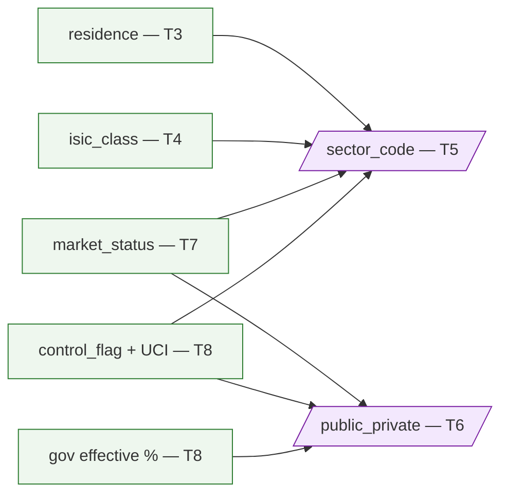

If T5 or T6 ran first, `market_status` and `control_flag` would be null and the SNA sector mapping
would be undefined. The `seq` ordering guarantees the inputs exist.

---

## 5. Logic map — T7 Market vs Non-Market (the 50% rule)

T7 determines whether a producer is a **market** or **non-market** producer using the SNA test of
*economically significant prices*: a unit is a market producer if its **sales cover at least 50%
of its production costs** over a sustained period.

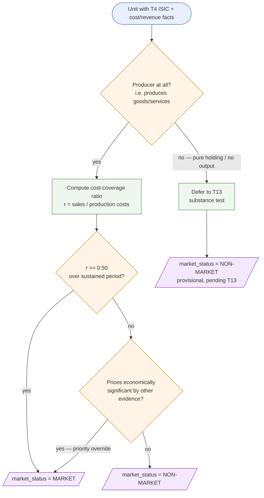

| Branch | Condition | Output |
|---|---|---|
| 1 | sales / production costs ≥ 50% (sustained) | `MARKET` |
| 2 | ratio < 50% but prices economically significant on other evidence | `MARKET` (priority override) |
| 3 | ratio < 50% and prices not significant | `NON-MARKET` |
| 4 | not a producer (pure vehicle) | `NON-MARKET` provisional, defer to T13 |

**Why T7 matters downstream.** `market_status` is consumed by **both** T5 and T6. A government-
controlled unit that is a *market* producer becomes a **public corporation** (S.11/S.12,
PUB-NFC/PUB-FC); the same unit that is *non-market* becomes **general government** (S.13, GG). The
50% rule is therefore the hinge between the corporate sectors and the government sector.

---

## 6. Logic map — T8 Ownership & Effective Control

T8 determines **effective control**, not nominal majority. The Ownership Intelligence Engine first
computes effective (direct + indirect, aggregated across vehicles) government and foreign ownership
percentages, the present control indicators, the **Ultimate Controlling Institutional Unit (UCI)**
and the full ownership chain. T8 then evaluates **nine control indicators** by priority and emits a
single `control_flag`.

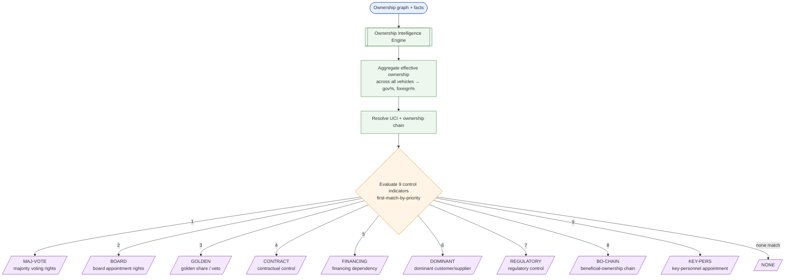

### 6.1 The nine control indicators (priority order)

| # | `control_flag` | Indicator | Typical evidence |
|---|---|---|---|
| 1 | `MAJ-VOTE` | Majority voting rights | Share register, voting agreements |
| 2 | `BOARD` | Right to appoint/remove the board majority | Articles, shareholder agreements |
| 3 | `GOLDEN` | Golden share / veto over strategic decisions | Special-share instrument |
| 4 | `CONTRACT` | Contractual control (management/concession) | Management contract, concession |
| 5 | `FINANCING` | Financing dependency | Funding structure, guarantees |
| 6 | `DOMINANT` | Dominant customer or supplier | Trade-concentration profiling |
| 7 | `REGULATORY` | Regulatory control | Sector regulation, licensing |
| 8 | `BO-CHAIN` | Beneficial-ownership chain | BO register, chain traversal |
| 9 | `KEY-PERS` | Key-personnel appointment | Director/CEO appointment rights |
| — | `NONE` | No control indicator present | — |

> **Substance-over-form.** Control is determined by the **strongest** indicator found, not by
> equity alone. A minority equity holding **plus** a golden share (`GOLDEN`) yields effective
> control and reclassifies the unit as a **public corporation**. State holdings split across
> several vehicles are **aggregated** by the engine before the indicators are evaluated, so that
> dispersed minority stakes summing to effective control are detected.

### 6.2 UCI resolution (ownership chain traversal)

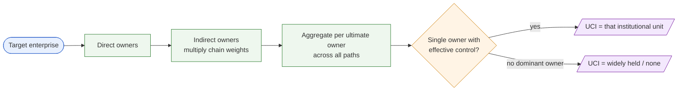

---

## 7. Logic map — T5 Institutional Sector (SNA S-codes)

T5 maps the unit to an **SNA institutional sector** using `residence` (T3), `isic_class` (T4),
`market_status` (T7) and `control_flag`/effective ownership (T8). The decisive splits are:
**resident vs non-resident**, **financial vs non-financial** (ISIC Section K = financial),
**market vs non-market**, and **who controls**.

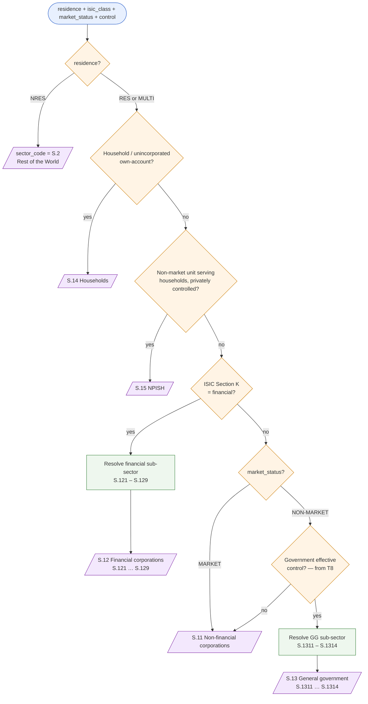

### 7.1 Sector code reference

| `sector_code` | Sector | Sub-codes |
|---|---|---|
| S.11 | Non-financial corporations | — |
| S.12 | Financial corporations | S.121 central bank · S.122 deposit-takers · S.123 MMFs · S.124 non-MMF investment funds · S.125 other financial intermediaries · S.126 financial auxiliaries · S.127 captive financials & money lenders · S.128 insurance corporations · S.129 pension funds |
| S.13 | General government | S.1311 central · S.1312 state · S.1313 local · S.1314 social security funds |
| S.14 | Households | — |
| S.15 | NPISH | — |
| S.2 | Rest of the World | (non-resident units) |

> **Financial sub-sector resolution** (S.121–S.129) is driven by the precise financial activity
> within ISIC Section K and the unit's function (intermediary, auxiliary, captive, insurer,
> pension). **General-government sub-sector resolution** (S.1311–S.1314) is driven by the level of
> government and the social-security distinction. Both are validated by VR-007
> (financial sector ↔ ISIC Section K) — see
> [`./13_data_quality_framework.md`](./13_data_quality_framework.md).

---

## 8. Logic map — T6 Public Sector Boundary (public_private)

T6 draws the **public-sector boundary**. It combines **government effective control** (any control
indicator present **OR** > 50% government effective ownership — both from T8) with
**`market_status`** (T7). A government-controlled **market** producer is a *public corporation*; a
government-controlled **non-market** unit is *general government*. Private units split by
financial/non-financial, foreign control and NPISH.

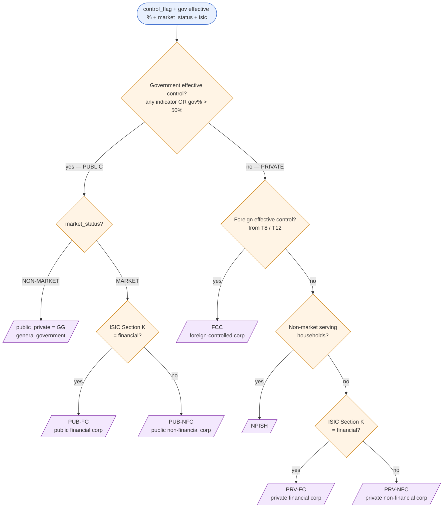

### 8.1 public_private value reference

| Value | Meaning | Control | Market | Financial |
|---|---|---|---|---|
| `PUB-NFC` | Public non-financial corporation | Government | MARKET | No |
| `PUB-FC` | Public financial corporation | Government | MARKET | Yes |
| `GG` | General government | Government | NON-MARKET | n/a |
| `PRV-NFC` | Private non-financial corporation | Private domestic | any | No |
| `PRV-FC` | Private financial corporation | Private domestic | any | Yes |
| `FCC` | Foreign-controlled corporation | Foreign | any | any |
| `NPISH` | Non-profit serving households | Private | NON-MARKET | n/a |

> **Worked substance case.** A sovereign wealth fund holds a minority equity stake **plus** a
> golden share in a domestic operating company. T8 emits `control_flag = GOLDEN`, so T6's first
> predicate (*government effective control?*) is **true** despite the minority equity. With
> `market_status = MARKET` and non-financial ISIC, the unit classifies as **PUB-NFC** — a public
> corporation. Legal form (minority shareholder) is overridden by economic substance (veto
> control). This is validated by VR-006 (public-sector control flag present).

---

## 9. Logic map — T12 Foreign Ownership & FDI (10% threshold)

T12 sets the `fdi_flag` using the FDI **10% threshold** of voting power for a direct investment
relationship, layered with control and the round-trip detection produced by the Ownership
Intelligence Engine.

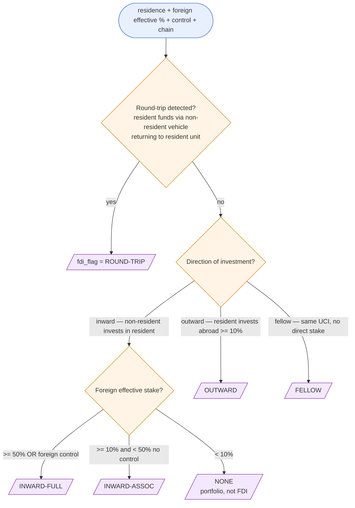

| `fdi_flag` | Condition |
|---|---|
| `INWARD-FULL` | Non-resident holds ≥ 50% **or** effective control of a resident unit |
| `INWARD-ASSOC` | Non-resident holds ≥ 10% and < 50% with no control (associate) |
| `OUTWARD` | Resident holds ≥ 10% in a non-resident unit |
| `ROUND-TRIP` | Resident-origin funds routed through a non-resident vehicle back into a resident unit |
| `FELLOW` | Fellow enterprises sharing a common UCI without a direct ≥ 10% stake |
| `NONE` | Stake below 10% (portfolio) or no cross-border ownership |

> **Round-trip + substance interplay.** A multi-level SWF cascade that passes through a
> non-resident vehicle but ultimately controls a **resident** unit still yields a **resident public
> corporation** at T5/T6 (the non-resident vehicle does not change residence of the target), while
> T12 independently flags the financing path as `ROUND-TRIP`. VR-012 (hidden-government
> cross-check) and the anomaly detector both watch for this pattern; missing FDI flags are caught
> by the *missing FDI flag* anomaly rule — see
> [`./13_data_quality_framework.md`](./13_data_quality_framework.md).

---

## 10. Logic map — T10 Enterprise Size

T10 assigns `size_class` from **employment (FTE)** and **annual revenue (QAR)**. Where the two
criteria disagree, the **higher** criterion governs (i.e. the unit is placed in the larger class).

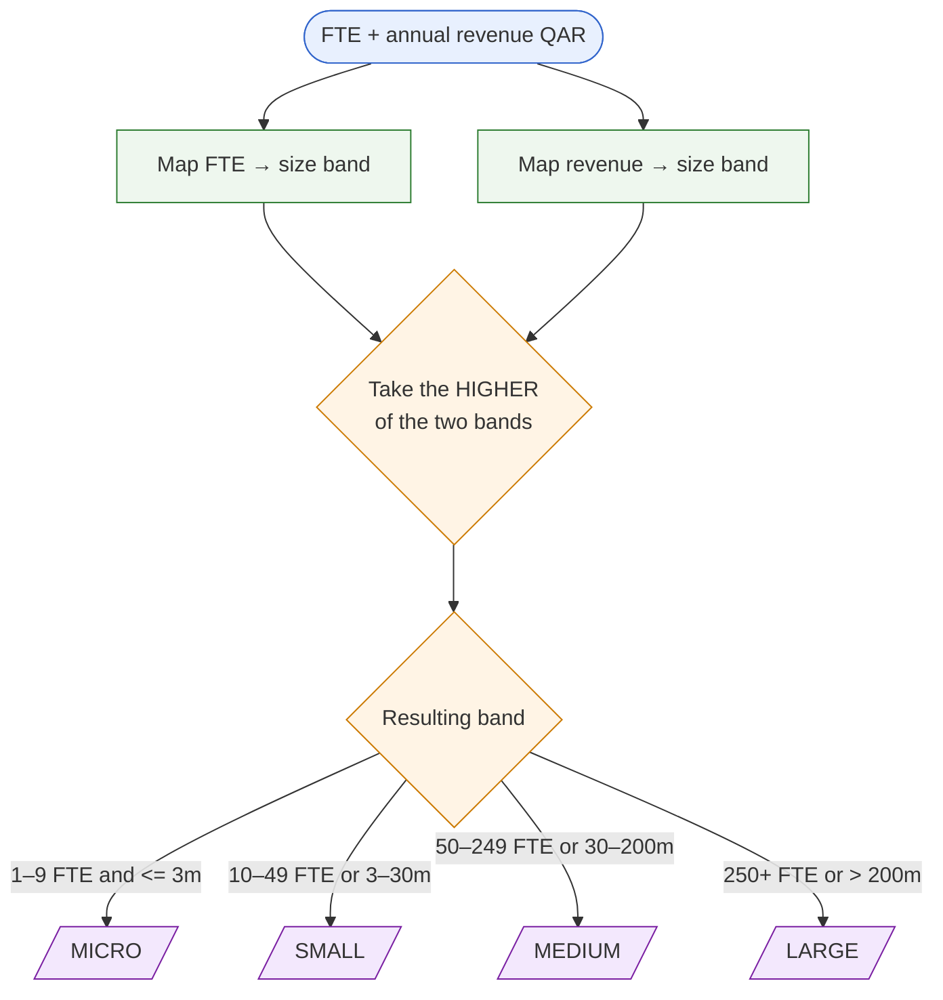

| `size_class` | Employment (FTE) | Annual revenue (QAR) |
|---|---|---|
| `MICRO` | 1–9 | ≤ 3 million |
| `SMALL` | 10–49 | 3–30 million |
| `MEDIUM` | 50–249 | 30–200 million |
| `LARGE` | 250+ | > 200 million |

> **Higher-criterion rule.** A unit with 12 FTE (SMALL) but QAR 250 million revenue (LARGE) is
> classified **LARGE**. Disagreement between FTE and revenue beyond one band triggers the
> *size-revenue consistency* validation (VR-013) and may route to review — see
> [`./13_data_quality_framework.md`](./13_data_quality_framework.md).

---

## 11. Logic map — T13 Special Entity (substance-over-form)

T13 tests **economic substance** to identify holding companies, special-purpose vehicles (SPVs)
and empty shells, and to mark consolidation parents. It consumes T4 (activity), T8 (control/chain)
and T11 (group/consolidation).

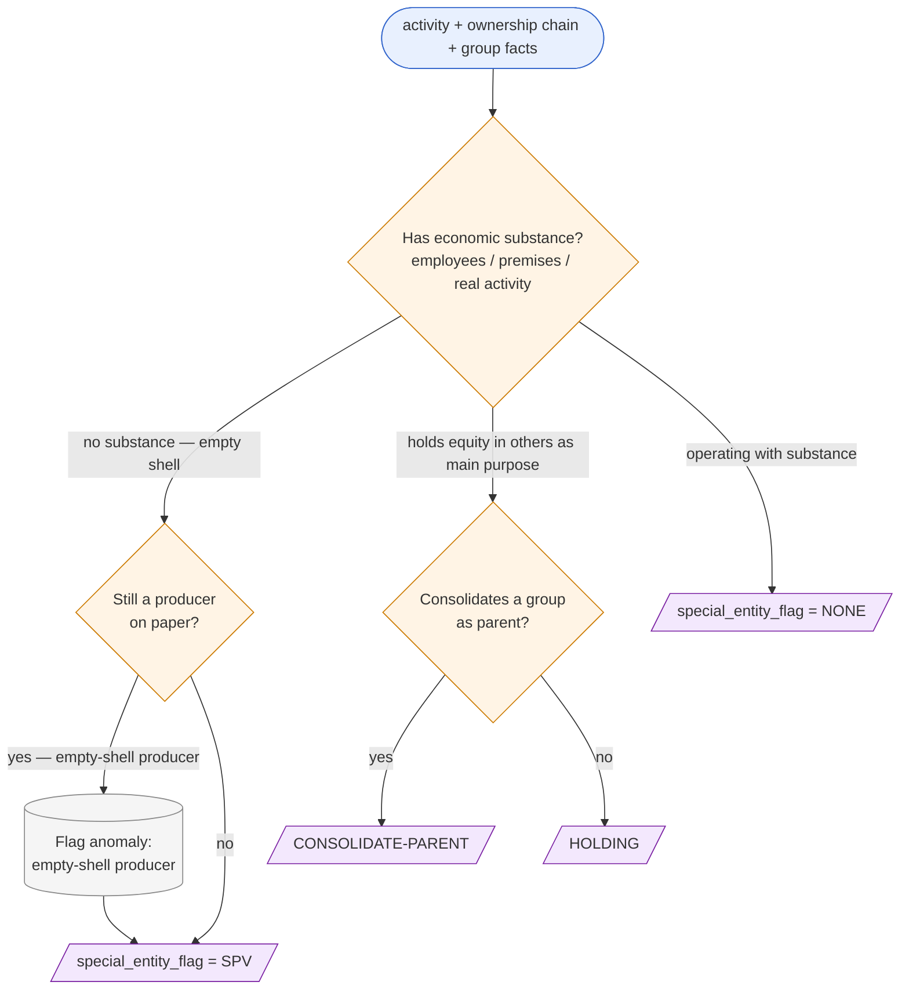

| `special_entity_flag` | Meaning |
|---|---|
| `HOLDING` | Holding company whose principal activity is owning equity in subsidiaries |
| `SPV` | Special-purpose vehicle / empty shell with no significant own activity |
| `CONSOLIDATE-PARENT` | Group parent that consolidates subsidiaries for statistical reporting |
| `NONE` | Operating unit with genuine economic substance |

> **Empty-shell producer.** A unit recorded with a producing ISIC class but **no** employees,
> premises or output is an *empty-shell producer*: T13 sets `SPV` and the Quality Engine raises the
> *empty-shell producer* anomaly (VR-015 empty-shell substance). The classification is held for
> review rather than committed silently.

---

## 12. Conflict resolution and provenance (T14–T15)

T14 ranks every fact by **data-source tier** before T15 resolves contradictions
**first-match-by-priority**. The highest-tier corroborated fact wins.

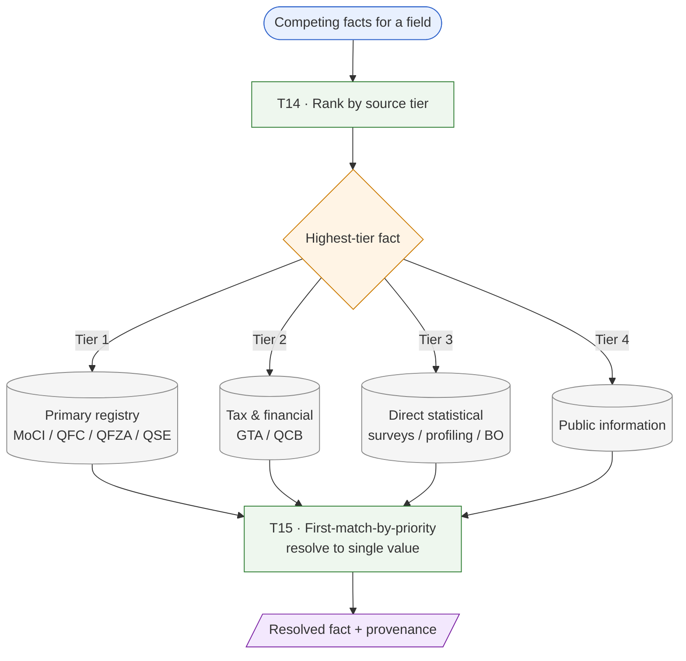

The tier hierarchy and the evidence register are detailed in
[`./14_audit_and_lineage_framework.md`](./14_audit_and_lineage_framework.md).

---

## 13. End-to-end worked example — a sovereign-controlled bank via an offshore vehicle

This example exercises the critical ordering and the substance rules together.

**Facts.** A SWF holds 35% direct equity plus a golden share in an offshore holding vehicle; that
vehicle holds 60% of a Doha-domiciled deposit-taking bank. The bank charges market interest rates
and covers > 50% of its costs from interest income.

```mermaid
flowchart TD
    S([SWF 35% + golden share → offshore vehicle → 60% → Doha bank]):::io
    S --> T3[/T3 residence = RES<br/>(bank domiciled in Qatar)/]:::out
    T3 --> T4[/T4 isic_class = K 6419<br/>other monetary intermediation/]:::out
    T4 --> OIE[[OIE: aggregate effective gov% across vehicles<br/>detect golden share, resolve UCI = SWF]]:::proc
    OIE --> T7[/T7 market_status = MARKET<br/>covers > 50% costs/]:::out
    T7 --> T8[/T8 control_flag = MAJ-VOTE + GOLDEN<br/>gov effective control = true/]:::out
    T8 --> T5[/T5 sector_code = S.122<br/>deposit-taking corporation/]:::out
    T5 --> T6[/T6 public_private = PUB-FC<br/>public financial corporation/]:::out
    T6 --> T12[/T12 fdi_flag = ROUND-TRIP<br/>resident-origin funds via offshore vehicle/]:::out
    T12 --> T13[/T13 special_entity_flag = NONE<br/>bank has substance/]:::out
    T13 --> DONE([Resident PUBLIC financial corporation,<br/>flagged ROUND-TRIP]):::io

    classDef io fill:#e8f0fe,stroke:#3366cc;
    classDef proc fill:#eef7ee,stroke:#2e7d32;
    classDef out fill:#f3e8fd,stroke:#7a1fa2;
```

**Reading.** Because T7 and T8 ran first, T5 had both `market_status = MARKET` and government
effective control available, so it could place the unit in **S.122** and T6 could mark it
**PUB-FC**. The offshore vehicle did **not** make the bank non-resident — residence follows the
operating unit's domicile — but the financing path is independently flagged **ROUND-TRIP** by T12.
Substance (golden share) overrode the minority direct equity throughout.

---

## 14. Traceability — maps to rules and data

Every decision branch in this document corresponds to a stored rule and emits an audited fact.

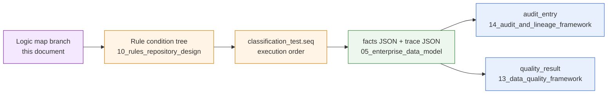

| Concern | Where |
|---|---|
| Rule storage, priority, condition trees | [`./10_rules_repository_design.md`](./10_rules_repository_design.md) |
| Fact set, trace JSON, output fields | [`./05_enterprise_data_model.md`](./05_enterprise_data_model.md) |
| Variable definitions / allowed values | [`./08_metadata_model.md`](./08_metadata_model.md) |
| Validation rules VR-001…VR-018 | [`./13_data_quality_framework.md`](./13_data_quality_framework.md) |
| Audit, versioning, reproduction | [`./14_audit_and_lineage_framework.md`](./14_audit_and_lineage_framework.md) |
| AI-assisted review of branches | [`./15_ai_review_framework.md`](./15_ai_review_framework.md) |

---

## 15. Related documents

- [`./05_enterprise_data_model.md`](./05_enterprise_data_model.md) — the data consumed and produced.
- [`./10_rules_repository_design.md`](./10_rules_repository_design.md) — rule storage and the
  `seq`-ordered execution engine these maps visualise.
- [`./13_data_quality_framework.md`](./13_data_quality_framework.md) — the DAMA dimensions,
  validation rules and anomaly detection that gate T17.
- [`./14_audit_and_lineage_framework.md`](./14_audit_and_lineage_framework.md) — how each branch is
  audited, versioned and reproduced.
- [`./15_ai_review_framework.md`](./15_ai_review_framework.md) — AI-assisted triage of branches
  routed to review.
- [`./INDEX.md`](./INDEX.md) — architecture documentation index.
