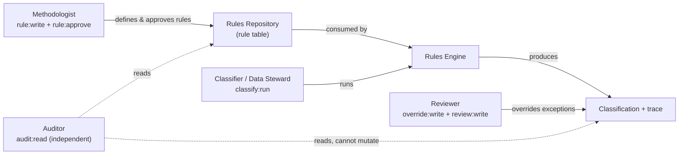
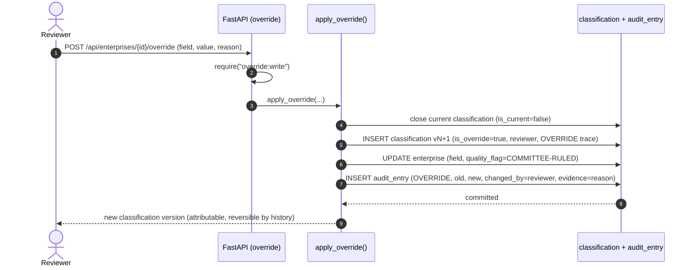
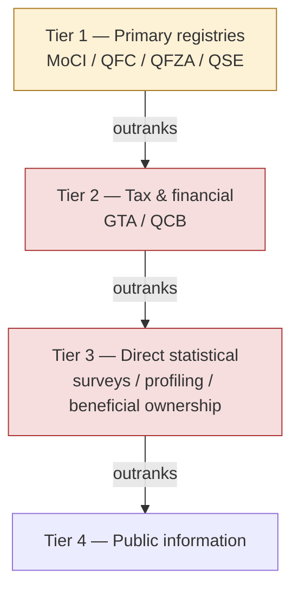

# 12 — Security Architecture

> **National Enterprise Intelligence and Classification System (NEICS)**
> National Statistics Office (NSO) — State of Qatar
> **Environment: STAGING / UAT.** Isolated from production and from live data providers.
> Document status: For review by data-governance specialists, security architects and senior statisticians.

---

## 1. Purpose and Scope

This document describes the **security architecture** of NEICS: identity and authentication,
the role-based access control (RBAC) model and its full roles × permissions matrix,
authorization enforcement, audit logging, statistical confidentiality under the **Qatar
Statistics Law**, data-access restrictions tied to the data-source hierarchy, and the
isolation of the STAGING/UAT environment from production.

NEICS holds enterprise master data, ownership and beneficial-ownership intelligence, and
official statistical classifications. These are sensitive both commercially and legally;
access is governed by least-privilege RBAC and by the confidentiality obligations of the
national statistics mandate.

Related documents:

- [`./03_application_architecture.md`](./03_application_architecture.md) — components and flows.
- [`./04_technical_architecture.md`](./04_technical_architecture.md) — runtime stack and the
  technical security building blocks.
- [`./10_rules_repository_design.md`](./10_rules_repository_design.md) — rule governance and
  approval workflow (which `rule:approve` gates).
- [`./05_enterprise_data_model.md`](./05_enterprise_data_model.md) — the `app_user`,
  `audit_entry` and classification tables referenced here.
- [`./INDEX.md`](./INDEX.md) — documentation index.

---

## 2. Security Principles

| # | Principle | Manifestation |
|---|-----------|---------------|
| S1 | **Authenticate everyone, trust nothing.** | Every protected endpoint requires a valid JWT; the SPA is treated as an untrusted client. |
| S2 | **Least privilege via permission verbs.** | Access is granted as fine-grained verbs (`enterprise:write`, `override:write`, …) mapped to roles, not by endpoint guesswork. |
| S3 | **Authorize server-side, always.** | The `require(perm)` dependency enforces permissions in the API regardless of what the UI exposes. |
| S4 | **Separation of duties.** | Authoring rules (`rule:write`/`rule:approve`), classifying (`classify:run`), reviewing/overriding (`override:write`) and auditing (`audit:read`) are distinct roles. |
| S5 | **Everything is audited.** | All material mutations write an append-only `audit_entry` (who, what, when, why). |
| S6 | **Confidentiality by law.** | Access and disclosure are bounded by the Qatar Statistics Law; published outputs are aggregated/non-identifying. |
| S7 | **Staging is isolated.** | UAT runs on a separate network, store and secret, with no connection to live data providers or production. |

---

## 3. Identity and Authentication

### 3.1 Users
Platform identities are stored in the `app_user` table: `username` (unique), `full_name`,
`email`, `hashed_password`, a single `role`, and an `is_active` flag. Each user holds exactly
one role; the role determines the permission set (Section 5).

### 3.2 Password storage
Passwords are never stored in clear text. They are hashed with **bcrypt** via `passlib`'s
`CryptContext(schemes=["bcrypt"], deprecated="auto")`. Verification uses
`pwd_context.verify`; the scheme can be upgraded transparently (`deprecated="auto"`).

### 3.3 Authentication flow — OAuth2 password → JWT
Authentication uses the OAuth2 password flow. `POST /api/auth/login` accepts form credentials,
verifies the bcrypt hash, and on success issues a signed **JWT access token** (HS256) with the
claims `sub` (username), `role` and `exp`. The token lifetime is `NEICS_JWT_EXPIRE_MINUTES`
(default **480 minutes / 8 hours**). The signing key is `NEICS_JWT_SECRET` — which **must be
overridden** away from its shipped default in any non-local environment.

Subsequent requests present the token as an `Authorization: Bearer <token>` header. The
`get_current_user` dependency decodes and verifies the signature and expiry, loads the user
from `app_user`, and rejects inactive or unknown users with `401`.

```mermaid
sequenceDiagram
    autonumber
    actor U as User (steward / reviewer / ...)
    participant SPA as React SPA
    participant API as FastAPI (auth.py)
    participant SEC as core/security.py
    participant DB as app_user (ORM)

    U->>SPA: Enter username + password
    SPA->>API: POST /api/auth/login (OAuth2 form)
    API->>DB: SELECT user WHERE username
    DB-->>API: user row (hashed_password, role, is_active)
    API->>SEC: verify_password(input, hashed)
    alt Invalid credentials or inactive
        SEC-->>API: false
        API-->>SPA: 401 Invalid credentials
    else Valid
        SEC-->>API: true
        API->>SEC: create_access_token(username, role)
        SEC-->>API: JWT (sub, role, exp; HS256)
        API-->>SPA: 200 {access_token, role, username}
    end

    Note over SPA,API: Subsequent calls attach Authorization: Bearer <JWT>

    SPA->>API: GET /api/enterprises (Bearer JWT)
    API->>SEC: get_current_user(token)
    SEC->>SEC: jwt.decode + verify signature/expiry
    SEC->>DB: SELECT user WHERE username = sub
    alt Token invalid / expired / user inactive
        SEC-->>API: raise 401
        API-->>SPA: 401 Not authenticated
    else Valid session
        SEC-->>API: User
        API->>SEC: require("enterprise:read") -> has_permission(role, perm)
        alt Role lacks permission
            SEC-->>API: raise 403
            API-->>SPA: 403 Role lacks permission
        else Authorized
            SEC-->>API: User (authorised)
            API-->>SPA: 200 resource
        end
    end
```

### 3.4 Token properties and posture

| Property | Value / approach |
|----------|------------------|
| Type | JWT, signed (HS256) |
| Claims | `sub` (username), `role`, `exp` |
| Lifetime | 8 hours (configurable) |
| Transport | `Authorization: Bearer` header over TLS (ingress termination) |
| Revocation | Deactivate `app_user.is_active` (checked on every request); expiry bounds exposure |
| Secret management | `NEICS_JWT_SECRET` from the platform secret store; never the default |

> **Note on session model.** Tokens are stateless and self-contained; there is no server-side
> session store. Immediate revocation is achieved by deactivating the user (the
> `get_current_user` check rejects inactive users on the next request); otherwise exposure is
> bounded by the token lifetime.

---

## 4. Authorization Model

Authorization is **permission-verb RBAC**. Each protected endpoint declares the single verb it
requires via the `require(perm)` FastAPI dependency factory in `app/core/security.py`. A role
maps to a set of permission verbs; `has_permission(role, perm)` returns true if the role holds
the verb or the wildcard `*` (Administrator). Failing the check raises `403` with an explicit
message naming the role and the missing permission.

### 4.1 Permission verbs (the complete vocabulary)

| Verb | Meaning |
|------|---------|
| `enterprise:read` | Read enterprise master data, profiles, dashboards. |
| `enterprise:write` | Create/update enterprises; bulk ingest. |
| `ownership:write` | Add ownership edges (the ownership graph). |
| `classify:run` | Execute the 18-test classification pipeline; run simulations. |
| `classify:read` | Read classifications, history and explainability. |
| `rule:read` | Read rules and test a rule against facts. |
| `rule:write` | Author / modify rules in the Rules Repository. |
| `rule:approve` | Approve rules for production use (`approval_status=APPROVED`). |
| `standard:read` | Read the Standards Repository. |
| `standard:write` | Author / modify standards and concepts. |
| `metadata:read` | Read the Metadata Repository, the 18 tests and reference codelists. |
| `metadata:write` | Author / modify statistical metadata variables. |
| `quality:read` | Read data-quality scores and exceptions. |
| `audit:read` | Read the audit trail. |
| `review:read` | Read the review queue. |
| `review:write` | Resolve / dismiss review items. |
| `override:write` | Apply a committee/reviewer classification override. |

### 4.2 Roles

| Role | Mandate |
|------|---------|
| **Administrator** | Full platform control (wildcard `*`), including user administration. |
| **Methodologist** | Authors and approves rules, standards and metadata; the methodological authority. |
| **Data Steward** | Maintains enterprise master data and ownership; runs classification; works the review queue. |
| **Classifier** | Maintains enterprise data and runs classification (no ownership authoring). |
| **Reviewer** | Reviews exceptions and applies committee overrides. |
| **Auditor** | Read-only access to audit, quality, classifications and methodology — independent assurance. |
| **Analyst** | Read-only analytics over the register and classifications. |

---

## 5. RBAC Matrix (Roles × Permissions)

The matrix below is the authoritative mapping as implemented in `ROLE_PERMISSIONS`
(`app/core/security.py`). `✔` = granted; blank = denied. **Administrator** holds the wildcard
`*` and is therefore granted **every** permission, present and future.

| Permission ↓ \ Role → | Administrator | Methodologist | Data Steward | Classifier | Reviewer | Auditor | Analyst |
|---|:---:|:---:|:---:|:---:|:---:|:---:|:---:|
| `enterprise:read`  | ✔ | ✔ | ✔ | ✔ | ✔ | ✔ | ✔ |
| `enterprise:write` | ✔ |   | ✔ | ✔ |   |   |   |
| `ownership:write`  | ✔ |   | ✔ |   |   |   |   |
| `classify:run`     | ✔ | ✔ | ✔ | ✔ | ✔ |   |   |
| `classify:read`    | ✔ | ✔ | ✔ | ✔ | ✔ | ✔ | ✔ |
| `rule:read`        | ✔ | ✔ | ✔ | ✔ | ✔ | ✔ | ✔ |
| `rule:write`       | ✔ | ✔ |   |   |   |   |   |
| `rule:approve`     | ✔ | ✔ |   |   |   |   |   |
| `standard:read`    | ✔ | ✔ |   |   |   | ✔ | ✔ |
| `standard:write`   | ✔ | ✔ |   |   |   |   |   |
| `metadata:read`    | ✔ | ✔ | ✔ | ✔ | ✔ | ✔ | ✔ |
| `metadata:write`   | ✔ | ✔ |   |   |   |   |   |
| `quality:read`     | ✔ | ✔ | ✔ | ✔ | ✔ | ✔ | ✔ |
| `audit:read`       | ✔ |   |   |   |   | ✔ |   |
| `review:read`      | ✔ | ✔ | ✔ | ✔ | ✔ | ✔ | ✔ |
| `review:write`     | ✔ |   | ✔ |   | ✔ |   |   |
| `override:write`   | ✔ |   |   |   | ✔ |   |   |

> **Reading the matrix.** `standard:read` is intentionally *not* held by Data Steward,
> Classifier or Reviewer in the implemented sets — those roles consume standards indirectly via
> rules and metadata, while explicit standards browsing is reserved to methodological and
> assurance roles. The live source of truth is `ROLE_PERMISSIONS`; the `GET /api/admin/roles`
> endpoint (Administrator only) returns it verbatim for verification.

### 5.1 Separation of duties highlights



- **Authoring vs running.** The role that authors and approves rules (Methodologist) does not
  also hold `enterprise:write`/`ownership:write`; the roles that ingest and classify data do
  not hold `rule:write`/`rule:approve`.
- **Running vs overriding.** Classifiers run the engine but cannot override results;
  `override:write` is restricted to Reviewer (and Administrator). Overrides are recorded as a
  new, attributed classification version (see Section 6).
- **Independent assurance.** The Auditor holds only read verbs (notably `audit:read`) and
  cannot mutate any record.

---

## 6. Audit Logging

Every material change is recorded in the append-only **`audit_entry`** table. The audit record
captures: `timestamp`, `record_type`, `record_id`, `action`
(`CREATE`/`UPDATE`/`CLASSIFY`/`OVERRIDE`/`DELETE`), `field_changed`, `old_value`, `new_value`,
`changed_by` (the authenticated username), and an `evidence_ref` (e.g. `bulk-ingest`,
confidence, or an override justification).

| Event | Where written | Action | Notable fields |
|-------|---------------|--------|----------------|
| Enterprise created | `enterprises.create_enterprise`, `ingest._ingest_records` | `CREATE` | `new_value` = legal name; `evidence_ref` = `bulk-ingest` on upload |
| Enterprise field updated | `enterprises.update_enterprise` | `UPDATE` | per-field `old_value` → `new_value` |
| Ownership edge added | `enterprises.add_ownership` | `UPDATE` | `field_changed` = `ownership_edge` |
| Classification committed | `service.run_classification` | `CLASSIFY` | `new_value` = `vN`; `evidence_ref` = confidence |
| Override applied | `service.apply_override` | `OVERRIDE` | `field_changed`, `old_value`, `new_value`, `evidence_ref` = reason |

The trail is queryable via `GET /api/audit` (permission `audit:read`), optionally filtered by
`record_id`. In addition to `audit_entry`, classification history is itself an immutable
record: classifications are temporally versioned (close-then-insert), and overrides carry an
explicit `OVERRIDE` entry in the classification `trace` naming the reviewer and rationale —
providing a second, decision-level audit independent of the row-level change log.



---

## 7. Confidentiality under the Qatar Statistics Law

NEICS processes data collected and held under the national statistics mandate. The
confidentiality obligations of the **Qatar Statistics Law** govern its use:

- **Purpose limitation.** Microdata (identified enterprise, ownership and beneficial-ownership
  records) are used for statistical classification, register maintenance and quality assurance
  — not for administrative, regulatory or enforcement action against the respondent.
- **Non-disclosure of identifiable units.** Identifiable enterprise records are accessible only
  to authorised internal roles. Published or shared statistical outputs are **aggregated and
  non-identifying**; primary and secondary disclosure risks are managed before any external
  release.
- **Need-to-know access.** The RBAC matrix (Section 5) operationalises need-to-know:
  read access to the register is broad among internal roles, but write access to master data,
  ownership and overrides is tightly restricted, and audit access is reserved to the
  independent Auditor.
- **Beneficial-ownership sensitivity.** The ownership graph (`ownership_edge`) and derived
  UCI/beneficial-ownership facts are among the most sensitive holdings; authoring them requires
  the dedicated `ownership:write` verb (Data Steward / Administrator only).
- **Accountability.** Because every read-affecting mutation is attributed and audited
  (Section 6), responsibility for any handling of confidential data is traceable to a named
  user.

> **UAT caveat.** This STAGING/UAT build operates on **sample and synthetic UAT data**, not
> live confidential microdata. The same controls are nonetheless exercised end-to-end so that
> the confidentiality posture is validated before any production data is admitted.

---

## 8. Data Access Restrictions and the Source Hierarchy

Classification inputs derive from sources of differing authority and confidentiality. The
**data-source hierarchy** (framework Test 14) both resolves conflicts and frames access
sensitivity:



| Tier | Sources | Authority for conflict resolution | Confidentiality sensitivity |
|------|---------|-----------------------------------|-----------------------------|
| Tier 1 | MoCI, QFC, QFZA, QSE (primary registries) | Highest | High (identified registration data) |
| Tier 2 | GTA, QCB (tax & financial) | Below Tier 1 | Very high (fiscal/financial confidentiality) |
| Tier 3 | Surveys, profiling, beneficial ownership | Below Tier 2 | Very high (respondent-provided, BO data) |
| Tier 4 | Public information | Lowest | Low (already public) |

Two consequences for security:

1. **Provenance is recorded.** Each classification stores the full `facts` set and `trace`; the
   `/explain` endpoint reports the data sources consulted, so the lineage of any official
   classification can be reconstructed and reviewed.
2. **Sensitivity follows the tier.** Tier 2 (fiscal) and Tier 3 (survey / beneficial-ownership)
   inputs carry the strongest confidentiality obligations; access to the derived
   ownership/beneficial-ownership intelligence is gated by `ownership:write` for authoring and by
   the general read controls for consumption.

---

## 9. Staging / UAT Isolation

The STAGING/UAT environment is deliberately and verifiably separated from production:

| Dimension | Control |
|-----------|---------|
| Network | UAT runs on its own isolated Docker Compose network; no route to production services or live data providers. |
| Data | Seeded with sample/synthetic UAT datasets only; no live confidential microdata. |
| Secrets | Distinct `NEICS_JWT_SECRET` and database credentials from production; tokens issued in UAT are not valid in production. |
| Store | A separate PostgreSQL instance/volume; no shared database with production. |
| Identity | UAT `app_user` accounts are environment-scoped and do not federate to production. |
| Signalling | `GET /health` reports `"environment": "staging-uat"`, and the API root and OpenAPI description state **"STAGING / UAT — not for production use,"** so operators and monitors cannot mistake the instance for production. |

> **Promotion checklist (security-relevant).** Before any environment leaves UAT posture:
> override `NEICS_JWT_SECRET`; set `NEICS_CORS_ORIGINS` to the exact SPA origin (never `*`);
> disable `NEICS_AUTO_SEED`; rotate database credentials; and confirm only authorised roles
> exist in `app_user`.

---

## 10. Threat Considerations and Mitigations

| Threat | Mitigation |
|--------|------------|
| Credential theft / brute force | bcrypt hashing; bounded token lifetime; deactivate via `is_active`; ingress rate-limiting (production). |
| Token forgery | HS256 signature verified on every request with an environment-supplied secret. |
| Privilege escalation | Server-side `require(perm)` on every protected route; least-privilege role sets; user administration restricted to `*`. |
| Injection via rule logic | Rules are evaluated by an explicit, allow-listed interpreter (`expression.py`) — **no `eval`**; unknown operators raise. |
| Injection via inputs | Pydantic v2 schema validation; parameterised ORM queries (SQLAlchemy). |
| Unauthorised disclosure | RBAC need-to-know; aggregated public outputs; Statistics-Law confidentiality. |
| Tampering / repudiation | Append-only `audit_entry`; immutable, versioned classification history; attributed overrides. |
| Cross-environment leakage | Network/data/secret isolation of UAT from production (Section 9). |
| Over-permissive CORS | `NEICS_CORS_ORIGINS` restricted to the SPA origin in staging/production. |

---

## 11. Security Component-to-Source Map

| Concern | Source |
|---------|--------|
| Password hashing / verification | `app/core/security.py` (`hash_password`, `verify_password`) |
| JWT issuance | `app/core/security.py` (`create_access_token`) |
| JWT verification / user load | `app/core/security.py` (`get_current_user`) |
| Permission check | `app/core/security.py` (`has_permission`, `require`) |
| Role → permission matrix | `app/core/security.py` (`ROLE_PERMISSIONS`) |
| Login / session endpoints | `app/api/auth.py` (`/api/auth/login`, `/api/auth/me`) |
| Role/user administration | `app/api/governance.py` (`/api/admin/users`, `/api/admin/roles`) |
| Audit writes | `app/engine/service.py`, `app/api/enterprises.py`, `app/api/ingest.py` |
| Audit read | `app/api/governance.py` (`/api/audit`) |
| User model | `app/models/governance.py` (`User` → `app_user`) |
| Audit model | `app/models/governance.py` (`AuditEntry` → `audit_entry`) |
| Config / secrets | `app/config.py` (`NEICS_*`) |

---

*End of document — `12_security_architecture.md`. See also
[`03_application_architecture.md`](./03_application_architecture.md),
[`04_technical_architecture.md`](./04_technical_architecture.md) and
[`10_rules_repository_design.md`](./10_rules_repository_design.md).*
