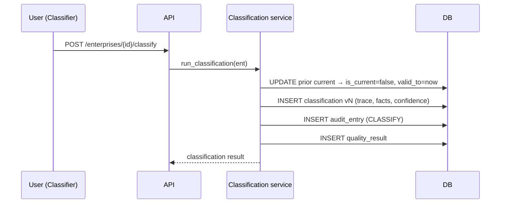

# Audit, Lineage & Temporal Versioning Framework

> NEICS — Staging / UAT. See sibling docs in [`INDEX.md`](./INDEX.md).

## 1. Principles

Every classification must be **reproducible** and **defensible**: any competent
statistician must be able to reconstruct exactly why a unit was classified as it was,
and what its classification was at any past point in time. NEICS achieves this through
three mechanisms working together — an immutable audit trail, temporal versioning of
classifications, and an evidence/lineage record embedded in each result.

## 2. Audit trail (`audit_entry`)

A per-record change log captures who changed what, when, why and with what evidence:

| Field | Meaning |
|---|---|
| `timestamp` | When the change occurred |
| `record_type`, `record_id` | The affected entity (e.g. enterprise) |
| `action` | CREATE / UPDATE / CLASSIFY / OVERRIDE / DELETE |
| `field_changed`, `old_value`, `new_value` | The specific change |
| `changed_by` | Acting user (RBAC identity) |
| `evidence_ref` | Pointer to the supporting evidence (e.g. committee minute, filing) |

Audit entries are written automatically on enterprise create/update, ownership
changes, every classification run, and every manual override. **VR-016** enforces that
a classified record has at least one audit entry.

## 3. Temporal versioning of classifications (`classification`)

Classifications are **never overwritten**. Each (re)classification:

1. Closes the previous current record (`is_current = false`, sets `valid_to`).
2. Inserts a new immutable row with an incremented `version`, `valid_from = now`,
   the full result, the **rule trace**, the **fact set used**, the confidence, and the
   methodology version.

This makes the classification history a complete, append-only timeline. To reproduce
a historical classification, select the row whose `[valid_from, valid_to)` interval
contains the date of interest.

## 4. Evidence & lineage in each result

Each `classification` row stores:

- **`trace`** — the ordered list of all 18 tests and, for each, the rule that fired
  (rule id, output, standard reference, rationale) or a note that no data rule applied.
- **`facts`** — the exact fact set fed to the engine (declared attributes + ownership-derived
  facts such as effective government/foreign ownership and the UCI), i.e. the data
  provenance for the decision.

`/api/enterprises/{id}/explain` assembles these into a complete explainability payload:
applied rules, data fields used, data sources, confidence, reviewer/override status and
methodology version.

## 5. Manual overrides

A reviewer/committee override (`apply_override`) is recorded as a **new classification
version** flagged `is_override = true` with the `override_reason`, `reviewer`, and an
appended OVERRIDE trace step — plus an `OVERRIDE` audit entry capturing old/new values.
The statistical override never silently mutates the database (framework Test 15).

## 6. Data source hierarchy & lineage

Attribute provenance follows the framework's fixed precedence:
**Tier 1** primary registry (MoCI / QFC / QFZA / QSE) → **Tier 2** tax & financial
(GTA / QCB) → **Tier 3** direct statistical (surveys, large-case profiling,
beneficial-ownership filings) → **Tier 4** public information. Conflicts are resolved by
priority with a logged statistical override.
