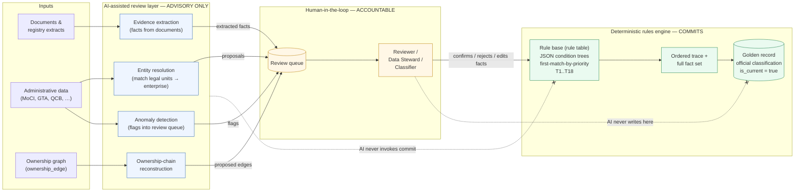
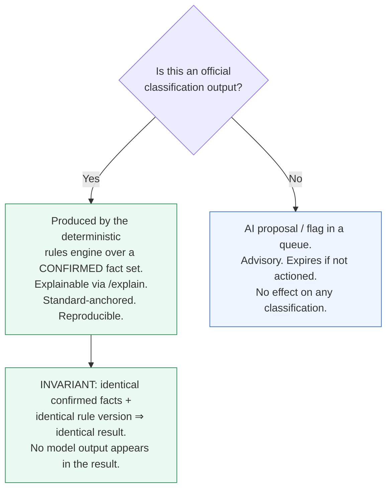

# 15 — AI-Assisted Review Framework

> **National Enterprise Intelligence and Classification System (NEICS)**
> National Statistics Office (NSO) — State of Qatar
> **Environment: STAGING / UAT.** Isolated from production and from live data providers.
> Document status: For review by senior statisticians, enterprise architects and data-governance specialists.

| | |
|---|---|
| **Document** | 15 — AI-Assisted Review Framework |
| **Status** | STAGING / UAT — pre-pilot review draft |
| **Audience** | Senior statisticians, enterprise architects, data-governance specialists |
| **Classification** | Official — Internal (subject to Qatar Statistics Law) |
| **Owner** | National Statistics Office (NSO), Statistical Methodology & Business Register Programme |
| **Date** | 2026-06-18 |
| **Related** | [`./10_rules_repository_design.md`](./10_rules_repository_design.md) · [`./11_classification_logic_maps.md`](./11_classification_logic_maps.md) · [`./13_data_quality_framework.md`](./13_data_quality_framework.md) · [`./14_audit_and_lineage_framework.md`](./14_audit_and_lineage_framework.md) · [`./00_executive_architecture.md`](./00_executive_architecture.md) · [`./INDEX.md`](./INDEX.md) |

---

## 1. Purpose and scope

This document specifies the **AI-assisted review layer** of NEICS: the set of machine-assisted
capabilities that help human officers profile enterprises faster and more consistently, without
ever displacing the deterministic, rule-based classification engine that produces Qatar's
official statistical classifications.

The framework is built around a single, non-negotiable architectural principle:

> **The AI layer assists; it never decides. AI proposes, humans confirm, and the
> rule-based engine commits.** No artificial-intelligence component writes an official
> classification, sets `is_current`, approves a rule, or alters the golden record.

This separation is deliberate and structural, not merely a matter of policy. The official
classification of an enterprise — its ISIC activity, its SNA institutional sector, its
public/private status, its market/non-market status, its FDI flags and its size class — is
the output of the database-driven, deterministic rules engine described in
[`./10_rules_repository_design.md`](./10_rules_repository_design.md). That engine is
explainable, reproducible and traceable to international and national standards. The AI layer
sits **upstream of the facts** and **alongside the human reviewer**, never on the path that
commits a determination.

Scope of this document:

- The four AI-assisted capabilities: **entity resolution**, **ownership-chain reconstruction**,
  **evidence extraction**, and **anomaly detection**.
- The **human-in-the-loop** control model and the roles that participate in it.
- The **boundary** between AI suggestions and the deterministic engine, and how that boundary
  is enforced technically and procedurally.
- Governance, auditability, model risk and the position of the layer in the STAGING/UAT build.

Out of scope: the rules engine internals (see document 10), the classification decision logic
itself (see document 11), and the quality KPIs (see document 13).

---

## 2. Why an AI layer at all — and why it must be subordinate

A national business register the size of Qatar's economy cannot be profiled entirely by hand,
yet it must not be profiled by a black box. The economic substance of an enterprise is buried
in commercial-registry extracts, shareholder agreements, annual reports, regulator filings,
prospectuses and free-zone licences. Reading those documents, matching legal units to
enterprises, and reconstructing ownership cascades is slow, error-prone manual work. This is
exactly where machine assistance pays for itself.

But statistical classification carries legal and economic weight. A determination that a
company is a **public non-financial corporation** rather than a private one moves it between
sectors in the National Accounts and the Government Finance Statistics. A determination that a
foreign holding has crossed the **10% FDI threshold** changes the Balance of Payments. These
outputs feed SNA 2025, IMF GFS 2014, IMF BPM6 and OECD BD4 statistics. They must be
**defensible, reproducible and explainable to an international standard** — properties that a
probabilistic model cannot guarantee on its own.

NEICS resolves this tension by **role separation**:

| Concern | Owner | Property |
|---|---|---|
| Finding, matching and reading the evidence | AI-assisted layer | Fast, broad, probabilistic, *advisory* |
| Confirming the facts and accepting/rejecting suggestions | Human officer (Reviewer / Data Steward / Classifier) | Accountable, judgement-bearing |
| Producing the official classification from confirmed facts | Deterministic rules engine | Reproducible, explainable, standard-anchored |

The AI layer increases **throughput and recall**; the human increases **accountability**; the
rules engine guarantees **determinism and traceability**. Each layer does what it is best at,
and none can substitute for another.

---

## 3. The human-in-the-loop principle

### 3.1 Statement of principle

Every official classification in NEICS is the product of the following invariant chain:

1. **Facts** are assembled about an enterprise (from administrative sources, documents and the
   ownership graph). The AI layer may *propose* facts; a human *confirms* them.
2. The **deterministic rules engine** evaluates the confirmed fact set against the versioned
   rule base (the ~40 seeded rules implementing the 18-test methodology, T1..T18), applying
   first-match-by-priority conflict resolution.
3. The engine writes an **ordered trace** and the **full fact set** with the classification, so
   the result is fully explainable via `/explain`.

The AI layer can touch steps that *feed* (1). It cannot touch (2) or (3). It cannot mark a
proposed fact as confirmed. It cannot run the engine in a mode that commits. It cannot set
`is_current`. It cannot approve a rule version.

### 3.2 The control flow

The dashed, crossed edges are the **prohibited paths**. They are enforced both by application
authorization (the AI service principal holds no `classify:run`, `override:write`,
`enterprise:write` or `rule:approve` permission) and by the data model (AI output lands only in
proposal/queue tables, never in classification tables).

### 3.3 The roles that close the loop

The human-in-the-loop is not a single role; it is the set of accountable officers defined in
the NEICS RBAC model (see [`./12_security_architecture.md`](./12_security_architecture.md)):

| Role | What they confirm | Typical AI assistance consumed |
|---|---|---|
| **Reviewer** | Triages the review queue; accepts/rejects anomaly flags; routes cases. | Anomaly detection, evidence extraction. |
| **Data Steward** | Confirms entity-resolution matches; approves the enterprise↔legal-unit linkage; curates the golden record's source facts. | Entity resolution, evidence extraction. |
| **Classifier** | Confirms ownership edges and the fact set; triggers the rules engine; reviews the trace before the result is accepted. | Ownership-chain reconstruction, evidence extraction. |

No AI suggestion changes state until one of these humans acts. A suggestion that is never
actioned simply expires in the queue; it has no effect on any classification.

---

## 4. Capability 1 — Entity resolution

### 4.1 The problem

The same economic enterprise can appear many times across administrative sources: a commercial
registration at MoCI, a tax file at GTA, a banking relationship at QCB, a free-zone licence at
QFZA or QFC, and an employer record in the labour systems. Names are transliterated
inconsistently, identifiers differ between agencies, and branches, holding vehicles and
trade names multiply the candidates. Before NEICS can profile an **enterprise** (a statistical
unit), it must decide which **legal units** belong to it and which records are duplicates.

### 4.2 What the AI does

The entity-resolution component proposes:

- **Match candidates** — clusters of legal-unit records that probably refer to the same
  enterprise, with a similarity/confidence score and the matching evidence (name tokens,
  address, identifiers, activity, dates).
- **Deduplication suggestions** — records that appear to be the same legal unit recorded twice.
- **Split suggestions** — a record that appears to conflate two distinct units.

Each proposal is written to the entity-resolution proposal queue with its supporting features.
It is **never** auto-merged into the golden record.

### 4.3 What the human does

A **Data Steward** reviews each cluster. They confirm, reject, or adjust the linkage. Only on
confirmation is the enterprise↔legal-unit relationship written, and that write is performed
under the steward's identity and recorded in the audit log
([`./14_audit_and_lineage_framework.md`](./14_audit_and_lineage_framework.md)). The
confirmed linkage then becomes part of the fact set the rules engine sees — but the AI's score
is *evidence for the steward*, never an input to the rules engine's logic.

### 4.4 Boundary

Entity resolution determines *which records describe the unit*; it does not determine the
unit's *classification*. A high-confidence match still produces no classification until the
fact set is confirmed and the engine is run.

---

## 5. Capability 2 — Ownership-chain reconstruction

### 5.1 The problem

Statistical sectorisation under SNA 2025 turns on **control**, and control is established by
walking the ownership graph: who owns whom, by what percentage, with what voting rights, and
through which intermediate vehicles. The raw evidence — shareholder registers, annual reports,
SWF disclosures, free-zone records — is fragmentary. Reconstructing the directed,
share-by-share ownership cascade by hand is laborious and easy to get wrong, especially where
ownership runs through non-resident vehicles.

### 5.2 What the AI does

The ownership-chain reconstruction component proposes **edges** for the `ownership_edge` graph:

- A directed owner→owned relationship.
- Proposed `ownership_pct`, `voting_pct`, and `control_indicator`.
- Proposed `owner_is_government` and `owner_is_resident` flags, with the source text cited.
- Candidate intermediate vehicles that complete a chain (e.g. a non-resident holding company
  inferred from a prospectus).

These are **proposed edges only**. They populate a staging view of the graph for human review;
they do not enter the production `ownership_edge` table.

### 5.3 What the human does

A **Classifier** confirms each proposed edge. On confirmation, the edges enter the ownership
graph and the **Ownership Intelligence Engine** (a deterministic component, not an AI
component) walks the confirmed graph to compute effective government ownership %, effective
foreign ownership %, control indicators, the Ultimate Controlling Institutional Unit (UCI), and
the full ownership chain. These computed values are deterministic functions of the confirmed
graph.

It is essential to distinguish the two:

| Component | Nature | Output |
|---|---|---|
| Ownership-chain **reconstruction** | AI-assisted, advisory | *Proposed* edges for human confirmation |
| Ownership **Intelligence Engine** | Deterministic graph walk | Effective %, control, UCI, chain — from *confirmed* edges |

The substance-over-form logic — minority equity plus a golden share yielding a **public
corporation**; a multi-level sovereign-wealth-fund cascade through a non-resident vehicle still
yielding a **resident public corporation flagged ROUND-TRIP** — is executed deterministically
by the Intelligence Engine and the rules engine on the *confirmed* graph, never by the AI.

---

## 6. Capability 3 — Evidence extraction

### 6.1 The problem

Many decisive facts live in unstructured documents: a golden-share clause in articles of
association, a controlling-stake disclosure in an annual report, a residence statement in a
licence, an activity description in a prospectus. Officers spend disproportionate time finding
and transcribing these facts.

### 6.2 What the AI does

The evidence-extraction component reads documents and registry extracts and proposes
**candidate facts**, each carrying:

- The extracted value (e.g. "golden share held by the State", "principal activity: crude
  petroleum extraction", "registered office: Doha").
- A **citation** — the document, page/section and quoted span the value came from.
- A confidence score.
- A mapping suggestion to the relevant NEICS fact field or test input (e.g. an ISIC Rev.4
  candidate, a COFOG/CPC hint, a control flag).

Extracted facts are written as **proposals tied to their source evidence**, supporting full
lineage.

### 6.3 What the human does

A **Reviewer** or **Data Steward** accepts, edits or rejects each extracted fact. Accepted
facts become confirmed facts in the enterprise's fact set, with the citation preserved for
lineage. Rejected facts are retained in the audit trail (with reason) but do not enter the fact
set.

### 6.4 Boundary

Evidence extraction supplies *candidate facts*; it never maps a candidate ISIC code into the
official activity field, and it never satisfies a test (T1..T18) on its own. The rules engine
evaluates only **confirmed** facts.

---

## 7. Capability 4 — Anomaly detection

### 7.1 The problem

Even a well-maintained register accumulates silent errors and concealed structures. Some are
benign data drift; some are economically material — a government stake hidden behind a private
facade, an activity code inconsistent with the unit's sector, an empty-shell "producer" with no
substance, or a foreign holding that should carry an FDI flag but does not.

### 7.2 What the AI does

The anomaly-detection component continuously scans the register and ownership graph and raises
**flags into the review queue**. Representative anomaly classes:

| Flag | What it indicates | Why it matters |
|---|---|---|
| **Hidden government ownership** | A chain that, when walked, exceeds a control threshold via the State, but the unit is recorded as private. | Mis-sectorisation between public and private corporations (SNA 2025 / GFS). |
| **ISIC / sector mismatch** | Declared ISIC Rev.4 activity inconsistent with the assigned SNA institutional sector. | Inconsistent National Accounts aggregates. |
| **Empty-shell producer** | A unit classified as a producer with no employment, no turnover and no substance. | Phantom output; SPV mis-treatment. |
| **Missing FDI flag** | A non-resident ownership ≥10% with no inward-direct-investment flag. | BPM6 / OECD BD4 Balance-of-Payments errors. |
| **Round-trip risk** | A resident-controlled chain routed through a non-resident vehicle. | Substance-over-form: ROUND-TRIP detection. |

### 7.3 What the human does

Flags are **triage items**, not findings. A **Reviewer** opens the flag, examines the supporting
facts and the ownership chain, and decides whether to investigate, dismiss (with reason), or
route the case to a Classifier for re-profiling. If re-profiling occurs, it follows the same
confirm-then-run-engine path as any other classification.

### 7.4 Boundary

An anomaly flag never reclassifies anything. It cannot clear `is_current`, cannot raise an
override, and cannot alter a fact. Its only effect is to put a case in front of a human.

---

## 8. The boundary between assistance and decision

The single most important property of this framework is the **hard boundary** between the AI
layer and the deterministic engine. It is enforced on three independent levels so that no single
failure can breach it.

### 8.1 Data-model enforcement

AI output lands exclusively in **proposal/queue tables** (entity-resolution proposals, proposed
ownership edges, extracted-fact candidates, anomaly flags). These tables are physically
distinct from the classification tables. There is no path by which an AI write reaches a
classification row, an `is_current` flag, or the `rule` table. Confirmed facts enter the fact
set only via a human-authored write.

### 8.2 Authorization enforcement

The AI service principal is a constrained identity. It holds read access to source data and
write access to proposal/queue tables only. It does **not** hold `classify:run`,
`override:write`, `enterprise:write`, `rule:write` or `rule:approve`. The deterministic engine
can be invoked only under a human officer's authenticated identity. (See
[`./12_security_architecture.md`](./12_security_architecture.md).)

### 8.3 Procedural enforcement

Every confirmation is attributable to a named officer and recorded in the append-only audit
log. The classification trace records the **confirmed fact set** the engine actually evaluated
— not the AI's proposals. An auditor reading a classification via `/explain` sees a
deterministic chain of rules over confirmed facts; the AI's involvement, where relevant, is
visible only as the *provenance* of a fact a human later confirmed.

### 8.4 What this guarantees

Because the official result is a deterministic function of confirmed facts and a versioned rule
set, re-running the engine on the same inputs always reproduces the same classification and the
same trace — a property essential for statistical defensibility and for compliance with the
Qatar Statistics Law and the international standards NEICS serves.

---

## 9. Governance, model risk and auditability

### 9.1 Model risk is contained by design

Because no AI output is ever committed, the classic failure modes of machine learning —
hallucination, distribution shift, adversarial input, silent degradation — **cannot corrupt the
official register**. The worst case for a faulty AI suggestion is wasted reviewer attention or a
missed assist (a recall loss), never an incorrect official classification. This containment is
the chief reason the human-in-the-loop boundary is architectural rather than discretionary.

### 9.2 Quality signals

The AI layer is monitored against operational signals that feed the quality framework
([`./13_data_quality_framework.md`](./13_data_quality_framework.md)):

- **Acceptance rate** of AI proposals by humans (per capability).
- **False-flag rate** for anomaly detection.
- **Time-to-classify** contribution (median ≤10 working days is the programme KPI).
- Confirmation that the **override rate ≤5%** and **classification error ≤2%** KPIs are not
  degraded by reliance on assistance.

These are health metrics for the assistance layer; they are **not** thresholds that auto-action
anything.

### 9.3 Auditability

Every proposal, every human confirmation/rejection (with reason), and every resulting
engine run is recorded. The lineage of a confirmed fact records whether it originated from an
AI extraction, an administrative feed or manual entry, so reviewers can later assess the
provenance mix behind any classification.

### 9.4 Position in the STAGING / UAT build

In the current STAGING/UAT environment the AI layer is exercised against test and
representative data only, isolated from live data providers. UAT specifically validates the
**boundary**: reviewers confirm that no AI action can reach a classification row, that
proposals expire harmlessly when unactioned, and that `/explain` traces contain only confirmed
facts and deterministic rule applications. Pilot authorisation is contingent on these
boundary tests passing.

---

## 10. Summary

The AI-assisted review layer makes NEICS officers faster and more thorough across the four
hardest manual tasks — entity resolution, ownership-chain reconstruction, evidence extraction
and anomaly detection. It does so without ever weakening the guarantee that matters most:
**the official classification is deterministic, rule-based, reproducible and explainable.**

AI proposes. Humans confirm. The rules engine commits. The boundary between assistance and
decision is enforced in the data model, in authorization and in procedure, so that the
intelligence of the layer is additive and its risk is contained.

> Continue to [`./16_simulation_framework.md`](./16_simulation_framework.md) for the
> classification sandbox, or return to the [`./INDEX.md`](./INDEX.md).
