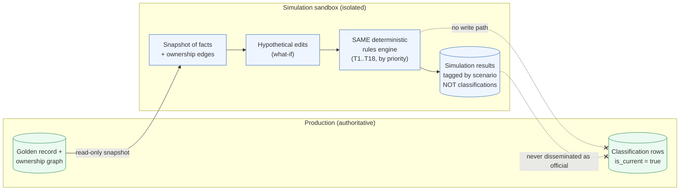
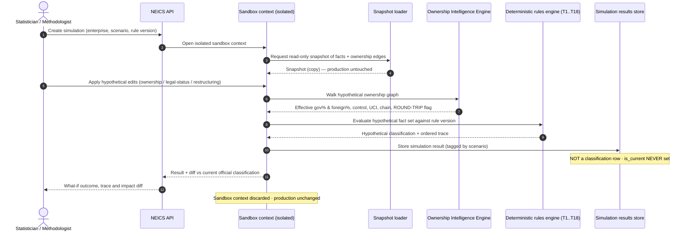

# 16 — Simulation Framework (Classification Sandbox)

> **National Enterprise Intelligence and Classification System (NEICS)**
> National Statistics Office (NSO) — State of Qatar
> **Environment: STAGING / UAT.** Isolated from production and from live data providers.
> Document status: For review by senior statisticians, enterprise architects and data-governance specialists.

| | |
|---|---|
| **Document** | 16 — Simulation Framework (Classification Sandbox) |
| **Status** | STAGING / UAT — pre-pilot review draft |
| **Audience** | Senior statisticians, enterprise architects, data-governance specialists |
| **Classification** | Official — Internal (subject to Qatar Statistics Law) |
| **Owner** | National Statistics Office (NSO), Statistical Methodology & Business Register Programme |
| **Date** | 2026-06-18 |
| **Related** | [`./10_rules_repository_design.md`](./10_rules_repository_design.md) · [`./11_classification_logic_maps.md`](./11_classification_logic_maps.md) · [`./15_ai_review_framework.md`](./15_ai_review_framework.md) · [`./14_audit_and_lineage_framework.md`](./14_audit_and_lineage_framework.md) · [`./00_executive_architecture.md`](./00_executive_architecture.md) · [`./INDEX.md`](./INDEX.md) |

---

## 1. Purpose and scope

This document specifies the **NEICS simulation framework** — the *classification sandbox* — which
lets statisticians ask **what-if** questions about an enterprise without altering its official
classification or touching production data.

The sandbox answers questions of the form:

> *If the State acquired a golden share in this private corporation, would it become a public
> corporation? If a foreign investor crossed the 10% — then the 50% — threshold, what FDI
> classification would result? If this sovereign-wealth-fund holding were restructured through a
> new non-resident vehicle, would the unit still be classified as a resident public corporation,
> and would ROUND-TRIP be detected?*

The defining property of the sandbox is that it **runs the same deterministic rules engine** as
the production classifier — the identical rule base, the identical 18-test methodology
(T1..T18), the identical first-match-by-priority conflict resolution — but over a **hypothetical
fact set in an isolated context**. Simulations never write an official classification row,
never set `is_current`, and never enter the golden record.

Scope:

- The isolation model that separates simulation from production.
- The simulation lifecycle and its inputs/outputs.
- A sequence walk-through of a simulation run.
- Three worked example simulations.
- Use of the sandbox for impact analysis ahead of committee rulings and for testing proposed
  rule versions.

Out of scope: the rule base itself (see document 10) and the decision logic (see document 11).

---

## 2. Why simulate

Statistical reclassification has consequences that ripple into the National Accounts (SNA 2025),
Government Finance Statistics (IMF GFS 2014), the Balance of Payments and FDI statistics
(IMF BPM6, OECD BD4), and the Statistical Business Register. Before the NSO commits such a
change — or before a classification committee issues a ruling — it needs to understand the
**impact** of a hypothetical event with the same rigour as a real determination, but without
risk.

Two distinct needs are served:

1. **Scenario impact analysis.** Decision-makers want to see, deterministically, what a
   proposed corporate event would do to an enterprise's sector, market status and FDI flags
   *before* the event is real and *before* a committee rules on it. The sandbox produces a
   traceable answer using the production methodology, so the analysis is defensible.

2. **Rule-version testing.** When a methodologist drafts a new or amended rule version, the
   sandbox lets them evaluate the candidate rule against historical or hypothetical fact sets to
   see what would change — a regression test for the methodology — before the version is
   submitted to the approval workflow. (The version is *not* approved by the sandbox; approval
   remains governed as in [`./10_rules_repository_design.md`](./10_rules_repository_design.md).)

In both cases the sandbox gives the **determinism and explainability** of the production engine
with **none of its commitment**.

---

## 3. Isolation from production — the cardinal rule

The sandbox is valuable only because it is trustworthy, and it is trustworthy only because it
**cannot affect production**. Isolation is enforced structurally:

| Guarantee | How it is enforced |
|---|---|
| **No official rows.** | A simulation run executes in a sandbox context that has no write path to the classification table. Its results are stored as *simulation results*, tagged with the scenario id, never as classifications. |
| **`is_current` is never set.** | Only the production commit path sets `is_current`. The sandbox lacks that path entirely. |
| **Golden record untouched.** | The enterprise's golden record and ownership graph are read into the sandbox as a snapshot; hypothetical edits apply to the *copy*, not the source. |
| **No FDI / sector aggregates affected.** | Simulation outputs are excluded from every dissemination and aggregation query by construction (they are not classifications). |
| **Rule versions remain governed.** | The sandbox can *evaluate* a draft rule version; it cannot *approve* one. Approval stays in the workflow. |

Conceptually:

The crossed edges are the **prohibited paths**. The sandbox reads from production but can never
write to it.

---

## 4. What a simulation operates on

A simulation is defined by three things:

1. A **base snapshot** — the current confirmed fact set and ownership edges of one or more
   enterprises, read read-only from production.
2. A **scenario** — a set of hypothetical mutations applied to the snapshot. Supported
   mutation classes:
   - **Ownership changes** — adding/removing/altering `ownership_edge` rows: percentage,
     voting, control indicator, `owner_is_government`, `owner_is_resident`, intermediate
     vehicles.
   - **Legal-status changes** — changing legal form, residence, or the presence of instruments
     such as a golden share.
   - **Restructuring** — mergers, splits and acquisitions that recompose the unit set or the
     ownership cascade.
3. The **rule version** to evaluate against — by default the current production version; for
   rule-version testing, a draft version.

The output is a **simulation result**: the classification the engine *would* produce, plus the
ordered trace and the hypothetical fact set, plus a **diff** against the enterprise's current
official classification. The diff is what statisticians actually read: *what would change, and
why*.

---

## 5. Simulation lifecycle — sequence

The sequence below shows a single what-if run. Note that the Ownership Intelligence Engine
(which walks the ownership graph to compute effective government/foreign ownership %, control
indicators, the UCI and the chain) runs **inside** the sandbox over the hypothetical graph,
exactly as it would in production — but on the copy.

The run is fully traceable: like a production classification, a simulation produces an ordered
trace and the full (hypothetical) fact set, so it is explainable via the same `/explain`
mechanism — clearly marked as a simulation, never as an official result.

---

## 6. Worked example simulations

The three examples below correspond to recurring decisions in Qatar's statistical practice.
Each shows the scenario, the mechanism, and the deterministic outcome.

### 6.1 State acquires a golden share — private → public reclassification

**Scenario.** A private corporation, currently classified as a **private non-financial
corporation**, is hypothetically given a **golden share** held by the State, alongside a
minority equity stake.

**Mechanism.** The sandbox adds the golden-share instrument and the State edge to the
hypothetical graph. The Ownership Intelligence Engine evaluates control on a
**substance-over-form** basis: a minority equity holding *plus a golden share* confers control
on the State. The control test (within T1..T18) therefore resolves to State control.

**Outcome.** The rules engine, by first-match-by-priority, classifies the unit as a **public
non-financial corporation**. The diff shows the SNA institutional-sector change from private to
public corporations, with the trace citing the control and substance-over-form rules. The
official classification is unchanged — this is a what-if only.

### 6.2 Foreign investor crosses 10%, then 50% — FDI threshold ladder

**Scenario.** A resident enterprise with **no** current FDI flag (`NONE`). A foreign,
non-resident investor hypothetically acquires first **10%**, then **50%**, of equity.

**Mechanism.** The sandbox runs two scenario states. At 10%, the foreign ownership reaches the
inward direct-investment association threshold (OECD BD4 / BPM6). At 50%, it crosses into
majority foreign control.

**Outcome (ladder).**

| Hypothetical foreign ownership | FDI classification |
|---|---|
| Below 10% | `NONE` |
| ≥10% and <50% | `INWARD-ASSOC` (inward direct investment — associate) |
| ≥50% | `INWARD-FULL` (inward direct investment — controlled) |

The diff shows the FDI flag transition `NONE → INWARD-ASSOC → INWARD-FULL` and, where relevant,
the consequence for the unit's foreign-control status. This is exactly the analysis the NSO
needs before recording a real FDI event in the Balance of Payments — produced deterministically,
with a trace, and with no production impact.

### 6.3 SWF restructures through a new non-resident vehicle — ROUND-TRIP detection

**Scenario.** A sovereign-wealth-fund holding in a resident enterprise is hypothetically
**restructured** so that the State's control runs through a **new non-resident vehicle** — a
multi-level cascade.

**Mechanism.** The sandbox inserts the non-resident vehicle into the hypothetical ownership
graph. The Ownership Intelligence Engine walks the cascade. Despite the non-resident vehicle in
the chain, the ultimate controlling institutional unit (UCI) remains the resident State.
Substance-over-form prevails: residence is determined by the substance of control, not by the
intermediate vehicle's location.

**Outcome.** The unit is still classified as a **resident public corporation**, and the
restructuring is flagged **ROUND-TRIP** — capital that leaves and returns to the same economy
through a non-resident vehicle. The trace shows the UCI computation and the ROUND-TRIP flag.
This lets statisticians see, before any committee ruling, that the proposed structure would not
change the unit's sector but would change its FDI/round-trip presentation.

---

## 7. Using the sandbox

### 7.1 Impact analysis before committee rulings

A NEICS classification committee frequently considers borderline or contested cases. The
sandbox lets the committee see the **deterministic consequence** of a proposed treatment before
ruling. Because the simulation uses the production methodology and produces a full trace, the
committee's deliberation is grounded in the same evidence the official classification would
rest on — yet nothing is committed until the committee's ruling is enacted through the normal
production path.

### 7.2 Testing proposed rule versions

When the methodology evolves — for example, refining a control test or adjusting a threshold —
a methodologist drafts a new rule version and **evaluates it in the sandbox** against a set of
representative enterprises (current and hypothetical). The sandbox reports which classifications
*would* change under the draft version, surfacing unintended consequences before the version
enters the approval workflow. The sandbox neither approves the version nor applies it to
production; it is a regression harness for the rule base. Approval, versioning and activation
remain governed exactly as in [`./10_rules_repository_design.md`](./10_rules_repository_design.md).

### 7.3 Relationship to the AI-assisted review layer

The sandbox and the AI-assisted review layer ([`./15_ai_review_framework.md`](./15_ai_review_framework.md))
are complementary but distinct. The AI layer helps humans *assemble and confirm facts* about
real enterprises. The sandbox lets humans *explore hypothetical facts* with the deterministic
engine. Neither commits an official classification; both feed human judgement.

---

## 8. Guarantees and review posture

The simulation framework upholds the same invariant as the rest of NEICS: the official register
is changed only through the governed production path, only by accountable humans, and only via
the deterministic engine over confirmed facts.

| Guarantee | Statement |
|---|---|
| **Determinism** | A simulation uses the production engine; identical hypothetical facts and rule version yield identical results and traces. |
| **Isolation** | Simulations read a snapshot and write only to the results store; production is never mutated. |
| **No `is_current`** | The sandbox has no path to set the current-classification flag. |
| **Explainability** | Simulations produce ordered traces, explainable via `/explain`, clearly marked as simulations. |
| **Governance preserved** | Rule-version approval and classification commitment remain outside the sandbox. |

### 8.1 STAGING / UAT validation

In the current STAGING/UAT build, UAT validates the **isolation** property directly: testers
confirm that simulation runs — including ownership, legal-status and restructuring scenarios —
produce no classification rows, set no `is_current` flags, leave the golden record and ownership
graph byte-for-byte unchanged, and are excluded from all dissemination/aggregation outputs.
The three worked examples in §6 form part of the UAT scenario suite. Pilot authorisation depends
on these isolation tests passing.

---

## 9. Summary

The NEICS classification sandbox brings the full rigour of the deterministic, rule-based engine
to bear on hypothetical events — golden-share acquisitions, FDI threshold crossings, sovereign
restructurings — and returns a traceable, explainable answer with an impact diff, while
guaranteeing that production is never touched. It is the NSO's instrument for **looking before
leaping**: understanding the statistical consequence of a corporate event, or of a methodology
change, before it becomes real.

> Continue to [`./17_future_roadmap.md`](./17_future_roadmap.md) for the platform's evolution,
> or return to the [`./INDEX.md`](./INDEX.md).
