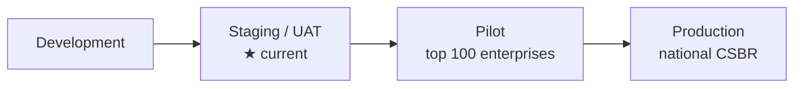

# Future Roadmap — Development → Staging → Pilot → Production

> NEICS — Staging / UAT. See sibling docs in [`INDEX.md`](./INDEX.md).

## 1. Where we are

The current build is a **verified staging / UAT environment**: the 18-test methodology,
database-driven rules engine, ownership intelligence, validation, data quality,
explainability, temporal audit, repositories, RBAC and APIs are implemented and
regression-tested (28/28 classification verdicts, 40/40 rules verified, 18/18 validation
rules). It runs in isolation from production and live data providers.

## 2. Maturity path

| Stage | Objective | Exit criteria |
|---|---|---|
| **Staging / UAT** ★ | Validate methodology, rules, workflows, UX | UAT cases passed; acceptance criteria met; sign-off |
| **Pilot** | Operate on the largest ~100 enterprises with real data | One administrative source integrated; security hardening done; large-case profiling unit established |
| **Production** | National CSBR for all statistical programmes | HA + DR; load-tested at national volume; data-sharing instruments in force under the Statistics Law |

This mirrors the framework's three capability layers — **Establish** (methodology,
committee, largest 100 units), **Integrate** (central register, source feeds, validation),
**Operate** (AI-assisted tooling, full coverage, external peer review).

## 3. Roadmap themes

### 3.1 Administrative-data integration
Direct, governed integration with source authorities — **MoCI, GTA, QCB, MoF, QFC, QFZA,
QSE, Ministry of Labour, QatarEnergy, Customs, licensing authorities** — via secure
pipes with entity resolution and the Tier 1–4 source hierarchy. Add XML/SDMX file-mapping
to the existing JSON/CSV ingestion.

### 3.2 Ownership-network analytics
Promote the relational ownership graph to a dedicated **graph database** for large-scale
network analysis, cycle detection, percentage propagation and visualisation of enterprise
groups and multinational structures.

### 3.3 AI-assisted review (human-in-the-loop)
Move from rule-based anomaly detection to ML-assisted **entity resolution / record
linkage**, **misclassification prediction**, and **LLM-assisted evidence extraction** from
filings and annual reports. Official classifications remain rule-based and committee-governed;
AI only suggests and flags.

### 3.4 Statistical production & dissemination
**SDMX** dissemination to IMF/OECD/GCC; **Power BI** connectors; GSBPM-aligned production
pipelines; LEI coverage drive for financial-sector entities.

### 3.5 Platform hardening (production gates)
Secrets management & rotation; PostgreSQL HA, backups and **Alembic** migrations;
penetration testing, rate limiting, audit-log immutability; observability
(metrics/tracing/alerting) and SLAs; national-scale performance testing (100k+ units);
full Arabic RTL UI and accessibility certification.

### 3.6 Governance & methodology
Stand up the **Technical Classification Committee** with documented workflow and
quarterly + trigger-based reclassification; publish the methodology bulletin; commission
**external (OECD-style) peer review**; formalise confidentiality controls under the
Statistics Law.

## 4. Recommendation

Methodology and data-governance readiness are strong. The recommended next step is a
**controlled pilot** on the largest 100 enterprises once security hardening and the first
administrative-source integration are complete, deferring full production until HA, DR,
load testing and data-sharing instruments are in place. See
[`../../docs/uat/ACCEPTANCE_CRITERIA.md`](../uat/ACCEPTANCE_CRITERIA.md) and the Gap
Analysis / Production Readiness module in the HTML walkthrough.
